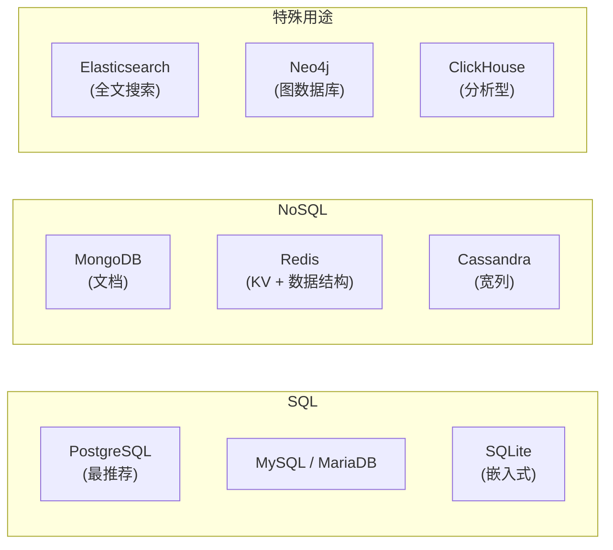
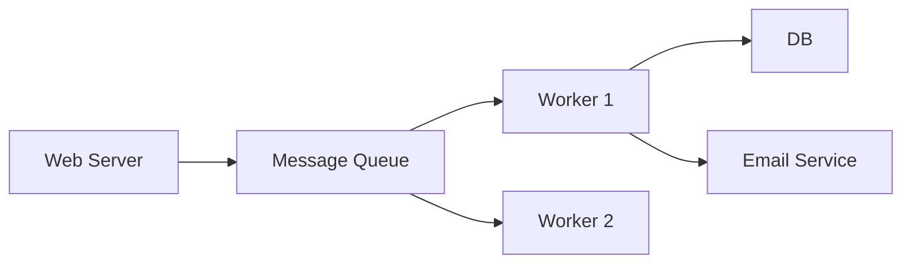

# 后端开发全景指南

> **前置阅读**：后端涉及多语言选择——建议先阅读对应语言的全景指南（[Go](../languages/go.md)、[Python](../languages/python.md)、[Rust](../languages/rust.md)、[JavaScript](../languages/javascript.md)）。

---

## 后端是什么

后端是在**服务器上运行**的软件系统，负责：

- 接收和处理客户端请求（HTTP、WebSocket、gRPC）
- 实现业务逻辑
- 与数据库、缓存、消息队列等基础设施交互
- 保证数据安全、一致性和可用性

---

## 运行环境全景

```mermaid
flowchart TB
    subgraph 请求入口
        LB["负载均衡<br/>(Nginx / HAProxy / Cloud LB)"]
        GW["API 网关<br/>(Kong / Envoy / 云 API Gateway)"]
    end

    subgraph 应用层
        WS["Web 服务器<br/>(HTTP + 路由 + 中间件)"]
        Worker["后台 Worker<br/>(消息队列消费者)"]
        Cron["定时任务<br/>(Cron / Scheduler)"]
    end

    subgraph 数据层
        DB["关系数据库<br/>(PostgreSQL / MySQL)"]
        Cache["缓存<br/>(Redis / Memcached)"]
        MQ["消息队列<br/>(Kafka / RabbitMQ / NATS)"]
        Search["搜索引擎<br/>(Elasticsearch / Meilisearch)"]
        ObjectStore["对象存储<br/>(S3 / MinIO)"]
    end

    subgraph 基础设施
        K8s["容器编排<br/>(Kubernetes)"]
        CI["CI/CD<br/>(GitHub Actions / GitLab CI)"]
        Obs["可观测性<br/>(Prometheus / Grafana / Loki)"]
    end

    LB --> WS
    GW --> WS
    WS --> DB
    WS --> Cache
    Worker --> MQ
    MQ --> Worker
    WS --> MQ
```



---

## Web 框架：按语言选型

### 多语言 Web 框架速览

| 语言 | 主流框架 | 轻量框架 | 特点 |
|------|---------|---------|------|
| **Go** | 标准库 `net/http` | Gin, Echo, Chi, Fiber | 多数场景标准库已够用 |
| **Python** | Django | FastAPI, Flask, Litestar | Django 全栈，FastAPI 异步+自动文档 |
| **Rust** | — | Actix-web, Axum, Rocket | Axum 是当前推荐（Tokio 生态） |
| **JavaScript/TS** | Next.js (全栈) | Express, Fastify, Hono | Express 老牌，Fastify 更快，Hono 边缘 |
| **Java** | Spring Boot | Quarkus, Micronaut | Spring 是企业标准 |
| **C#** | ASP.NET Core | — | .NET 生态一体 |
| **PHP** | Laravel | Symfony | Laravel 是 PHP 的"电池全包"方案 |
| **Ruby** | Rails | Sinatra | Rails 是"约定大于配置"的原点 |

### 框架设计中需要理解的共性概念

所有后端框架都在解决类似的问题，只是设计理念不同：

| 概念 | 说明 |
|------|------|
| **路由（Routing）** | URL → Handler 的映射。不同 HTTP 方法（GET/POST/PUT/DELETE）对应不同操作 |
| **中间件（Middleware）** | 请求/响应的处理链。认证、日志、CORS、限流等功能用中间件实现 |
| **请求验证** | 校验输入数据格式和约束——永远不要信任客户端输入 |
| **序列化/反序列化** | JSON ↔ 语言结构体。各家有各家的实现 |
| **依赖注入（DI）** | 如何将数据库连接、配置等依赖传递给 handler |
| **ORM（对象关系映射）** | 抽象 SQL 为对象操作。是双刃剑 |

---

## API 范式

| 范式 | 说明 | 适合场景 |
|------|------|---------|
| **REST** | 资源导向（URL 代表资源，HTTP 方法代表操作） | 大多数 API，简单直观 |
| **GraphQL** | 客户端指定需要的字段，单端点 | 复杂数据关系、多客户端（Web+iOS+Android） |
| **gRPC** | 基于 Protocol Buffers，二进制协议，HTTP/2 | 微服务间高性能通信 |
| **WebSocket** | 双向持久连接 | 实时通信（聊天、协作编辑） |
| **SSE（Server-Sent Events）** | 服务端向客户端单向推送 | 实时通知、日志流 |
| **tRPC** | TypeScript 端到端类型安全 | 全栈 TS 项目 |

**选择原则**：
- 浏览器/移动端 → 客户端 = REST（或 GraphQL）
- 微服务之间 = gRPC
- 全栈 TypeScript = tRPC
- 实时推送 = WebSocket / SSE

---

## 认证与授权

后端开发中安全相关的最基础概念：

| 概念 | 说明 |
|------|------|
| **认证（Authentication）** | 你是谁？（登录） |
| **授权（Authorization）** | 你能做什么？（权限） |
| **Session-based Auth** | 服务端存储会话，客户端存 cookie。传统方案 |
| **JWT（JSON Web Token）** | 自包含 token，无状态。适合分布式系统但不可撤销 |
| **OAuth 2.0 / OIDC** | 第三方登录（Google/GitHub/...）的工业标准 |
| **API Key** | 服务间认证的简单方式 |
| **RBAC / ABAC** | 基于角色/属性的权限模型 |

---

## 数据库

### 分类



### 选择策略

| 场景 | 推荐 |
|------|------|
| 通用 Web 应用 | **PostgreSQL**（默认选择） |
| 高可用、MySQL 运维经验丰富 | MySQL |
| 移动端本地数据库 / 小项目 | SQLite |
| Schema 不固定的文档 | MongoDB |
| 缓存、限流、会话 | Redis |
| 全文搜索 | Elasticsearch / Meilisearch |
| 时序数据（监控/物联网） | TimescaleDB / ClickHouse |

### ORM vs Query Builder vs Raw SQL

| 方式 | 代表 | 优点 | 缺点 |
|------|------|------|------|
| **ORM** | Prisma, SQLAlchemy, GORM, Diesel | 类型安全，自动迁移 | 复杂查询难表达，性能黑箱 |
| **Query Builder** | Knex.js, jOOQ | 接近 SQL 的表达力+类型安全 | 仍需理解 SQL |
| **Raw SQL** | 直接写 SQL | 完全控制 | 类型安全缺失，注入风险 |
| **类型安全 SQL** | sqlc (Go), SQLx (Rust) | 从 SQL 生成类型安全代码 | 需要额外的代码生成步骤 |

> **推荐**：优先选择类型安全的 SQL 方案（sqlc/SQLx），或 Query Builder。纯 ORM 适合简单 CRUD，不适合复杂查询。

---

## 消息队列与异步处理

把耗时操作（发邮件、生成报告、视频编码）从请求-响应周期中分离出来：



| 消息队列 | 模型 | 适用 |
|----------|------|------|
| **RabbitMQ** | 传统消息代理（AMQP 协议） | 任务队列、可靠投递 |
| **Kafka** | 分布式日志，持久化，可回放 | 事件流、大规模数据处理 |
| **NATS** | 轻量、极简、高性能 | 微服务通信、边缘计算 |
| **Redis Pub/Sub + Stream** | 轻量（纯内存） | 已有 Redis 时的简单场景 |

**核心概念**：
- **生产者/消费者**：A 发消息，B 处理消息
- **至少一次 / 最多一次 / 精确一次**：保证消息被处理的策略
- **死信队列（DLQ）**：处理失败的消息的去处

---

## 可观测性（Observability）

| 支柱 | 说明 | 工具 |
|------|------|------|
| **日志（Logging）** | 离散的事件记录 | 结构化日志（JSON）、Loki、ELK |
| **指标（Metrics）** | 聚合数据（请求数、延迟、错误率） | Prometheus + Grafana |
| **链路追踪（Tracing）** | 跟踪一个请求跨越多个服务的路径 | OpenTelemetry、Jaeger、Tempo |

### 可观测性最小实践

1. **结构化日志**：日志写成 JSON（或 key=value 格式），不要写无格式的纯文本
2. **健康检查端点**：`/health`（活了吗？）和 `/ready`（能处理请求吗？）
3. **REQUEST_ID**：每个请求分配唯一 ID，贯穿所有日志
4. **RED 指标**：Rate（请求率）、Errors（错误率）、Duration（延迟）

---

## 部署

### 部署谱系

| 方式 | 复杂度 | 适合 |
|------|--------|------|
| **单机 + systemd** | 最低 | 个人项目、内网服务 |
| **Docker + Docker Compose** | 低 | 中小项目、快速部署 |
| **Kubernetes** | 高 | 多服务、需自动扩缩容、大团队 |
| **Serverless（FaaS）** | 中 | 事件驱动、间歇性负载 |
| **PaaS（Heroku/Render/Fly.io）** | 低 | 不想管基础设施 |

### 容器化基础

```dockerfile
# Go 项目的多阶段构建示例
FROM golang:1.23 AS builder
COPY . /src && cd /src && CGO_ENABLED=0 go build -o /app .

FROM scratch
COPY --from=builder /app /app
ENTRYPOINT ["/app"]
```

### 环境配置

- **环境变量**：最简单、最通用的配置方式
- **12-Factor App**：[12factor.net](https://12factor.net)，现代应用开发的 12 条原则
- **Secret 管理**：敏感信息（数据库密码、API key）通过环境变量或 Secret 管理服务注入，**永远不要**写入代码或配置文件

---

## 代表性项目

| 项目 | 语言 | 说明 | 为什么值得研究 |
|------|------|------|---------------|
| [PostgreSQL](https://github.com/postgres/postgres) | C | 关系数据库 | 数据库内核设计、查询优化器、MVCC |
| [Redis](https://github.com/redis/redis) | C | 缓存/数据结构服务 | 事件循环、单线程高性能 I/O、数据结构实现 |
| [Docker](https://github.com/moby/moby) | Go | 容器引擎 | namespaces/cgroups、镜像分层、REST API 设计 |
| [Caddyserver](https://github.com/caddyserver/caddy) | Go | Web 服务器 | 自动 HTTPS、插件架构 |
| [PocketBase](https://github.com/pocketbase/pocketbase) | Go | 一键后端（DB+Auth+API） | SQLite + Go 的单文件后端，轻量级后端的范本 |
| [FastAPI](https://github.com/fastapi/fastapi) | Python | Web 框架 | 类型注解驱动的 API 设计，OpenAPI 自动生成 |
| [NATS](https://github.com/nats-io/nats-server) | Go | 消息系统 | 极简设计的分布式消息系统 |
| [sqlc](https://github.com/sqlc-dev/sqlc) | Go | 类型安全 SQL | 从 SQL 生成类型安全代码——"SQL 是真理，代码是衍生" |

---

## 实用入门路径

### 最小 Web 服务示例

选择一门语言，用其框架写一个 HTTP 服务：

```bash
# Go（标准库，无需框架）
cat > main.go << 'EOF'
package main
import ("fmt"; "net/http")
func main() {
    http.HandleFunc("/", func(w http.ResponseWriter, r *http.Request) {
        fmt.Fprintf(w, "hello")
    })
    http.ListenAndServe(":8080", nil)
}
EOF
go run main.go &

# Python + FastAPI
cat > main.py << 'EOF'
from fastapi import FastAPI
app = FastAPI()
@app.get("/")
def root(): return {"message": "hello"}
EOF
uvicorn main:app --reload &

# Node.js + Express
cat > server.js << 'EOF'
const express = require('express');
const app = express();
app.get('/', (req, res) => res.json({ message: 'hello' }));
app.listen(3000);
EOF
node server.js &
```

### 学习路线

1. **理解 HTTP 协议**：方法、状态码、请求/响应头、缓存（Cache-Control、ETag）
2. **掌握 REST API 设计**：资源命名、状态码的正确使用、分页
3. **数据库设计**：范式化、索引、事务。理解 N+1 查询问题
4. **认证实现**：从 bcrypt 密码哈希 + JWT 开始
5. **可观测性**：结构化日志 + 指标（Prometheus）+ 链路追踪
6. **容器化和 CI/CD**：Docker + GitHub Actions 自动测试部署
7. **系统设计**：水平扩展、缓存策略、最终一致性、CAP 定理

### 关键资源

- **12factor.net**：现代应用开发的 12 条原则
- **HTTP Status Codes**：httpstatuses.io，每个状态码的含义和用法
- **PostgreSQL 官方文档**：postgresql.org/docs，数据库文档的黄金标准
- **System Design Primer**：github.com/donnemartin/system-design-primer
- **High Performance Browser Networking (Ilya Grigorik)**：Web 性能的底层原理
