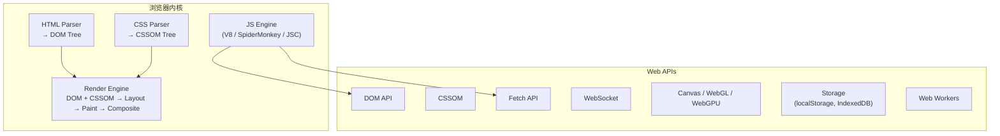
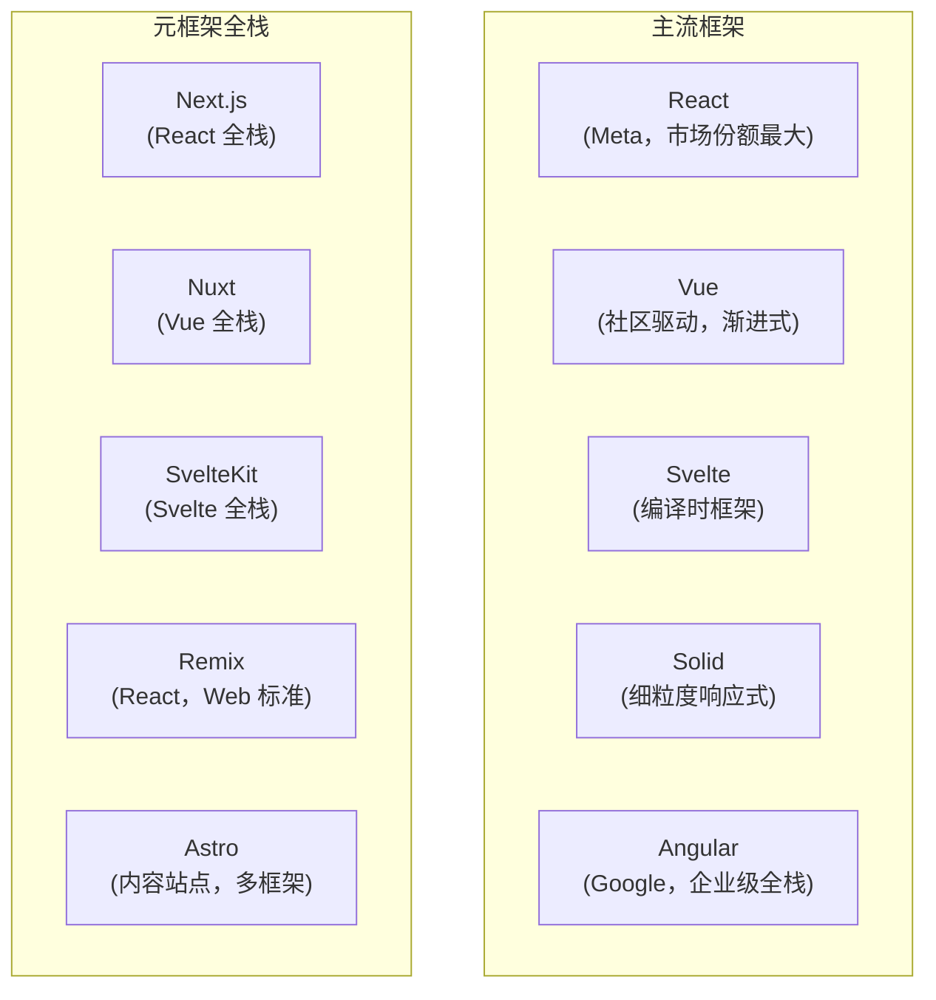

# 前端开发全景指南

> **前置阅读**：[JavaScript / TypeScript 全景指南](../languages/javascript.md)——本文假设你已了解 JS/TS 语言基础。
> **范围说明**：本文聚焦浏览器端开发的全景地图。后端 JS 开发详见 [后端开发全景指南](backend.md)。

---

## 前端是什么

前端开发是构建**在用户浏览器中运行**的应用界面和交互逻辑。它不同于后端开发的核心在于：

- 运行环境是**浏览器**（不可控——用户可能是 Chrome 126、Safari 17、或五年前的 IE）
- 性能约束是**网络延迟 + 客户端设备**（首次加载要快、交互要流畅）
- 产物是**HTML + CSS + JavaScript 的静态资源**（通过 HTTP 传输到浏览器）

---

## 浏览器：前端的基础平台



**关键理解**：
- **JS 是单线程的**（主线程），由事件循环（event loop）驱动
- **渲染也是主线程**——长时间运行的 JS 会阻塞 UI，这就是为什么 Web Workers 存在
- **浏览器兼容性**是前端的基础工程问题（MDN + caniuse.com 是你的朋友）

---

## 框架版图

现代前端开发几乎总是基于框架。以下是当前的主流选择：



### 框架定位速览

| 框架 | 核心思想 | 适合场景 | 学习曲线 |
|------|---------|---------|---------|
| **React** | 组件 = 函数，UI = f(state)，虚拟 DOM + 协调 | 最大生态、最多岗位 | 中（Hooks 心智模型需适应） |
| **Vue** | 响应式数据 + 模板，渐进式（可逐步采用） | 中小项目、快速原型、渐进迁移 | 低（语法最接近传统 HTML） |
| **Svelte** | 编译时消除框架——组件编译为直接操作 DOM 的代码 | 性能敏感、包体积敏感 | 低（接近写原生代码） |
| **Solid** | 与 React 语法相似但无虚拟 DOM，细粒度响应式 | 追求极致性能 | 中（React 用户易迁移） |
| **Angular** | 完整的 MVC 框架，依赖注入、RxJS、模块化 | 大型企业应用 | 高（概念最多） |

### 元框架（Meta-framework）

元框架在 UI 框架之上添加了**路由、SSR、数据加载、构建优化**等开箱即用的能力：

| 元框架 | 基于 | 核心优势 |
|--------|------|---------|
| **Next.js** | React | 生态最大，App Router（React Server Components），Vercel 支持 |
| **Nuxt** | Vue | Vue 的 Next.js 等价物，自动导入、文件路由 |
| **SvelteKit** | Svelte | Svelte 官方全栈方案，适配器架构（多平台部署） |
| **Remix** | React | 拥抱 Web 标准（Web Fetch API），嵌套路由 |
| **Astro** | 多框架 | 默认零 JS 输出，内容站点首选，支持 React/Vue/Svelte 组件 |

**选择建议**：新项目首选元框架（而不是裸框架），它们解决了路由、构建、SSR 等问题。

---

## 渲染策略

前端不再只有"发 HTML 到浏览器"这一种方式。现代前端有多种渲染策略：

| 策略 | 缩写 | 行为 | 适合 |
|------|------|------|------|
| **客户端渲染** | CSR | 浏览器下载空 HTML + JS bundle，JS 渲染整个页面 | 需要登录后的 App |
| **服务端渲染** | SSR | 服务器为每个请求动态生成完整 HTML | 需要 SEO 的动态页面 |
| **静态生成** | SSG | 构建时预先生成所有 HTML | 博客、文档、营销页面 |
| **增量静态再生** | ISR | SSG + 按需重新生成过期页面 | 内容更新不频繁的站点 |
| **Resumable** | — | 服务端序列化状态，客户端"恢复"而非"重建" | 追求极致性能（Qwik 使用） |

Next.js App Router 默认使用 **React Server Components**——组件默认在服务端渲染，只有交互式组件才发送 JS 到客户端。

---

## 状态管理

当多个组件需要共享同一份数据时，就需要状态管理。

| 方案 | 适用 | 说明 |
|------|------|------|
| **组件内部 state** | 单组件状态 | `useState`（React）、`ref`（Vue） |
| **Props 传递** | 父子组件间 | 单向数据流 |
| **Context / provide-inject** | 跨层级传递 | React Context、Vue provide/inject |
| **Pinia** | Vue 应用 | Vue 官方状态管理 |
| **Zustand** | React 应用 | 轻量，推荐 |
| **Jotai / Recoil** | React 应用 | 原子化状态（每状态独立管理） |
| **TanStack Query / SWR** | 服务端状态 | 专门管理从 API 获取的数据（缓存、重新获取、乐观更新） |
| **Redux** | 大型 React | 老牌，概念多（action/reducer/store），多数新项目不再选它 |

**核心原则**：区分**UI 状态**和**服务端状态**。TanStack Query 解决的是"把服务器数据同步到 UI"的问题，不应该用 Redux 手动做这件事。

---

## 样式方案

| 方案 | 代表 | 特点 |
|------|------|------|
| **全局 CSS** | `style.css` | 简单但易冲突 |
| **CSS Modules** | `*.module.css` | 自动作用域隔离，构建时处理 |
| **CSS-in-JS** | styled-components, Emotion | 运行时生成样式（可能有性能开销） |
| **零运行时 CSS-in-JS** | Panda CSS, Vanilla Extract | 编译时提取为静态 CSS（无运行时开销） |
| **原子化 CSS** | Tailwind CSS, UnoCSS | 用工具类组合，构建时摇树优化 |
| **组件库** | shadcn/ui, Ant Design, MUI | 提供预制组件（配合框架） |

**当前趋势**：Tailwind CSS + 组件库（shadcn/ui）成为新项目最主流选择。

---

## 打包与构建

参见 [JavaScript 工具链地图](../languages/javascript.md#工具链地图)。这里强调前端特有的构建关注点：

| 关注点 | 工具 | 说明 |
|--------|------|------|
| **代码分割** | Vite/Webpack 自动 | 拆分 bundle，按需加载（lazy import） |
| **Tree Shaking** | esbuild/Rollup | 移除未使用代码 |
| **CSS 提取** | Vite 内置 | 将 CSS 提取为独立文件 |
| **静态资源处理** | Vite 内置 | 图片优化、SVG 处理、字体文件 |
| **环境变量** | `.env` 文件 | 构建时注入（`VITE_API_URL`） |
| **差异化构建** | 手动配置 | 为现代和旧浏览器生成不同 bundle |

---

## 测试版图

| 层次 | 工具 | 测试什么 |
|------|------|---------|
| **单元测试** | Vitest, Jest | 函数、hook、工具逻辑 |
| **组件测试** | Testing Library + Vitest | 组件在隔离环境中的行为 |
| **视觉回归** | Storybook + Chromatic | 组件外观是否意外变化 |
| **E2E** | Playwright, Cypress | 完整用户流程（登录→购买→结账） |

**测试策略**：E2E 测试最有价值但最慢。现代实践倾向于用 Playwright 覆盖关键路径 + Vitest 覆盖核心逻辑。

---

## 部署

前端构建产物是纯静态文件（HTML + CSS + JS），部署极其简单：

```bash
npm run build       # 产出 dist/ 目录
# 部署 dist/ 到任何静态托管
```

**主流部署平台**：

| 平台 | 特点 |
|------|------|
| **Vercel** | 零配置，自动 CI/CD，Next.js 默认推荐 |
| **Netlify** | 类似 Vercel，Git 推送到部署 |
| **Cloudflare Pages** | 全球 CDN，边缘计算能力 |
| **GitHub Pages** | 免费，适合个人项目 |
| **S3 + CloudFront** | AWS 生态，适合企业 |
| **Nginx** | 自托管 |

---

## 代表性项目

| 项目 | 说明 | 值得研究的原因 |
|------|------|---------------|
| [shadcn/ui](https://ui.shadcn.com/) | 组件库 | "不是组件库"的组件库——代码直接复制到项目中，完全控制 |
| [Tailwind CSS](https://tailwindcss.com/) | CSS 框架 | 改变了 CSS 的写法，构建时生成精确的 CSS |
| [HTMX](https://htmx.org/) | HTML 扩展 | 反框架运动——在 HTML 中声明动态行为 |
| [TanStack Query](https://tanstack.com/query) | 服务端状态 | 解决了"前端如何管理服务端数据"这个最难的问题 |
| [Playwright](https://playwright.dev/) | E2E 测试 | 自动等待、多浏览器、追踪——前端测试的工业标准 |
| [Hono](https://hono.dev/) | 边缘 Web 框架 | 极简、多运行时（Node/Deno/Bun/Cloudflare） |

---

## 实用入门路径

```bash
# React + Vite + TypeScript
npm create vite@latest myapp -- --template react-ts
cd myapp && npm install && npm run dev

# Vue + Vite + TypeScript
npm create vite@latest myapp -- --template vue-ts

# SvelteKit
npm create svelte@latest myapp
```

### 学习路线

1. **理解浏览器**：DOM、事件循环、CSS 盒模型、Web API（fetch、storage）
2. **选一个框架入门**：React 或 Vue。学会组件、状态、props 单向数据流
3. **理解构建工具**：Vite 在背后做了什么？为什么需要打包？
4. **掌握服务端渲染**：Next.js 或 Nuxt 的 SSR/SSG 概念
5. **性能优化**：代码分割、懒加载、图片优化、Core Web Vitals

### 关键资源

- **MDN Web Docs**：developer.mozilla.org，Web 技术的权威文档
- **caniuse.com**：检查浏览器兼容性
- **web.dev**：Google 的 Web 性能和质量指南
- **You Don't Know JS**：深入 JS 语言细节
