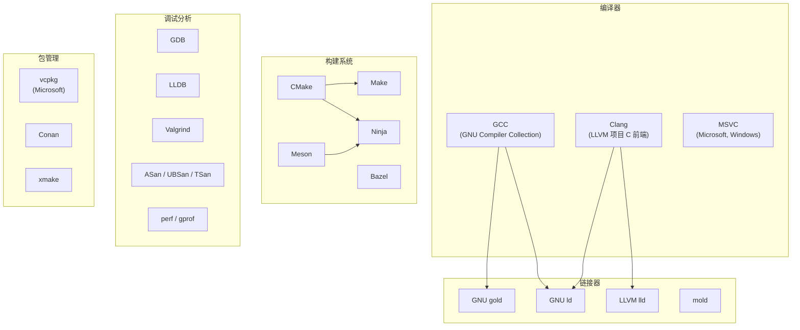

# C 语言开发者全景指南

## 语言画像

| 维度 | 描述 |
|------|------|
| 类型 | **编译型**——源码必须经过编译→汇编→链接才能运行 |
| 类型系统 | **静态、弱类型**——类型在编译时确定，但允许隐式转换（如 int↔char） |
| 内存管理 | **纯手动**——`malloc`/`free`，没有 GC，没有 RAII 的编译器支持（但可通过约定模拟） |
| 范式 | **过程式**——函数是第一组织单元，没有类/继承（但可用结构体+函数指针实现多态） |
| 运行形态 | **原生机器码**——编译产物为 ELF/Mach-O/PE 格式，直接在 CPU 上执行 |
| 标准 | **ISO C**（C89→C99→C11→C17→C23），有正式国际标准 |
| 主要实现 | GCC（GNU）、Clang（LLVM）、MSVC（Microsoft）。前两者是 Unix/Linux 主流 |

**一句话定位**：C 是所有现代操作系统、嵌入式固件和高性能基础设施的基石语言。它的设计哲学是"信任程序员"——不隐藏成本，不强制安全，不运行时检查（除非你明确要求）。

---

## 从源码到运行

完整流程见 [编译通识](../topics/02-build-pipeline.md)。这里只强调 C 语言特有的要点：

```
main.c ──[预处理]──▶ main.i ──[编译]──▶ main.s ──[汇编]──▶ main.o
                                                              │
lib.c ───────────────────────────────────────────▶ lib.o ───[链接]──▶ a.out
```

**C 特有的关键点**：

- **头文件不是"模块"**：`#include` 本质是文本复制。头文件里放**声明**，`.c` 文件里放**定义**。声明可以出现多次（所以需要 include guard），定义只能出现一次。
- **编译单元是 `.c` 文件**：每个 `.c` 文件独立编译，编译时看不到其他 `.c` 文件的内容。这就是为什么需要头文件——告诉编译器"外部有这些函数，相信我"。
- **链接时才拼合**：编译器只管自己的 `.c`，链接器才负责把 `call printf` 和 printf 的实际地址对接上。
- **链接 libc**：几乎所有 C 程序都链接 C 标准库（libc）。Linux 上主流是 **glibc**（GNU C Library）和 **musl**（轻量替代）。macOS 上是 **libSystem**。Windows 上是 **MSVC Runtime**。

---

## 工具链地图

C 语言有两条成熟的工具链阵营，以及一个构建系统生态层。



### 编译器：GCC vs Clang

| | GCC | Clang |
|------|-----|-------|
| 项目归属 | GNU 项目 | LLVM 项目 |
| 许可证 | GPLv3 | Apache 2.0（更宽松） |
| 错误信息 | 传统风格，常有模板地狱 | 以清晰友好著称，带修复建议 |
| 编译速度 | 中等 | 通常更快 |
| 优化能力 | 深厚，老牌 | 接近甚至超过 GCC |
| 插件/工具 | 较少 | LLVM 工具链丰富（sanitizers, static analyzer） |
| IDE 支持 | 较难集成 | 模块化架构，容易嵌入（IDE/Xcode 常用） |

**不是非此即彼的关系**：Linux 发行版可同时安装 GCC 和 Clang，用 `CC=gcc` 或 `CC=clang` 切换。很多项目 CI 同时用两者编译以确保可移植性。

### 构建系统

构建系统不是 C 语言的一部分，但 C 的编译模型（独立编译+链接）催生了对构建系统的强需求。

| 工具 | 定位 | 何时使用 |
|------|------|---------|
| **Make** | 最底层、最通用 | 小项目、学习用途、嵌入系统 |
| **CMake** | 事实标准 | 几乎所有中等以上规模的项目 |
| **Meson** | 现代替代 | 新项目、追求编译速度 |
| **Ninja** | 执行引擎（非配置工具） | 配合 CMake/Meson，作为 Make 的更快替代 |
| **Bazel** | 大型 monorepo | Google 风格的大规模项目 |

Makefile 直接定义编译规则，CMake/Meson 生成 Makefile 或 Ninja 文件。**CMake 是"元构建系统"**——它不直接编译，而是生成其他构建系统的输入文件。

### 调试与错误检测

| 工具 | 做什么 | 备注 |
|------|--------|------|
| **GDB** | 命令行调试器 | GNU 项目，功能全面 |
| **LLDB** | 命令行调试器 | LLVM 生态，macOS 默认 |
| **Valgrind** | 内存错误检测 | 检测泄漏、越界、未初始化读取（Linux only） |
| **ASan** (AddressSanitizer) | 内存错误检测 | 编译器内置（`-fsanitize=address`），比 Valgrind 快得多 |
| **UBSan** (UndefinedBehaviorSanitizer) | 未定义行为检测 | 检测整数溢出、空指针解引用等 |
| **TSan** (ThreadSanitizer) | 数据竞争检测 | 检测多线程竞态条件 |

### 格式化与静态分析

- **clang-format**：代码格式化的事实标准（虽然叫 clang，但可以格式化任何语言的代码）
- **clang-tidy**：C/C++ 静态分析器，检查常见错误和风格问题
- **cppcheck**：轻量级开源静态分析工具
- **Coverity**：商业级静态分析（大型项目用，Linux 内核等）

---

## 依赖管理与包生态

C 语言**没有官方包管理器**，这是它和其他现代语言最显著的区别。

### 为什么 C 没有统一包管理器？

1. C 出现时（1972 年）没有"包管理"概念，库通过系统路径（`/usr/lib`）共享
2. C 编译模型的碎片化——不同平台、不同编译器、不同 ABI 使得"一个预编译包"很难通用
3. 系统包管理器（apt/dnf/pacman）承担了一部分角色（安装 lib*-dev 包）

### 当前方案

| 方案 | 说明 |
|------|------|
| **系统包管理器** | `apt install libssl-dev`，安装到 `/usr/include` + `/usr/lib`。最传统的方式 |
| **vcpkg** | Microsoft 维护，跨平台，与 CMake 深度集成 |
| **Conan** | 社区驱动，Python 编写，支持多种构建系统 |
| **xmake** | 国产现代方案，构建+包管理一体 |
| **Git submodule** | 直接将依赖源码纳入仓库（vendoring） |
| **手动下载** | 仍然常见（特别是小库），下载源码放到 `third_party/` 或 `lib/` |

### pkg-config：查找已安装的库

`pkg-config` 不是包管理器，但它是 C 开发中不可或缺的工具。它回答"已安装的库的头文件和链接标志在哪儿"：

```bash
pkg-config --cflags openssl    # → -I/usr/include/openssl
pkg-config --libs openssl      # → -lssl -lcrypto
```

---

## 项目结构约定

C 项目没有绝对统一的结构，但以下是一种最常见、可扩展的布局：

```
project/
├── src/               # .c 源文件（实现）
│   ├── main.c
│   ├── parser.c
│   └── network.c
├── include/           # 公开头文件（对库使用者暴露的 API）
│   └── project/
│       ├── parser.h
│       └── network.h
├── internal/           # 内部头文件（不对库使用者暴露）
│   ├── common.h
│   └── utils.h
├── test/               # 测试代码
├── lib/                # 第三方库（vendored）
├── build/              # 构建产物输出目录（不提交到 Git）
├── Makefile            # 或 CMakeLists.txt
├── configure.ac        # 或 meson.build
└── README.md
```

**常见变体**：
- GNU 风格：`src/` + `lib/`(辅助库) + `doc/` + `tests/`
- 单文件库风格（如 SQLite）：一个巨大的 `.c` + `.h`（amalgamation）
- Linux 内核风格：按子系统分子目录（`kernel/`, `mm/`, `fs/`, `drivers/`, `net/`）

---

## 编码习惯与语言惯用法

### 命名

| 类型 | 惯例 | 示例 |
|------|------|------|
| 函数 | snake_case | `parse_config_file()` |
| 结构体 | snake_case（常带 `_t` 后缀，但 POSIX 保留 `_t`） | `struct buffer` |
| 宏 | SCREAMING_SNAKE_CASE | `#define BUFFER_SIZE 4096` |
| 全局变量 | g_ 前缀（惯例非强制） | `g_debug_level` |
| typedef | `_t` 后缀（有争议） | `typedef struct buffer buffer_t;` |

### 错误处理

C 没有异常机制。错误处理的主流模式：

1. **返回错误码**：`int` 返回值，0 表示成功，负数表示错误
2. **errno**：标准库的全局错误变量（`#include <errno.h>`）
3. **goto cleanup**：在函数末尾统一清理资源，用 `goto` 跳转（Linux 内核大量使用）
4. **setjmp/longjmp**：非局部跳转（不推荐，容易泄漏资源）

```c
int do_something(const char *path) {
    FILE *f = fopen(path, "r");
    if (!f) return -1;           // 返回错误码
    char *buf = malloc(1024);
    if (!buf) { fclose(f); return -1; }
    // ... 使用 buf ...
    free(buf);
    fclose(f);
    return 0;                     // 成功
}
```

### 资源管理

- 没有析构函数，靠**手动配对**：`malloc/free`、`fopen/fclose`
- 大型项目用 `goto cleanup` 模式避免重复写 `free`
- 可以模拟 RAII：在函数退出前统一 `cleanup:` 标签处理

### 头文件保护

```c
#ifndef PROJECT_PARSER_H   // 传统方式
#define PROJECT_PARSER_H
// ... 头文件内容 ...
#endif

#pragma once                // 非标准但所有主流编译器支持，更简洁
```

### 前置声明 vs 包含

优先在头文件中使用前置声明，将 `#include` 推迟到 `.c` 文件，减少编译依赖：

```c
// header.h — 前置声明
struct connection;  // 不需要 #include "connection.h"
void process(struct connection *conn);
```

### 多态

C 没有类，但可以用结构体+函数指针实现：

```c
struct file_ops {
    int (*open)(const char *path);
    int (*read)(int fd, void *buf, size_t len);
    int (*close)(int fd);
};
// Linux VFS（虚拟文件系统）就是这样做多态的
```

---

## 测试版图

C 的测试框架选择较少，但核心功能齐全：

| 工具 | 类型 | 说明 |
|------|------|------|
| **Check** | 单元测试 | 最流行的 C 单元测试框架，支持 fork 模式 |
| **Unity** | 单元测试 | 轻量级，单头文件+单源文件，适合嵌入式 |
| **CMock** | Mock 框架 | 配合 Unity，自动生成 mock 函数 |
| **CUnit** | 单元测试 | 老牌框架，xUnit 风格 |
| **Criterion** | 单元测试 | 现代风格，类似 Catch2 |
| **gcov + lcov** | 覆盖率 | GCC 内置覆盖率工具 |

### 测试 vs 断言

C 标准库提供了 `assert()`（`#include <assert.h>`），在 release 构建中可通过 `-DNDEBUG` 禁用。适用于内部一致性检查，而非错误处理。

---

## 部署与分发

### 产物形态

| 形态 | 适用场景 | 优点 | 缺点 |
|------|---------|------|------|
| **静态二进制**（static linking） | CLI 工具、容器 | 单文件部署，无依赖 | 体积大，更新库需重编译 |
| **动态链接二进制** | Linux 发行版软件包 | 体积小，库可共享更新 | 依赖目标系统有正确版本的 .so |
| **源码分发**（autotools/cmake） | 开源库 | 跨平台 | 用户需要编译环境 |
| **系统包**（.deb/.rpm） | Linux 发行版 | 自动管理依赖和更新 | 打包工作量大 |

### 交叉编译

C 语言交叉编译相对成熟。方法：
1. 安装目标平台的工具链（如 `arm-linux-gnueabihf-gcc`）
2. 安装目标平台的 sysroot
3. 设置 `--sysroot` 指向 sysroot

LLVM/Clang 对交叉编译支持更好——它是多目标架构设计，不需要"特殊版本"的编译器。

---

## 代表性项目

| 项目 | 规模 | 为什么值得研究 |
|------|------|---------------|
| [SQLite](https://github.com/sqlite/sqlite) | ~15 万行 | 单文件库的极致——amalgamation 构建、100% 分支覆盖测试、极其详尽的注释。学习"怎么把 C 写对"的最佳范本 |
| [Redis](https://github.com/redis/redis) | ~12 万行 | 清晰的事件驱动模型、优秀的 C 工程组织、可读性极强 |
| [Git](https://github.com/git/git) | ~25 万行 | 大型 C 项目组织典范，porcelain/plumbing 分层设计，POSIX API 的教科书式用法 |
| [Nginx](https://github.com/nginx/nginx) | ~15 万行 | 事件驱动+非阻塞 I/O 的极致性能实现，模块化架构设计 |
| [Linux 内核](https://github.com/torvalds/linux) | ~2800 万行 | 规模最大的 C 项目（几乎全是 C）。学习驱动模型、内存管理、并发原语的工业级实现。从 `kernel/` 或 `mm/` 子目录开始读 |
| [FFmpeg](https://github.com/FFmpeg/FFmpeg) | ~120 万行 | 多媒体处理的事实标准，编解码器框架的经典设计 |
| [musl libc](https://git.musl-libc.org/) | ~8 万行 | 标准库实现的优秀范本，代码比 glibc 简洁得多 |

---

## 实用入门路径

### 最小环境搭建

```bash
# Linux (已预装)
sudo apt install build-essential gdb    # Debian/Ubuntu
sudo pacman -S base-devel gdb           # Arch

# macOS
xcode-select --install                  # 安装 Command Line Tools（含 Clang + LLDB）

# Windows
# 选项 A: MinGW-w64（GCC 的 Windows 移植）
# 选项 B: WSL（完整 Linux 环境，推荐）
# 选项 C: Visual Studio Build Tools（MSVC 工具链）
```

### 第一个程序

```bash
mkdir hello && cd hello
cat > main.c << 'EOF'
#include <stdio.h>
int main(void) {
    printf("hello, world\n");
    return 0;
}
EOF

# GCC
gcc -Wall -Wextra -o hello main.c
./hello

# Clang
clang -Wall -Wextra -o hello main.c
./hello
```

`-Wall -Wextra` 开启大多数重要警告。**永远不要不加警告标志编译 C 代码**——编译器是你最好的静态分析工具。

### 学习路线建议

1. **掌握编译流程**：会用 `-E` / `-S` / `-c` 分步查看产物，理解每个阶段做什么
2. **掌握调试器**：GDB 或 LLDB 的基本用法（断点、单步、查看变量、查看调用栈）
3. **理解内存模型**：栈 vs 堆、指针算术、`malloc`/`free`、常见内存错误
4. **理解链接**：静态库 vs 动态库、符号可见性、`extern` 关键字
5. **开启 sanitizers**：`-fsanitize=address,undefined` 帮你捕捉内存错误
6. **阅读经典项目源码**：从 SQLite 或 Redis 开始

### 关键资源

- **The C Programming Language (K&R)**：C 语言的"圣经"，薄而精
- **C99/C11 标准文档**：最终权威（但一般查 cppreference.com 更实用）
- **cppreference.com**：C 和 C++ 的在线参考，比 man page 更友好
- **Modern C (Jens Gustedt)**：讲解现代 C（C11/C17）的最佳实践
- **SEI CERT C Coding Standard**：C 语言安全编码规范
