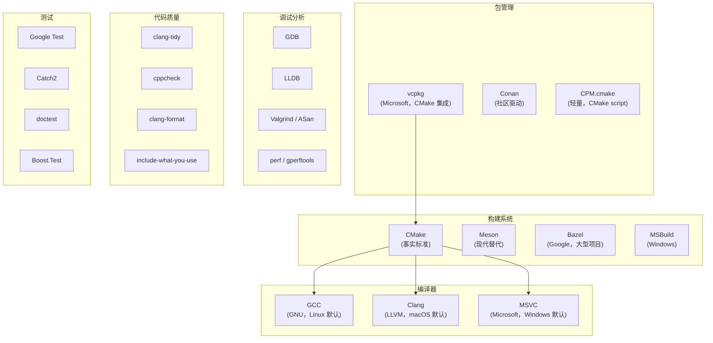

# C++ 开发者全景指南

## 语言画像

| 维度 | 描述 |
|------|------|
| 类型 | **编译型**——源码编译为本地机器码 |
| 类型系统 | **静态、强类型**——编译时类型检查，支持隐式转换和用户定义的类型转换 |
| 内存管理 | **手动 + RAII + 智能指针**——`new`/`delete`（手动）、`unique_ptr`/`shared_ptr`（自动）、`optional`/`variant`（值语义） |
| 范式 | **多范式**——面向对象（类、继承、虚函数）、泛型（模板）、函数式（lambda、`std::function`）、过程式 |
| 运行形态 | **原生机器码**——与 C 同级性能，可静态或动态链接 |
| 标准 | **ISO C++**（C++98→03→11→14→17→20→23→26）。每三年一个新标准 |
| 主要实现 | **GCC**（GNU）、**Clang**（LLVM）、**MSVC**（Microsoft）。三者竞争激烈，标准支持速度各有先后 |

**一句话定位**：C++ 是"你可以控制一切的系统编程语言"——零成本抽象、手动控制内存布局、直接操作硬件。代价是极高的复杂度：世界上最复杂的语言之一，没有单一的正确写法。

### 与 C 的关系

不是简单的超集。C++ 继承了 C 的语法和编译模型，但哲学上分叉：

| | C | C++ |
|------|---|-----|
| 错误处理 | 返回码、goto cleanup | 异常、RAII、`expected`（C++23） |
| 泛型 | 宏 + `void*` | 模板（编译时多态） |
| 多态 | 函数指针 | 虚函数（运行时多态）+ 模板（编译时多态） |
| 资源管理 | 手动 malloc/free | RAII + 智能指针 |
| 字符串 | `char*` | `std::string` / `std::string_view` |
| 容器 | 手动实现 | STL（`vector`, `map`, `unordered_map`...） |

---

## 从源码到运行

与 C 相同的基本流程（参见 [编译通识](../topics/compilation.md)），但 C++ 有独特之处：

```
源码 .cpp + .hpp ──[预处理]──▶ 翻译单元 ──[编译]──▶ .o ──[链接]──▶ 可执行文件
                         │                    │
                         │  模板在此阶段实例化  │
                         │  （模板不是"代码"，   │
                         │   是"代码生成器"）   │
```

### C++ 编译的特殊负担

- **模板实例化**：每个翻译单元独立实例化模板，导致大量重复编译。这是 C++ 编译慢的主要原因之一
- **头文件膨胀**：`#include <iostream>` 展开后可达数万行
- **链接时优化（LTO）**：编译单元之间做内联和优化，增加链接时间
- **C++20 Modules**：试图从语言层面解决头文件的根本问题（`import std;` 替代 `#include <iostream>`），生态仍在迁移

### 增量构建

C++ 项目必须依赖构建系统的增量编译能力。修改一个被 500 个 `.cpp` 包含的头文件 = 重新编译 500 个翻译单元。这也是为什么大型 C++ 项目需要分布式编译（如 distcc、ccache、sccache）。

---

## 工具链地图



### 编译器现状

三者都是高质量实现，但各有侧重：

| | GCC | Clang | MSVC |
|------|-----|-------|------|
| 平台 | Linux 为主 | macOS 默认，跨平台 | Windows 独占（但可交叉编译） |
| C++20 支持 | 完整 | 完整 | 完整 |
| C++23 支持 | 领先 | 紧随 | 部分支持 |
| 诊断信息 | 中等 | 最优 | 中等 |
| LSP 基础 | 较差 | clangd（最佳 C++ IDE 体验） | VS 集成 |

**实际建议**：Linux 上 GCC + Clang 并存（可交叉验证代码）。用 clangd 作为 LSP（基于 Clang 的 AST，补全/跳转最准确）。

### 构建系统：没有选择，是 CMake

CMake 是现代 C++ **唯一的事实标准**。不是"最好"，而是"所有人都用它"。其他构建系统（Meson、Bazel）可能在特定项目/公司中有优势，但 CMake 的生态位不可替代——几乎所有 C++ 库都提供 CMake 集成。

---

## 依赖管理与包生态

与 C 语言面临同样的问题——没有官方包管理器。但近年来情况在改善。

### 主要方案

| 方案 | 说明 | 适用 |
|------|------|------|
| **vcpkg** | Microsoft 维护，与 CMake 深度集成，支持 manifest 模式（`vcpkg.json`） | Windows 优先但跨平台 |
| **Conan** | 社区驱动，Python 编写，类似 pip | 跨平台 |
| **CPM.cmake** | 单个 CMake 脚本，在 CMake 中声明式下载依赖 | 简单、不离开 CMake |
| **系统包管理器** | `apt install libboost-dev` | 快速原型 |
| **Git submodule / FetchContent** | CMake 3.11+ 内置的 `FetchContent` 模块 | 小依赖 |

### vcpkg（当前推荐）

```json
// vcpkg.json（manifest 模式）
{
  "dependencies": [
    "fmt",
    "nlohmann-json",
    "gtest"
  ]
}
```

```cmake
# CMakeLists.txt 中集成
find_package(fmt CONFIG REQUIRED)
find_package(nlohmann_json CONFIG REQUIRED)
target_link_libraries(myapp PRIVATE fmt::fmt nlohmann_json::nlohmann_json)
```

### 为什么 C++ 包管理仍然碎片化

1. **ABI 不兼容**：不同编译器、不同标准库版本、不同编译选项产生的 `.o` 无法互相链接
2. **编译选项敏感**：`-D_GLIBCXX_DEBUG`、`-fno-exceptions`、`-fno-rtti` 等标志改变 ABI
3. **没有标准构建系统**：CMake 是事实标准但不是唯一方案
4. **遗留代码**：大量库不使用现代包管理器

---

## 项目结构约定

### 典型 CMake 项目

```
project/
├── CMakeLists.txt           # 顶层 CMake 配置
├── src/
│   ├── CMakeLists.txt       # 子目录构建配置
│   ├── main.cpp
│   ├── parser.cpp
│   └── network.cpp
├── include/
│   └── mylib/
│       ├── parser.hpp
│       └── network.hpp
├── internal/                 # （可选）内部头文件
├── test/
│   ├── CMakeLists.txt
│   └── test_parser.cpp
├── third_party/              # vendored 依赖
├── cmake/                    # CMake 模块和工具脚本
├── docs/
├── .clang-format             # 格式化配置
├── .clang-tidy               # lint 配置
└── vcpkg.json                # 或 conanfile.txt
```

### 最小 CMakeLists.txt

```cmake
cmake_minimum_required(VERSION 3.21)
project(myapp VERSION 1.0.0 LANGUAGES CXX)

# 设置 C++ 标准
set(CMAKE_CXX_STANDARD 20)
set(CMAKE_CXX_STANDARD_REQUIRED ON)

# 可执行文件
add_executable(myapp
    src/main.cpp
    src/parser.cpp
)

# 库（如果提供可被外部使用的 API）
add_library(mylib
    src/parser.cpp
    src/network.cpp
)
target_include_directories(mylib PUBLIC include)

# 测试
enable_testing()
add_subdirectory(test)
```

---

## 编码习惯与语言惯用法

### 命名

| 类型 | 惯例 | 示例 |
|------|------|------|
| 类/结构体 | PascalCase | `HttpClient` |
| 函数/方法 | PascalCase 或 snake_case（风格分裂） | `ParseConfig()` 或 `parse_config()` |
| 变量 | snake_case | `user_count` |
| 成员变量 | `m_` 前缀（老风格）或 `_` 后缀 | `m_count` 或 `count_` |
| 常量 | kPascalCase 或 SCREAMING_SNAKE | `kMaxRetries` 或 `MAX_RETRIES` |
| 模板参数 | PascalCase 或 T | `typename ValueType` |
| 宏 | SCREAMING_SNAKE_CASE | `#define BUFFER_SIZE 4096` |
| 命名空间 | snake_case 或 小写 | `namespace mylib` |

> C++ 没有统一的命名风格。STL 用 snake_case，Unreal 用 PascalCase，LLVM 用 PascalCase。选择一种并在项目内保持一致。

### 资源管理：RAII（C++ 的核心哲学）

RAII（Resource Acquisition Is Initialization）——资源获取即初始化。这是 C++ 最重要的惯用法：

```cpp
{
    std::ifstream file("data.txt");  // 构造函数获取资源
    // ... 使用 file ...
}  // 析构函数自动释放资源（关闭文件）

// 不需要手动 close()，不需要 defer，不需要 finally
```

RAII 通过**智能指针**扩展到堆内存：
```cpp
auto data = std::make_unique<BigObject>();     // 独占所有权
auto shared = std::make_shared<Cache>();        // 共享所有权
// 离开作用域时自动释放，不需要 delete
```

**核心原则**：永远不要写 `new` 和 `delete`（C++11 起）。使用 `make_unique`/`make_shared`。

### 错误处理

C++ 支持多种错误处理方案，当前在过渡期：

| 方式 | 说明 | 使用场景 |
|------|------|---------|
| **异常** | `throw` / `try` / `catch` | 传统 C++，标准库使用 |
| **错误码（error_code）** | `std::error_code` + `std::expected`（C++23） | 不想要异常开销的场景 |
| **std::expected<T, E>** | C++23 的 Result 类型（类似 Rust） | 新项目推荐 |
| **std::optional<T>** | 值可能存在也可能不存在 | 替代 null 的场景 |

**现状**：Google/LLVM 等大型项目禁用异常（历史原因和性能考量），但现代 C++ 推荐使用异常或 `std::expected`。C++23 的 `std::expected` 正在统一社区。

### 模板（Templates）

C++ 的模板是其最强大也最复杂的特性——它是编译时的代码生成器：

```cpp
template<typename T>
T max(T a, T b) {
    return a > b ? a : b;
}

auto result = max(42, 99);         // 编译器生成 max<int>
auto result2 = max(3.14, 2.71);    // 编译器生成 max<double>
```

关键概念：
- **SFINAE**（Substitution Failure Is Not An Error）：如果模板替换失败，不报错而是尝试其他重载
- **Concepts**（C++20）：给模板参数加约束（`template<std::integral T>`），替代复杂 SFINAE
- **Variadic Templates**：可变参数模板（`template<typename... Args>`）

### 三/五/零法则（Rule of Three/Five/Zero）

| 法则 | 内容 |
|------|------|
| **法则三** | 如果定义了析构函数、拷贝构造函数或拷贝赋值中的一个，很可能需要定义全部三个 |
| **法则五** | C++11 起加上移动构造函数和移动赋值 |
| **法则零** | 不要定义任何这些——让编译器生成，或使用能自我管理的成员（智能指针、容器） |

**现代推荐：法则零**。99% 的类不需要自定义析构函数。

---

## 测试版图

| 工具 | 说明 | 特点 |
|------|------|------|
| **Google Test (GTest)** | 最流行的 C++ 测试框架 | 功能最全，与 Google Mock 配套 |
| **Catch2** | 现代风格的测试框架 | 单头文件，BDD 风格，表达式分解（CATCH_REQUIRE） |
| **doctest** | Catch2 的超轻量替代 | 编译极快，单头文件 |
| **Boost.Test** | Boost 库的一部分 | 老牌，功能丰富但笨重 |

### Catch2 示例

```cpp
#include <catch2/catch_test_macros.hpp>

TEST_CASE("addition works", "[math]") {
    REQUIRE(add(2, 3) == 5);
}

TEST_CASE("division by zero throws", "[math]") {
    REQUIRE_THROWS_AS(divide(1, 0), std::domain_error);
}
```

| 辅助工具 | 说明 |
|----------|------|
| **Google Mock** | mock 框架（与 GTest 配套） |
| **gcov + lcov** | 覆盖率（GCC） |
| **ASan / UBSan / TSan** | 编译器内置的 sanitizer（强烈推荐开发期间开启） |

---

## 部署与分发

与 C 基本相同（参见 [C 语言指南](c.md#部署与分发)）：

- **静态二进制**：推荐，避免 ABI 地狱
- **动态库**：ABI 兼容性是大问题（`libstdc++.so` 版本不匹配）
- **包管理器**：通过 vcpkg/Conan 发布
- **系统包管理器**：`lib*-dev` 包
- **Docker 容器**：现代部署主流方案

### C++ ABI 兼容性

不同编译器版本、不同标准库版本、不同编译标志编译的二进制可能互不兼容。这是 C++ 部署最大的痛点。

---

## 代表性项目

| 项目 | 规模 | 为什么值得研究 |
|------|------|---------------|
| [LLVM](https://github.com/llvm/llvm-project) | ~500 万行 | 编译器基础设施。现代 C++ 工程组织的教科书——模块化、CMake 构建、LTO 使用 |
| [Chromium](https://chromium.googlesource.com/chromium/src) | ~3500 万行 | 世界上最大的 C++ 项目之一。多进程架构、沙箱模型、构建系统（GN+Ninja） |
| [Qt](https://code.qt.io/cgit/qt/qtbase.git) | ~200 万行 | GUI 框架。信号-槽机制（MOC 代码生成）、跨平台抽象的工业实现 |
| [fmtlib](https://github.com/fmtlib/fmt) | ~5 万行 | 格式化库（C++20 `std::format` 的来源）。编译时字符串处理的范本 |
| [Abseil](https://github.com/abseil/abseil-cpp) | ~50 万行 | Google 的 C++ 基础库。"Google 风格 C++"的参考实现 |
| [SerenityOS](https://github.com/SerenityOS/serenity) | ~150 万行 | 从零实现的类 Unix 操作系统。展示 C++ 在系统编程中的现代用法 |
| [Hyprland](https://github.com/hyprwm/Hyprland) | ~10 万行 | Wayland 合成器。现代 C++20/23 在 Linux 桌面领域的实践 |

---

## 实用入门路径

### 最小环境

```bash
# Linux
sudo apt install build-essential g++ cmake gdb    # Debian/Ubuntu
sudo pacman -S base-devel cmake gdb                # Arch

# macOS
xcode-select --install    # Clang + LLDB + CMake（通过 brew install cmake）

# Windows
# 推荐: Visual Studio Build Tools + vcpkg
```

### 第一个项目

```bash
mkdir hello-cpp && cd hello-cpp

cat > main.cpp << 'EOF'
#include <iostream>
#include <vector>
#include <algorithm>

int main() {
    std::vector<int> nums = {3, 1, 4, 1, 5, 9};
    std::sort(nums.begin(), nums.end());           // STL 算法
    for (int n : nums) std::cout << n << " ";      // range-for
    std::cout << "\n";
}
EOF

cat > CMakeLists.txt << 'EOF'
cmake_minimum_required(VERSION 3.21)
project(hello VERSION 1.0.0 LANGUAGES CXX)
set(CMAKE_CXX_STANDARD 20)
set(CMAKE_CXX_STANDARD_REQUIRED ON)
add_executable(hello main.cpp)
EOF

cmake -B build && cmake --build build && ./build/hello
```

### 学习路线建议

C++ 的学习曲线是所有语言中最陡峭的之一。建议分阶段学习：

**阶段 1：C++ 基础（用 C++ 写更好的 C）**
- STL 容器：`vector`、`string`、`map`、`unordered_map`
- 智能指针：`unique_ptr`、`shared_ptr`（不要再写 `new`/`delete`）
- 范围 for、auto、lambda
- 理解 RAII：为什么不需要手动释放资源

**阶段 2：C++ 核心（掌握 C++ 独特的能力）**
- 模板基础：函数模板、类模板
- 移动语义：`std::move`、右值引用、移动构造函数
- 异常安全：基本保证、强保证
- CMake 基础：target 模型、find_package

**阶段 3：C++ 进阶**
- Concepts（C++20）：约束模板参数
- 模板元编程：`constexpr`、`if constexpr`、`std::tuple`
- 协程（C++20）：`co_await`、`co_yield`
- Modules（C++20）：`import std;`

### 关键资源

- **cppreference.com**：C++ 的权威在线参考，比标准文档更可读
- **A Tour of C++ (Bjarne Stroustrup)**：C++ 之父的快速概览（~200 页）
- **Effective Modern C++ (Scott Meyers)**：C++11/14 的最佳实践
- **C++ Core Guidelines**：isocpp.github.io/CppCoreGuidelines，Bjarne 和 Herb Sutter 维护的编码规范
- **Compiler Explorer**：godbolt.org，在线查看 C++ 编译后的汇编输出
- **CMake 官方教程**：cmake.org/cmake/help/latest/guide/tutorial
