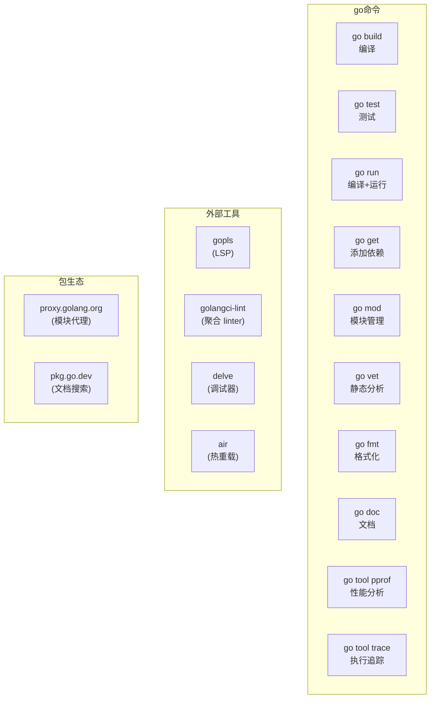

# Go 语言开发者全景指南

## 语言画像

| 维度 | 描述 |
|------|------|
| 类型 | **编译型**——源码编译为静态链接的本地二进制文件 |
| 类型系统 | **静态、强类型**——编译时类型检查完毕，无隐式转换 |
| 内存管理 | **并发 GC**——三色标记清扫，低延迟（STW 通常在微秒级） |
| 范式 | **过程式 + 接口多态**——不是 OOP（无继承、无类），通过 interface 实现多态 |
| 运行形态 | **静态链接的本地二进制**——每个 Go 程序是一个自包含的可执行文件 |
| 标准 | **无正式标准**。Google 主导语言设计，Go 团队控制核心演进。有 Go 1 兼容性承诺 |
| 主要实现 | **gc**（Go 团队官方编译器 + 运行时，唯一主流）、gccgo（GCC 前端，边缘） |

**一句话定位**：Go 是为"大规模网络服务和并发后端"设计的语言。核心主张：**极简**——语法少、关键词少、特性少，把复杂度从语言层面转移到工具链和工程规范层面。

---

## 从源码到运行

```
源码 .go ──[编译]──▶ 目标文件 .o ──[链接]──▶ 静态可执行文件
                      │
                      └── 运行时被链接到每个二进制中（GC、goroutine 调度器）
```

Go 编译的特点：

- **极快的编译速度**：Go 1 设计时就以编译速度为第一优先级。依赖图分析、无头文件、语法极简共同保证了这一点
- **每个 Go 二进制自带运行时**：GC、goroutine 调度器、channel 实现都随二进制分发，不依赖外部 .so
- **交叉编译极其简单**：`GOOS=linux GOARCH=arm64 go build` 即可
- **无预处理器、无宏**：这是 Go 与 C 的哲学分叉——牺牲灵活性换取可读性和编译速度
- **Cgo**：允许 Go 调用 C 代码（以及 C 调用 Go），但代价是失去交叉编译的便利和编译速度

---

## 工具链地图

Go 的工具链是它最被称赞的部分——**几乎一切功能都整合在 `go` 命令中**。



**核心哲学**：Go 不需要 Makefile、不需要 CMakeLists.txt、不需要 setup.py。`go build` 自动处理所有依赖解析和编译。

### 关键工具

| 工具 | 说明 |
|------|------|
| **go build** | 编译当前模块的所有源文件 |
| **go test** | 运行测试（内建测试框架，无需 pytest 之类的外部工具） |
| **go get** | 添加/升级依赖 |
| **go fmt** | 代码格式化（社区强制统一，零争议） |
| **go vet** | 官方静态分析工具 |
| **gopls** | Go 语言服务器（LSP），驱动编辑器补全/跳转/重构 |
| **golangci-lint** | 社区标配的聚合 linter（整合数十个检查器） |
| **delve** | Go 专用调试器（GDB 对 Go 支持不佳） |

---

## 依赖管理与包生态

### 演变历史：混乱→统一

Go 的包管理经历了一段混乱期才收敛到今天的方案：

1. **GOPATH 时代**（Go 1.0–1.10）：所有代码必须放在 `$GOPATH/src/` 下，依赖通过 `go get` 拉取到全局 GOPATH
2. **dep 时代**（2017–2018）：社区推动的官方实验，提供锁定版本的能力
3. **Go Modules**（Go 1.11+，1.16 起默认）：今天唯一正确的方案

### Go Modules（当前方案）

```bash
go mod init github.com/you/project    # 初始化模块，创建 go.mod
go get github.com/gin-gonic/gin       # 添加依赖
go mod tidy                           # 清理未使用的依赖
go mod vendor                         # 将依赖 vendoring 到 vendor/ 目录
```

- **go.mod**：声明模块路径和依赖的版本约束
- **go.sum**：所有依赖的加密哈希（不是锁文件！只是校验和）
- **MVS（最小版本选择）**：Go 的依赖解析算法——不选"最新兼容版本"，而选"满足所有约束的最旧版本"

### 包注册：去中心化

Go 没有注册中心。模块路径即导入路径，也即仓库 URL：

```
import "github.com/gin-gonic/gin"
```

这行代码同时告诉 Go 工具链：从 `github.com/gin-gonic/gin` 拉取源码。

- **proxy.golang.org**：Google 运行的模块代理（缓存和加速下载，非注册中心）
- **pkg.go.dev**：自动索引所有开源 Go 包的文档
- **sum.golang.org**：校验和数据库（防篡改）

### Go mod 独特设计：MVS

与 npm/pip 的"选最新版本"策略不同，Go 的 **MVS（Minimum Version Selection）** 选择满足所有约束的**最旧**版本：

```
项目需要 A v1.2.0 和 B v1.0.0
      而 B v1.0.0 依赖 A v1.0.0
结果：选择 A v1.2.0（满足两个约束中较新的那个）
```

开发者通过显式 `go get -u` 来升级——构建结果不是"碰巧的"，而是明确的。

---

## 项目结构约定

Go 社区有较强的结构约定，没有官方强制但有事实标准。

```
project/
├── go.mod                # 模块定义
├── go.sum                # 校验和
├── main.go               # 入口（对于可执行项目）
├── cmd/                  # 命令入口（多命令项目）
│   ├── server/
│   │   └── main.go
│   └── worker/
│       └── main.go
├── internal/             # 内部包（编译器强制不可被外部导入）
│   ├── config/
│   └── storage/
├── pkg/                  # 可被外部导入的公共库包（有争议，部分人认为应扁平化）
│   └── api/
├── api/                   # API 定义（OpenAPI/gRPC proto）
├── test/                  # 集成测试数据
└── scripts/               # 构建/部署脚本
```

**关键惯例**：

- `internal/` 是编译器级别的封装边界——外部模块无法导入
- `cmd/` 存放多个 `main` 包，每个一个子目录
- Go 不使用 `src/` 目录——项目根目录即包根目录
- 包名全部小写、单数、无下划线

### 最小项目

```
hello/
├── go.mod       # module hello
└── main.go      # package main; func main() { ... }
```

---

## 编码习惯与语言惯用法

### 命名

| 类型 | 惯例 | 说明 |
|------|------|------|
| 导出标识符 | PascalCase | 首字母大写 = public |
| 非导出标识符 | camelCase | 首字母小写 = package-private |
| 变量 | camelCase | `userCount` |
| 缩写 | 全大写或全小写 | `HTTPServer` 或 `httpServer` |
| 包名 | 全小写、单数 | `config`, `server`, `user` |

### 错误处理：Go 最被讨论的惯用法

Go 没有异常，没有 try-catch。函数返回 `error` 作为最后一个返回值：

```go
f, err := os.Open("file.txt")
if err != nil {
    return fmt.Errorf("opening file: %w", err)
}
defer f.Close()
```

- `if err != nil` 是 Go 中最常见的代码行
- `%w` 动词包装错误，保留错误链（`errors.Is` / `errors.As` 可检查）
- **defer** 是 Go 的资源管理方式——确保函数退出时执行（类似 Python 的 `with` / C 的 cleanup goto）

### 并发模型：Goroutine + Channel

Go 的并发是基于 **CSP（Communicating Sequential Processes）** 理论的：

```go
go doSomething()    // 启动一个 goroutine，开销极小（~2KB 栈）

ch := make(chan int, 10)  // 有缓冲 channel
ch <- 42                  // 发送
val := <-ch               // 接收
```

- **Goroutine**：极轻量的用户态线程（比 OS 线程小 2-3 个数量级）
- **Channel**：goroutine 之间安全通信的管道
- **select**：在多个 channel 操作间等待（类似多路复用）
- **sync 包**：提供传统的 mutex、waitgroup 等原语

哲学的演变：早期鼓吹"用 channel 通信，不用共享内存"。如今更务实：**用适合问题的方式**，mutex 和 channel 各有适用场景。

### 接口（Interface）

Go 的接口是**隐式实现**的——不需要声明 `implements`：

```go
type Reader interface {
    Read([]byte) (int, error)
}

// 任何有 Read 方法的类型自动实现了 Reader
// 没有 "implements" 关键字
```

这被称为**结构类型（structural typing）**——鸭子类型，但有编译时检查。这是 Go 实现多态的唯一方式。

### 零值（Zero Value）

所有类型都有默认零值（`int`=0, `string`="" , `pointer`=nil），这影响了 Go 的代码风格——没有"未初始化"的变量。

---

## 测试版图

Go 的测试开发工具链高度内聚：

| 工具 | 说明 |
|------|------|
| **go test** | 内置测试运行器 |
| **testing** | 标准库测试框架 |
| **Testify** | 社区最流行的断言和 mock 库（补充标准库） |
| **httptest** | 标准库 HTTP 测试辅助（极好） |
| **go test -bench** | 内置基准测试 |
| **go test -race** | 数据竞争检测器（重要！） |
| **go test -cover** | 内置覆盖率 |
| **go test -fuzz** | 内置模糊测试（Go 1.18+） |

### 测试组织

```go
// calculator_test.go（与 calculator.go 在同一目录、同一 package）
func TestAdd(t *testing.T) {
    result := Add(2, 3)
    if result != 5 {
        t.Errorf("Add(2,3) = %d; want 5", result)
    }
}

// 表驱动测试（Go 的标志性测试惯用法）
func TestAdd_Table(t *testing.T) {
    tests := []struct {
        a, b, expected int
    }{
        {1, 2, 3},
        {0, 0, 0},
        {-1, 1, 0},
    }
    for _, tt := range tests {
        if got := Add(tt.a, tt.b); got != tt.expected {
            t.Errorf("Add(%d,%d) = %d; want %d", tt.a, tt.b, got, tt.expected)
        }
    }
}
```

---

## 部署与分发

Go 的部署是它最大的工程优势之一。

### 默认：静态链接的单一二进制

```bash
go build -o myapp .
# myapp 是一个自包含的可执行文件（包含 Go 运行时 + 所有依赖）
# 复制到任何相同架构的机器上即可运行
```

### 交叉编译

```bash
GOOS=linux   GOARCH=amd64 go build -o myapp-linux   .
GOOS=darwin  GOARCH=arm64 go build -o myapp-mac     .
GOOS=windows GOARCH=amd64 go build -o myapp.exe     .
```

### 容器化

Go 的静态二进制特性使其成为容器部署的理想语言：

```dockerfile
FROM scratch                          # 空镜像！不需要 glibc
COPY myapp /myapp
ENTRYPOINT ["/myapp"]
```

产物镜像可小至 ~5MB（编译后的二进制 + scratch 基础镜像）。

### CGO 的代价

如果使用了 CGO（调用 C 代码），则失去静态链接和简单交叉编译的优势。CGO 开启后：
- 二进制变成动态链接（依赖 libc）
- 交叉编译需要 C 交叉工具链
- 编译速度显著下降

**规则**：尽可能避免 CGO。大多数 Go 项目不需要它。

---

## 代表性项目

| 项目 | 规模 | 为什么值得研究 |
|------|------|---------------|
| [Go 标准库](https://github.com/golang/go/tree/master/src) | ~200 万行 | 最好的 Go 代码范本。`net/http`、`encoding/json` 是中间件和流式处理的典范 |
| [Docker / Moby](https://github.com/moby/moby) | ~40 万行 | 容器引擎。展示如何用系统调用（namespaces/cgroups）实现容器 |
| [Kubernetes](https://github.com/kubernetes/kubernetes) | ~300 万行 | 云原生操作系统。控制器模式（reconcile loop）的设计范本 |
| [Prometheus](https://github.com/prometheus/prometheus) | ~20 万行 | 监控系统。TSDB 存储引擎的 Go 实现，TSDB 的持久化设计 |
| [Caddy](https://github.com/caddyserver/caddy) | ~15 万行 | 自动 HTTPS 的 Web 服务器。展示如何用接口构建插件系统 |
| [Hugo](https://github.com/gohugoio/hugo) | ~20 万行 | 最快的静态站点生成器。展示 Go 的并发能力在批处理中的应用 |
| [etcd](https://github.com/etcd-io/etcd) | ~15 万行 | 分布式键值存储。Raft 共识算法的 Go 参考实现 |
| [TinyGo](https://github.com/tinygo-org/tinygo) | ~10 万行 | Go 的微型化编译器（面向 MCU/嵌入式/Wasm）。展示 LLVM 在 Go 的应用 |

---

## 实用入门路径

### 最小环境

```bash
# 从 go.dev/dl 下载安装
wget https://go.dev/dl/go1.23.0.linux-amd64.tar.gz
sudo tar -C /usr/local -xzf go1.23.0.linux-amd64.tar.gz
export PATH=$PATH:/usr/local/go/bin   # 添加到 ~/.bashrc 或 ~/.config/fish/config.fish
```

### 第一个项目

```bash
mkdir hello-go && cd hello-go
go mod init hello
cat > main.go << 'EOF'
package main
import "fmt"
func main() { fmt.Println("hello, world") }
EOF
go run main.go
```

### 学习路线建议

1. **理解 Go 的类型系统**：struct、interface、method set。隐式接口是 Go 核心设计
2. **掌握并发原语**：goroutine、channel、select、sync 包。不要过早使用 channel
3. **理解错误处理**：`errors.Is` / `errors.As`、`%w` 包装、sentinel error vs error type
4. **学习标准库的精华**：`net/http`（HTTP 服务器）、`context`（超时和取消）、`io.Reader/Writer`（流式处理）
5. **使用 profiling 工具**：`go tool pprof` 和 `go test -bench`
6. **理解内存模型**：escape analysis、栈 vs 堆、GC 调优

### 关键资源

- **Go 官方 Tour**：tour.golang.org，交互式学习
- **Effective Go**：官方文档，Go 惯用法权威指南
- **The Go Programming Language (Donovan & Kernighan)**：K&R 风格的 Go 书
- **go.dev**：官方门户，文档+包搜索+学习资源
- **Go by Example**：gobyexample.com，常用模式的代码速查
