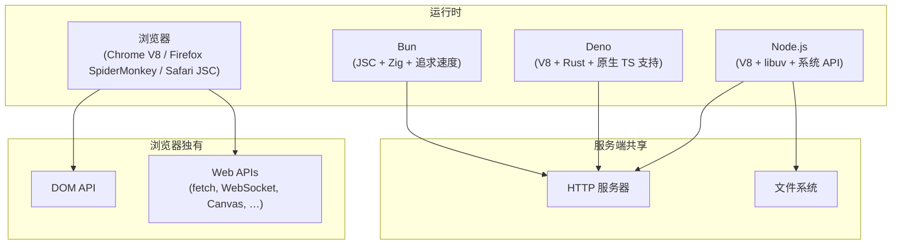
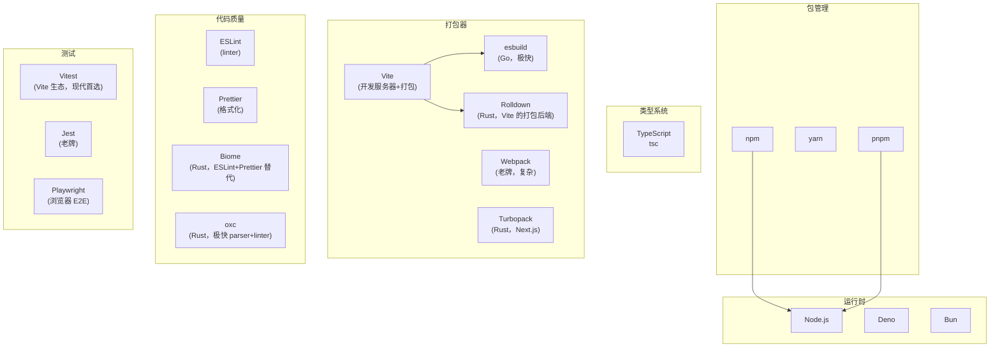

# JavaScript / TypeScript 开发者全景指南

> **范围说明**：本文涵盖 JavaScript 语言本身和 TypeScript 类型层。前端框架/打包器详见 [前端开发全景指南](../domains/frontend.md)，Node.js 后端开发详见 [后端开发全景指南](../domains/backend.md)。

## 语言画像

### JavaScript

| 维度 | 描述 |
|------|------|
| 类型 | **JIT 编译 + 解释混合**——现代 JS 引擎（V8、JavaScriptCore、SpiderMonkey）先解析为字节码，热路径经 JIT 编译为本地代码 |
| 类型系统 | **动态、弱类型**——变量无类型，隐式类型转换（`"3" + 3` = `"33"`） |
| 内存管理 | **分代 GC**——标记-清除为主，无手动内存管理 |
| 范式 | **多范式**——面向对象（原型继承）+ 函数式（一等公民函数、闭包）+ 事件驱动 |
| 运行形态 | **宿主环境决定**——浏览器（DOM+Web API）、Node.js（fs+net 等系统 API）、Deno、Bun |
| 标准 | **ECMAScript**（ECMA-262）。TC39 委员会以年为单位发布新版本（ES2015→ES2024） |
| 主要引擎 | **V8**（Chrome/Node.js/Deno）、**JavaScriptCore**（Safari/Bun）、**SpiderMonkey**（Firefox） |

### TypeScript

TypeScript 是 JavaScript 的**类型超集**——任何合法的 JS 都是合法的 TS。它添加了静态类型系统，但在编译到 JS 时类型被擦除（类型没有运行时开销）。

| 维度 | 描述 |
|------|------|
| 类型系统 | **渐进式静态类型**——可以逐步为 JS 代码添加类型注解。类型在编译时被擦除 |
| 编译目标 | 输出纯 JavaScript。可以指定目标 ES 版本（`"target": "ES2022"`） |
| 编译器 | **tsc**（TypeScript 编译器），由 Microsoft 维护 |
| 类型空间 | 类型和值分属两个空间——类型断言 `as`、泛型 `Array<T>` 等仅存在于编译期 |

---

## 运行时全景

JavaScript 最独特之处：**同一种语言运行在浏览器和服务器两端**。



### 各运行时特点

| | Node.js | Deno | Bun |
|------|---------|------|-----|
| 首次发布 | 2009 | 2020 | 2023 |
| 包管理 | npm/yarn/pnpm | 内置（URL import + deno.json） | 内置（兼容 npm） |
| TS 支持 | 需额外配置 | 原生 | 原生 |
| 权限模型 | 无 | 默认拒绝（需显式授权） | 无 |
| 模块系统 | CJS + ESM（双模块） | 仅 ESM | CJS + ESM |
| 最佳场景 | 生态最全、生产环境首选 | 安全优先、CLI 工具 | 追求极致速度 |

---

## 工具链地图

JavaScript 的工具链是所有语言生态中最复杂的——部分原因是历史积累，部分是因为它覆盖前后端两个完全不同的领域。



### 关键工具速解

| 工具 | 解决的问题 | 备注 |
|------|-----------|------|
| **Node.js** | 在服务器上运行 JS | 生态的锚点，所有工具链基于它（即便用 Deno/Bun 也常需要 Node 兼容） |
| **npm / yarn / pnpm** | 包管理 | pnpm 因磁盘效率和严格依赖解析正成为新标准 |
| **TypeScript (tsc)** | 为 JS 添加类型系统 | 现代 JS 开发的默认选择 |
| **Vite** | 开发服务器 + 生产构建 | 已取代 Webpack 成为主流 |
| **ESLint** | 代码规范检查 | 每个项目标配 |
| **Prettier / Biome** | 代码格式化 | Prettier 是当前标准，Biome 在追赶 |
| **Vitest** | 测试运行器 | 与 Vite 生态深度集成 |
| **Playwright** | 浏览器端到端测试 | 跨浏览器、跨平台的 UI 测试 |

---

## 依赖管理与包生态

### npm 注册中心

**npmjs.com** 是世界上最大的包注册中心（500 万+ 包）。npm（Node Package Manager）是 Node.js 的默认包管理器。

### 声明文件：package.json

```json
{
  "name": "myapp",
  "version": "1.0.0",
  "type": "module",
  "scripts": {
    "dev": "vite",
    "build": "vite build",
    "test": "vitest run"
  },
  "dependencies": {
    "express": "^4.18.0"
  },
  "devDependencies": {
    "typescript": "^5.4.0",
    "vite": "^5.0.0",
    "vitest": "^1.0.0"
  }
}
```

- **dependencies**：运行时需要的包
- **devDependencies**：仅开发时需要（测试框架、打包器、类型定义等）
- **peerDependencies**：要求宿主提供（插件系统用）
- **scripts**：定义可执行命令（`npm run build`、`npm test`）

### npm vs yarn vs pnpm

| | npm | yarn | pnpm |
|------|-----|------|------|
| 安装速度 | 中 | 中 | 快（硬链接+内容寻址存储） |
| 磁盘效率 | 低（每项目独立 `node_modules`） | 中 | 高（全局 store + 硬链接） |
| 幽灵依赖 | 存在（可访问未声明的依赖） | 较少 | 无（严格解析） |
| 锁文件 | `package-lock.json` | `yarn.lock` | `pnpm-lock.yaml` |
| 当前定位 | 默认选择 | 仍然健康 | 新项目推荐 |

### 模块系统：CJS vs ESM

JavaScript 有**两套不兼容的模块系统**，这是目前最大的痛点：

| | CommonJS (CJS) | ES Modules (ESM) |
|------|----------------|-------------------|
| 导入 | `const x = require('x')` | `import x from 'x'` |
| 导出 | `module.exports = x` | `export default x` / `export { x }` |
| 加载时机 | 运行时（同步） | 编译时（静态分析） |
| 文件后缀 | `.js` / `.cjs` | `.js`/`.mjs`（`"type":"module"` 时） |
| 生态 | Node.js 传统默认 | 浏览器原生 + 现代 Node.js |

**现状**：ESM 是未来，CJS 是历史包袱。大多数新项目使用 ESM，但大量 npm 包仍是 CJS。TypeScript 的 `"moduleResolution"` 配置处理这种双模式。

---

## 项目结构约定

### 现代前端/Node 项目（Vite + TypeScript）

```
project/
├── package.json           # 项目元数据和依赖
├── tsconfig.json          # TypeScript 配置
├── vite.config.ts         # Vite 构建配置
├── index.html             # 入口 HTML（前端项目）
├── src/
│   ├── main.ts            # 应用入口
│   ├── components/        # 组件
│   ├── utils/
│   └── types/             # 类型声明
├── public/                # 静态资源（直接复制到构建产物）
├── tests/
├── node_modules/          # 安装的依赖（不提交）
├── dist/                  # 构建产物（不提交）
└── .env / .env.local      # 环境变量
```

### 最小包（npm 库）

```
mylib/
├── package.json
├── tsconfig.json
├── src/
│   └── index.ts
└── dist/                  # tsc 编译产物
```

---

## 编码习惯与语言惯用法

### 命名

| 类型 | JavaScript | TypeScript 额外 |
|------|-----------|----------------|
| 变量/函数 | camelCase | 同 |
| 类/组件 | PascalCase | 同 |
| 常量 | SCREAMING_SNAKE_CASE 或 camelCase | 同 |
| 接口/类型 | — | PascalCase（`interface User`, `type Config`） |
| 私有成员 | `_` 前缀（约定） / `#` 前缀（ES2022 真私有） | 同 |
| 文件名 | kebab-case 或 camelCase | 同 |

### async/await

现代 JavaScript 的异步编程统一为 async/await：

```typescript
// Promise 链（旧）
fetch(url)
  .then(res => res.json())
  .then(data => console.log(data))
  .catch(err => console.error(err));

// async/await（现代）
try {
  const res = await fetch(url);
  const data = await res.json();
  console.log(data);
} catch (err) {
  console.error(err);
}
```

### 解构（Destructuring）

```typescript
const { name, age } = user;
const [first, ...rest] = array;
const { data: { items } } = response;  // 重命名 + 嵌套
```

### 可选链和空值合并

```typescript
const city = user?.address?.city;         // 可选链（如果中间任一步是 null/undefined，返回 undefined）
const name = input ?? "default";           // 空值合并（仅 null/undefined 触发默认值，不同于 || 的行为）
```

### 函数式惯用法

```typescript
// map / filter / reduce 替代 for 循环
const names = users
  .filter(u => u.active)
  .map(u => u.name);

// 展开运算符
const merged = { ...defaults, ...overrides };
const combined = [...arr1, ...arr2];
```

### TypeScript 类型惯用法

```typescript
// 联合类型（Union Types）
type Status = "idle" | "loading" | "success" | "error";

// 区分联合（Discriminated Union）
type Result<T> = { type: "ok"; value: T } | { type: "err"; error: Error };

// 泛型约束
function pick<T, K extends keyof T>(obj: T, keys: K[]): Pick<T, K> { ... }

// satisfies（TS 4.9+）：检查类型但不扩宽类型推断
const config = { port: 3000 } satisfies ServerConfig;
```

---

## 测试版图

| 工具 | 类型 | 说明 |
|------|------|------|
| **Vitest** | 单元/集成测试 | Vite 生态，兼容 Jest API，速度更快，推荐 |
| **Jest** | 单元/集成测试 | 老牌标准，生态最丰富 |
| **Playwright** | E2E（浏览器） | 多浏览器（Chromium/Firefox/WebKit），自动等待，推荐 |
| **Cypress** | E2E（浏览器） | 老牌，实时重载，仅支持部分浏览器 |
| **Storybook** | 组件测试/文档 | 隔离开发和测试 UI 组件 |
| **Testing Library** | 测试辅助 | 以用户视角测试 UI（`@testing-library/react` 等） |

### Vitest 示例

```typescript
import { describe, it, expect, vi } from 'vitest';

describe('add', () => {
  it('adds two numbers', () => {
    expect(add(2, 3)).toBe(5);
  });

  it('calls the logger', () => {
    const logger = { log: vi.fn() };
    addWithLogger(2, 3, logger);
    expect(logger.log).toHaveBeenCalledWith(5);
  });
});
```

---

## 部署与分发

### npm 包发布

```bash
npm login
npm publish              # 发布到 npmjs.com
npm publish --access public  # 公开包
```

### 前端应用部署

1. `npm run build`（或 `vite build`）→ 生成 `dist/` 目录
2. `dist/` 中的文件是静态 HTML/JS/CSS，可部署到任何静态托管服务（Vercel、Netlify、Cloudflare Pages、S3 + CDN、Nginx）

### 后端应用部署

- **传统**：`node server.js`（配合 pm2 进程管理）
- **容器化**：Docker 镜像（Node.js 基础镜像 + npm install + npm start）
- **Serverless**：Vercel Functions、AWS Lambda、Cloudflare Workers

---

## 代表性项目

| 项目 | 规模 | 为什么值得研究 |
|------|------|---------------|
| [TypeScript](https://github.com/microsoft/TypeScript) | ~100 万行 | TypeScript 编译器本身是 TypeScript 写的。`src/compiler/checker.ts` 是类型检查器的核心 |
| [React](https://github.com/facebook/react) | ~30 万行 | UI 库，Fiber 架构（可中断渲染）、Hooks 系统的设计 |
| [Vue](https://github.com/vuejs/core) | ~8 万行 | 渐进式框架，响应式系统（`@vue/reactivity`）的独立设计 |
| [Vite](https://github.com/vitejs/vite) | ~8 万行 | 构建工具，原生 ESM 开发服务器的实现，插件系统的设计 |
| [VS Code](https://github.com/microsoft/vscode) | ~130 万行 | 基于 Electron 的编辑器，LSP/插件架构的工业实现 |
| [esbuild](https://github.com/evanw/esbuild) | ~5 万行 | Go 写的 JS 打包器。展示为什么速度在工具链中如此重要 |
| [Prettier](https://github.com/prettier/prettier) | ~8 万行 | 代码格式化器，展示如何处理多语言的 AST 格式化 |
| [Hono](https://github.com/honojs/hono) | ~3 万行 | 超轻量 Web 框架（支持多运行时），展示如何设计多平台兼容的库 |

---

## 实用入门路径

### 最小环境

```bash
# 选项 A: Node.js（最主流）
# 从 nodejs.org 下载，或通过版本管理器
curl -o- https://raw.githubusercontent.com/nvm-sh/nvm/v0.40.0/install.sh | bash
nvm install 22
nvm use 22

# 选项 B: Bun（追求速度）
curl -fsSL https://bun.sh/install | bash

# 选项 C: Deno（追求安全）
curl -fsSL https://deno.land/install.sh | sh
```

### 第一个项目

```bash
# 使用 Vite + TypeScript 模板
npm create vite@latest hello-ts -- --template vanilla-ts
cd hello-ts
npm install
npm run dev       # 启动开发服务器（热重载）

# 或纯 Node.js 脚本
mkdir hello-node && cd hello-node
cat > index.ts << 'EOF'
const greeting: string = "hello, world";
console.log(greeting);
EOF
npx tsx index.ts
```

### 学习路线建议

1. **理解 JavaScript 运行时**：事件循环（event loop）、宏任务/微任务（理解 `setTimeout` vs `await`）
2. **掌握 ESM 模块系统**：理解它与 CJS 的区别，`import`/`export` 语法
3. **理解 this 和闭包**：JS 最独特的两个概念（箭头函数解决了 `this` 问题）
4. **掌握 Promise 和 async/await**：现代 JS 异步的核心
5. **学习 TypeScript**：理解类型空间的独立存在，泛型、联合类型、条件类型
6. **深入你的运行时**：浏览器（DOM、Web API）或 Node.js（fs、net、stream）

### 关键资源

- **MDN Web Docs**：developer.mozilla.org，JS 的权威参考
- **TypeScript Handbook**：typescriptlang.org/docs/handbook
- **JavaScript.info**：javascript.info，现代 JS 教程
- **Node.js 官方文档**：nodejs.org/docs
- **TC39 Proposals**：github.com/tc39/proposals，跟踪语言新特性
- **Vite 文档**：vitejs.dev
