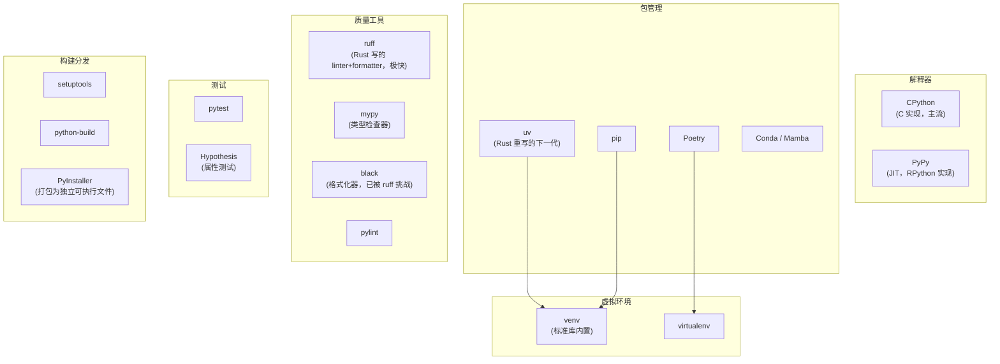

# Python 开发者全景指南

## 语言画像

| 维度 | 描述 |
|------|------|
| 类型 | **解释型**（主流实现 CPython 是源码→字节码→虚拟机执行）。存在 JIT 变体（PyPy）和 AOT 编译尝试（Cython、mypyc） |
| 类型系统 | **动态、强类型**——变量无类型声明但运行时检查类型（`"3" + 3` 会报错，不像 JS 会隐式转换）。自 3.5 起支持渐进类型注解 |
| 内存管理 | **引用计数 + 分代 GC**——引用计数处理大多数对象释放，GC 处理循环引用 |
| 范式 | **多范式**——面向对象、过程式、函数式（有限的）、元编程（强大的自省和装饰器） |
| 运行形态 | 源码 → 编译为字节码 `.pyc` → Python 虚拟机执行 |
| 标准 | **无正式标准**。CPython 是参考实现，语言规范由 PEP（Python Enhancement Proposal）定义 |
| 主要实现 | **CPython**（C 编写，绝对主流）、PyPy（JIT，RPython 编写）、Jython（JVM，已停滞）、IronPython（.NET，已停滞） |

**一句话定位**：Python 是通用胶水语言——数据科学、Web 后端、自动化运维、教育科研的"第二语言"。设计哲学强调可读性和"只用一种方式做一件事"。

---

## 从源码到运行

```
源码 .py ──[解析]──▶ AST ──[编译]──▶ 字节码 .pyc ──[Python 虚拟机]──▶ 输出
```

与 C 语言的关键区别：
- **没有链接阶段**：import 在运行时解析和加载模块
- **字节码是平台无关的**：`.pyc` 可以在任何有 Python 虚拟机的系统上运行
- **编译是隐式的**：开发者通常不感知 `import` 触发的编译过程
- `.pyc` 缓存于 `__pycache__/` 目录，加速重复导入

### CPython 是 C 程序

CPython 本身是用 C 编写的。这意味着：
- 可以用 C 编写 Python 扩展（`#include <Python.h>`，通过 Python C API）
- C 扩展编译为 `.so`/`.pyd`，在 Python 中被 `import`
- Cython、pybind11 等项目简化了 C/C++ ↔ Python 互操作

---

## 工具链地图



### 包管理器的演变史（理解这个才能理解当前的混乱）

Python 包管理的工具链经历了曲折的演变：

1. **distutils**（2001）：标准库内置，功能稀少
2. **setuptools**（2004）：distutils 的增强替代，`setup.py` + `easy_install`
3. **pip**（2011）：取代 `easy_install`，成为事实标准的安装器
4. **virtualenv**（2007）→ **venv**（3.3+ 内置）：隔离项目环境
5. **Pipenv**（2017）：试图统一 pip + virtualenv，但没有取代它们
6. **Poetry**（2019）：锁定依赖+构建+发布一体化
7. **pyproject.toml**（PEP 517/518/621）：标准化项目元数据和构建配置
8. **uv**（2024）：Rust 重写的 pip+venv+pip-compile 替代品，极大提速

**当前局面**：Python 社区正在从 `setup.py` + `requirements.txt` 时代向 `pyproject.toml` + `uv/poetry` 时代迁移。老项目仍大量使用旧工具。

### 关键工具说明

| 工具 | 解决的问题 |
|------|-----------|
| **pip** | 从 PyPI 安装包到当前环境 |
| **venv** | 创建项目隔离的 Python 环境 |
| **uv** | pip + venv + pip-tools 的一体化替代，极快 |
| **Poetry** | 声明依赖+锁定版本+项目构建打包 |
| **ruff** | 一揽子替代 flake8+isort+pyupgrade+部分 black，极快 |
| **mypy** | 检查类型注解是否正确（静态类型检查） |
| **pytest** | 测试框架（几乎无争议的主流） |

---

## 依赖管理与包生态

### 注册中心

- **PyPI**（pypi.org）：Python 的中央包仓库，截至 2026 年有 50 万+ 项目
- **Conda**（anaconda.org）：面向数据科学，管理 Python + 非 Python 依赖（C 库等）

### 声明文件演化

| 文件 | 用途 | 现状 |
|------|------|------|
| `setup.py` | 旧标准的包元数据和构建 | 正在被淘汰 |
| `setup.cfg` | 声明式配置（替代 setup.py 中的声明部分） | 过渡方案 |
| `requirements.txt` | 锁定依赖版本（简单文本格式） | 仍广泛使用但不标准 |
| `pyproject.toml` | 现代标准（PEP 621），统一包元数据和构建配置 | 当前推荐 |
| `poetry.lock` / `uv.lock` | 锁文件（Poetry / uv 各自的格式） | 确保精确复现 |

### pip vs uv vs Poetry vs Conda

| | pip + venv | Poetry | uv | Conda |
|------|-----------|--------|-------|-------|
| 安装速度 | 慢 | 中（依赖解析慢） | 极快（Rust，比 pip 快 10-100x） | 慢 |
| 锁文件 | 需配合 pip-tools | ✅ poetry.lock | ✅ uv.lock | ✅ environment.yml |
| 虚拟环境 | 手动配合 venv | 自动管理 | 自动管理 | 自动管理 |
| 非 Python 依赖 | ❌ | ❌ | ❌ | ✅（C 库、CUDA 等） |
| 项目构建发布 | 需 setuptools | ✅ 内置 | ✅ 内置 | ❌ |
| 适合场景 | 简单脚本 | 应用程序开发 | 所有场景（推荐新项目） | 数据科学 |

> **建议**：新项目优先考虑 **uv**——它正在成为社区新标准。数据科学/ML 场景使用 **Conda/Mamba**。

---

## 项目结构约定

### 现代标准（pyproject.toml + src layout）

```
project/
├── pyproject.toml        # 项目元数据、依赖、构建配置（PEP 621）
├── src/                  # 源码（src layout，推荐）
│   └── mypackage/
│       ├── __init__.py
│       ├── core.py
│       └── utils.py
├── tests/                # 测试（与 src 平级）
│   ├── test_core.py
│   └── conftest.py       # pytest fixtures
├── docs/
├── scripts/              # 开发用脚本
├── .venv/                # 虚拟环境（不提交）
└── README.md
```

### 最小 pyproject.toml

```toml
[project]
name = "mypackage"
version = "0.1.0"
requires-python = ">=3.10"
dependencies = ["requests>=2.28"]

[project.optional-dependencies]
dev = ["pytest", "ruff", "mypy"]

[build-system]
requires = ["setuptools>=64"]
build-backend = "setuptools.build_meta"
```

### src layout vs flat layout

- **src layout**（`src/mypackage/`）：强制开发者安装包后才能导入，避免意外导入源码目录。**推荐**。
- **flat layout**（根目录直接放 `mypackage/`）：简单但容易踩坑（Python 路径问题）。

---

## 编码习惯与语言惯用法

### 命名（PEP 8）

| 类型 | 惯例 | 示例 |
|------|------|------|
| 函数/方法/变量 | snake_case | `parse_config()` |
| 类 | PascalCase | `HttpClient` |
| 常量 | SCREAMING_SNAKE_CASE | `MAX_RETRIES = 5` |
| 私有成员 | `_` 前缀（约定非强制） | `self._internal_state` |
| "魔法"方法 | `__dunder__`（双下划线） | `__init__`, `__str__`, `__len__` |

### 资源管理：with 语句（Context Manager）

Python 通过 `with` 语句和 context manager 协议处理资源：

```python
with open("file.txt") as f:  # 自动关闭文件（类似 Go 的 defer）
    data = f.read()
```

这是 Python 中最接近 RAII 的机制。

### 错误处理：EAFP > LBYL

- **LBYL**（Look Before You Leap）：先检查再操作（C 风格）
- **EAFP**（Easier to Ask Forgiveness than Permission）：先操作，出错了再处理（Python 风格）

```python
# LBYL（不推荐）
if "key" in d:
    value = d["key"]

# EAFP（推荐）
try:
    value = d["key"]
except KeyError:
    value = "default"
```

### 迭代与推导式

Python 的 `for` 不是 C 风格的计数循环，而是迭代器协议：

```python
# 列表推导式（Python 的标志性惯用法）
squares = [x**2 for x in range(10) if x % 2 == 0]

# 字典推导式
name_map = {user.id: user.name for user in users}
```

### 装饰器（Decorator）

装饰器是 Python 最独特的特性之一——它是高阶函数的语法糖，用于"包装"函数：

```python
@lru_cache(maxsize=128)    # 标准库提供
def expensive(n): ...

@app.route("/users")        # Flask 的用法
def list_users(): ...
```

### 并发模型

Python 的并发是一个复杂话题（GIL 限制）：

| 方式 | 适用场景 | 说明 |
|------|---------|------|
| **threading** | I/O 密集型 | GIL 导致 CPU 密集型无法利用多核 |
| **multiprocessing** | CPU 密集型 | 绕过 GIL，进程间通信有开销 |
| **asyncio** | 高并发 I/O | 单线程事件循环，`async/await` 语法 |
| **concurrent.futures** | 通用 | 线程池/进程池高层抽象 |

---

## 测试版图

### pytest：几乎无争议的主流

```python
# test_calculator.py
import pytest

def test_add():
    assert add(2, 3) == 5

@pytest.mark.parametrize("a,b,expected", [(1,2,3), (0,0,0), (-1,1,0)])
def test_add_param(a, b, expected):
    assert add(a, b) == expected

@pytest.fixture
def db():
    conn = create_test_db()
    yield conn       # 测试函数使用 conn
    conn.close()     # 测试后清理
```

| 工具 | 类型 | 说明 |
|------|------|------|
| **pytest** | 单元测试 | 简洁的断言（不用 `self.assertEqual`），丰富的插件生态 |
| **unittest** | 单元测试 | 标准库内置，Java 风格（TestCase 类） |
| **Hypothesis** | 属性测试 | 自动生成测试用例，发现边界条件 |
| **coverage.py** | 覆盖率 | `coverage run -m pytest && coverage report` |
| **tox / nox** | 多环境测试 | 在多个 Python 版本中运行测试 |
| **pytest-mock** | Mock | 整合 unittest.mock 和 pytest |

---

## 部署与分发

### 产物形态

| 形态 | 适用场景 | 工具 |
|------|---------|------|
| **源码包（sdist）** | PyPI 发布 | `python -m build` |
| **Wheel（.whl）** | PyPI 发布（预编译） | `python -m build --wheel` |
| **独立可执行文件** | CLI 工具分发 | PyInstaller、Nuitka |
| **Docker 镜像** | 服务端部署 | 标准容器化 |
| **PEX / shiv** | Python 应用打包 | zipapp 风格 |

### 虚拟环境

**永远不要在系统 Python 中 `pip install`**。为每个项目创建独立的虚拟环境：

```bash
python3 -m venv .venv
source .venv/bin/activate    # Linux/macOS
# .venv\Scripts\activate     # Windows
```

### 版本管理

Python 有多个版本共存的需求（不同项目需要不同 Python 版本）：

| 工具 | 说明 |
|------|------|
| **pyenv** | 安装和切换多个 CPython 版本 |
| **uv python** | uv 内置的 Python 版本管理 |
| **conda** | 同时管理 Python 版本和包 |

---

## 代表性项目

| 项目 | 规模 | 为什么值得研究 |
|------|------|---------------|
| [CPython](https://github.com/python/cpython) | ~150 万行 | 语言本身。`Lib/` 目录是 Python 标准库的 Python 实现（极适合学习） |
| [Django](https://github.com/django/django) | ~50 万行 | 全栈 Web 框架，大型 Python 项目的组织范例 |
| [Flask](https://github.com/pallets/flask) | ~1 万行 | 微框架的极致——代码量极少但扩展性极强。适合学习"怎么把 API 设计好" |
| [FastAPI](https://github.com/fastapi/fastapi) | ~2 万行 | 现代 Python Web 框架，类型注解驱动的 API 设计，自动化 OpenAPI 文档 |
| [requests](https://github.com/psf/requests) | ~1 万行 | HTTP 库，"人性化 API"的模范。`api.py` 值得逐行阅读 |
| [pandas](https://github.com/pandas-dev/pandas) | ~60 万行 | 数据分析基石。展示 Python 如何包装底层 C/Cython 运算 |
| [ruff](https://github.com/astral-sh/ruff) | ~10 万行 | Rust 编写的 Python 工具。展示 Rust+Python 生态互操作的现代方式 |
| [rich](https://github.com/Textualize/rich) | ~6 万行 | 终端富文本库，"把 API 设计得让人爱用"的极佳范例 |

---

## 实用入门路径

### 最小环境

```bash
# 确保 Python 3.10+
python3 --version

# 安装 uv（推荐的现代包管理器）
curl -LsSf https://astral.sh/uv/install.sh | sh
```

### 第一个项目

```bash
mkdir hello-python && cd hello-python
uv init                              # 创建 pyproject.toml + src/
uv add requests                      # 安装依赖
uv run python -c "
import requests
r = requests.get('https://httpbin.org/json')
print(r.json())
"
```

### 学习路线建议

1. **理解 Python 对象模型**：一切皆对象，`id()` / `type()` / `dir()` 探索
2. **掌握迭代器和生成器**：`yield` 是 Python 的核心控制流工具
3. **理解 import 系统**：模块/包/命名空间，`sys.path` 如何影响导入
4. **掌握装饰器和 context manager**：Python 最强大的自定义控制流机制
5. **学习类型注解**：渐进类型 + mypy 是现代 Python 开发的基础设施
6. **理解异步模型**：`async/await` + asyncio 生态

### 关键资源

- **Python 官方文档**：docs.python.org，质量极高
- **Fluent Python (Luciano Ramalho)**：深入 Python 的对象模型和惯用法
- **Effective Python (Brett Slatkin)**：Python 最佳实践
- **PyPI**：pypi.org，搜索第三方库
- **PEP 8**：官方编码风格指南
