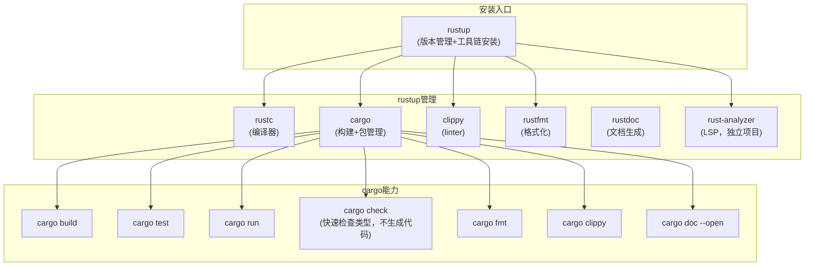

# Rust 开发者全景指南

## 语言画像

| 维度 | 描述 |
|------|------|
| 类型 | **编译型**——源码编译为本地二进制（通过 LLVM 后端） |
| 类型系统 | **静态、强类型、代数数据类型**——Sum type (enum)、Product type (struct)、模式匹配 |
| 内存管理 | **所有权（Ownership）+ 借用（Borrowing）+ 生命周期（Lifetime）**——编译时确定所有内存的分配和释放，无 GC、无手动 free |
| 范式 | **多范式**——函数式（迭代器、闭包、模式匹配）+ 过程式 + trait 多态（类似 Haskell typeclass） |
| 运行形态 | **原生机器码**——与 C 同级性能，可静态链接 |
| 标准 | **无正式标准**。Rust 项目主导语言演进（RFC 流程），每 6 周发布稳定版 |
| 主要实现 | **rustc**（Rust 编译器，使用 LLVM 后端）。GCC Rust（gccrs）在开发中 |

**一句话定位**：Rust 是"系统编程语言中第一个真正解决内存安全问题的语言"——在不牺牲性能的前提下，通过所有权系统在编译时消除空指针、悬垂指针、数据竞争等 C/C++ 常见错误类型。

### Rust 独特之处

| 概念 | 解决的问题 |
|------|-----------|
| **所有权（Ownership）** | 每个值只有一个所有者，所有者离开作用域时值被释放（确定性析构，无 GC） |
| **借用（Borrowing）** | 可以有多个不可变引用（`&T`），或一个可变引用（`&mut T`），但不同时存在 |
| **生命周期（Lifetime）** | 编译器追踪引用的有效范围，确保引用不会比它指向的数据活得更久 |
| **Unsafe** | 所有权规则在 `unsafe` 块内可突破，用于 FFI、直接硬件访问等场景 |
| **Trait** | 类似接口但更强大，可以有条件地为类型实现 trait，支持零成本抽象 |
| **Send + Sync** | 线程安全标记 trait，编译器自动推导类型是否可跨线程传递 |

这些概念构成了 Rust 陡峭学习曲线的主要部分（"与编译器搏斗"阶段），但也使得"编译通过即正确"成为 Rust 开发的真实体验。

---

## 从源码到运行

```
源码 .rs ──[rustc]──▶ MIR ──[优化]──▶ LLVM IR ──[LLVM 后端]──▶ 目标文件 .o ──[链接]──▶ 可执行文件
                                                                                    │
                                        Cargo（构建+包管理）──────────────────────────┘
```

Rust 编译的要点：

- **rustc 是编译器驱动**：类似 gcc，处理编译到链接的全流程
- **MIR（Mid-level IR）**：Rust 自己的中间表示，在 LLVM IR 之前。borrow checker 在此层面运行
- **LLVM 作为后端**：Rust 依赖 LLVM 做优化和机器码生成。这意味着 Rust 自动获得 LLVM 支持的所有目标平台
- **编译速度是已知痛点**：大量类型推导 + trait 解析 + LLVM 优化 → 编译较慢
- **增量编译**：`cargo build` 默认启用，只重编译修改过的 crate

---

## 工具链地图

Rust 的工具链以其高度集成和一致性著称。



### rustup：统一入口

`rustup` 是 Rust 的安装和版本管理工具——类似 Python 的 pyenv、Node 的 nvm、Go 的 go 下载页，但它是官方维护的一体化方案：

```bash
rustup install stable         # 安装稳定版
rustup install nightly        # 安装 nightly（夜间构建版，用于实验性特性）
rustup default stable         # 设置默认工具链版本
rustup component add clippy   # 添加组件
rustup target add wasm32-unknown-unknown  # 添加交叉编译目标
```

### Cargo：全能构建工具

Cargo 不仅仅是包管理器——它是构建系统、测试运行器、文档生成器、发布工具的一体化平台：

| 命令 | 功能 |
|------|------|
| `cargo build` | 编译（debug 模式） |
| `cargo build --release` | 编译（release 模式，启用优化） |
| `cargo run` | 编译并运行 |
| `cargo test` | 运行测试 |
| `cargo check` | 快速检查代码能否通过类型检查（不生成二进制，极快） |
| `cargo fmt` | 格式化代码 |
| `cargo clippy` | 运行 linter |
| `cargo doc --open` | 生成并打开文档 |
| `cargo publish` | 发布到 crates.io |

### 其他重要工具

| 工具 | 说明 |
|------|------|
| **rust-analyzer** | Rust 的 LSP 实现（代码补全、跳转、重构）。独立于 rustc，比旧的 RLS 快得多 |
| **clippy** | 社区维护的 linter（已纳入 rustup 组件），提供代码风格和正确性建议 |
| **rustfmt** | 官方代码格式化工具（类似 Go 的 gofmt） |
| **cargo-deny** | 检查依赖树中的许可证冲突和安全漏洞 |
| **cargo-audit** | 检查依赖是否有已知安全漏洞 |
| **bindgen** | 从 C 头文件自动生成 Rust FFI 绑定 |
| **cbindgen** | 从 Rust 代码生成 C 头文件 |

---

## 依赖管理与包生态

### Cargo 与 crates.io

Rust 的依赖管理模型是所有语言中的黄金标准之一：

```toml
# Cargo.toml
[package]
name = "myapp"
version = "0.1.0"
edition = "2021"

[dependencies]
serde = { version = "1.0", features = ["derive"] }
tokio = { version = "1", features = ["full"] }
clap = "4"

[dev-dependencies]
tempfile = "3"
```

- **crates.io**：Rust 的中央包注册中心（类似 npmjs.com、pypi.org）
- **Cargo.toml**：声明文件（包元数据 + 依赖 + 构建配置）
- **Cargo.lock**：锁文件。应用程序应提交到 Git，库不应提交
- **SemVer 严格执行**：crates.io 发布后不可删除/不可修改，版本号不可覆盖

### Cargo 依赖解析：多版本可共存

与 npm 类似，Cargo 允许同一包的不同 MAJOR 版本在依赖树中共存。如果包 A 需要 `serde 1.0`，包 B 需要 `serde 0.9`，两个版本都会被编译。

### Feature Flags（条件编译）

Rust 没有 C 的 `#ifdef`，但有更结构化的 feature 系统：

```toml
[dependencies]
serde = { version = "1.0", features = ["derive"] }  # 启用 derive 宏
```

Feature 在编译时解析——未启用的 feature 对应的代码不会被编译，是真正的零成本抽象。

---

## 项目结构约定

```
project/
├── Cargo.toml            # 包元数据和依赖
├── Cargo.lock            # 锁文件（应用程序提交，库不提交）
├── src/
│   ├── main.rs           # 可执行入口（对 binary crate）
│   ├── lib.rs            # 库入口（对 library crate）
│   ├── error.rs          # 错误类型定义
│   └── utils.rs          # 工具函数（通过 mod utils; 引入）
├── tests/                # 集成测试
│   └── integration_test.rs
├── examples/             # 示例程序（cargo run --example name）
├── benches/              # 基准测试
├── build.rs              # 构建脚本（编译前执行的 Rust 代码，用于 C 绑定等场景）
└── target/               # 构建产物目录（不提交）
```

### Workspace（大型项目）

多个 crate 可以被组织在同一个 workspace 中：

```
project/
├── Cargo.toml            # workspace 根（[workspace] 声明成员）
├── crates/
│   ├── core/             # ./crates/core/Cargo.toml
│   │   └── src/lib.rs
│   ├── cli/              # ./crates/cli/Cargo.toml
│   │   └── src/main.rs
│   └── web/              # ./crates/web/Cargo.toml
│       └── src/main.rs
└── target/               # workspace 共享一个 target 目录
```

---

## 编码习惯与语言惯用法

### 命名（Rust 编译器会发出警告）

| 类型 | 惯例 | 示例 |
|------|------|------|
| 变量/函数 | snake_case | `user_name`, `parse_config()` |
| 类型/Struct/Enum/Trait | PascalCase | `HttpClient`, `Result<T, E>` |
| 常量/静态变量 | SCREAMING_SNAKE_CASE | `MAX_CONNECTIONS` |
| 宏 | snake_case! | `println!`, `vec!` |

### 错误处理：Result & Option

Rust 没有异常、没有 null：

```rust
// Option<T>：值可能存在
fn find_user(id: u64) -> Option<User> { ... }
match find_user(42) {
    Some(user) => println!("{}", user.name),
    None => println!("not found"),
}

// Result<T, E>：操作可能失败
fn read_file(path: &str) -> Result<String, io::Error> { ... }
let content = read_file("config.toml")?;  // ? 运算符：出错就传播

// 更常见的写法（使用 match 或 if let）
if let Some(user) = find_user(42) {
    println!("{}", user.name);
}
```

`Result` + `?` 运算符是 Rust 错误处理的核心模式。主流应用代码使用 `anyhow`（应用程序）和 `thiserror`（库）来管理错误类型。

### 资源管理：Drop + RAII

Rust 通过 `Drop` trait 和所有权系统实现确定性资源管理：

```rust
{
    let f = File::open("data.txt")?;  // 打开文件
    // ... 使用 f ...
}  // f 离开作用域 → Drop::drop 被调用 → 文件自动关闭
```

不需要 `defer`、不需要 `with` 语句、不需要 `try-finally`。RAII 被编译器强制执行。

### 并发模型

Rust 通过 Send/Sync trait 在编译时阻止数据竞争：

```rust
// std::thread — 操作系统线程
std::thread::spawn(|| { ... });

// Arc<Mutex<T>> — 共享可变状态的标准方式
let data = Arc::new(Mutex::new(vec![]));

// mpsc — 多生产者单消费者 channel
let (tx, rx) = std::sync::mpsc::channel();

// rayon — 数据并行（自动将迭代器并行化）
vec.par_iter().map(|x| x * 2).collect()
```

对于异步 I/O，Rust 的生态以 **Tokio** 为主流运行时，提供 `async/await` 支持和 async I/O 原语。

### 模式匹配（Pattern Matching）

模式匹配是 Rust 中使用最密集的特性：

```rust
match value {
    Some(x) if x > 0 => println!("positive: {}", x),
    Some(0) => println!("zero"),
    Some(x) => println!("negative: {}", x),
    None => println!("nothing"),
}
```

编译器**强制要求**匹配所有可能的情况（exhaustive check），这防止了大量运行时错误。

---

## 测试版图

Rust 的测试直接集成在 Cargo 中：

```rust
// 单元测试（与源码放一起，在 #[cfg(test)] 模块中）
#[cfg(test)]
mod tests {
    use super::*;

    #[test]
    fn test_add() {
        assert_eq!(add(2, 3), 5);
    }

    #[test]
    #[should_panic]
    fn test_panic() {
        panic!("expected");
    }
}
```

| 工具 | 说明 |
|------|------|
| **cargo test** | 运行所有测试（单元测试 + 集成测试 + doctest） |
| **cargo bench** | 基准测试（需 nightly 或 `criterion` 库） |
| **cargo test -- --nocapture** | 显示测试中打印的输出 |
| **cargo test --test integration** | 只运行指定集成测试文件 |
| **proptest** | 属性测试（类似 Python 的 Hypothesis） |
| **loom** | 并发代码的模型检查器 |
| **tarpaulin / cargo-llvm-cov** | 代码覆盖率工具 |

### 文档测试（Doctest）

Rust 的独有特性——文档中的代码示例被编译并作为测试运行：

```rust
/// 计算两个数的和
///
/// # Examples
/// ```
/// use mylib::add;
/// assert_eq!(add(2, 3), 5);
/// ```
pub fn add(a: i32, b: i32) -> i32 { a + b }
```

`cargo test` 会运行这些代码块。这意味着文档永远不会过时——如果 API 变了，文档测试会编译失败。

---

## 部署与分发

### 默认：静态链接的二进制

Rust 默认静态链接所有 Rust 依赖（包括标准库的一部分）。产物是单个自包含的二进制文件。

### 链接 C 库

Rust 默认动态链接 libc（在 Linux 上）。要生成完全静态的二进制：

```bash
rustup target add x86_64-unknown-linux-musl
cargo build --release --target x86_64-unknown-linux-musl
```

这使用 musl libc 进行静态链接，产物可在任何 Linux 上运行。

### 交叉编译

```bash
rustup target add aarch64-unknown-linux-gnu   # ARM64 Linux
rustup target add x86_64-pc-windows-gnu       # Windows (MinGW)
cargo build --target aarch64-unknown-linux-gnu
```

比 C 的交叉编译简单得多——不需要单独安装交叉工具链。

### 发布

```bash
cargo publish    # 发布到 crates.io（需要 crates.io 账号和 API token）
```

---

## 代表性项目

| 项目 | 规模 | 为什么值得研究 |
|------|------|---------------|
| [Rust 标准库](https://github.com/rust-lang/rust/tree/master/library) | ~30 万行 | `std::vec`, `std::collections`, `std::sync` 是数据结构与并发的参考实现 |
| [ripgrep](https://github.com/BurntSushi/ripgrep) | ~3 万行 | 最快的文本搜索工具。展示 Rust 在 I/O 密集型场景下如何击败 C 实现 |
| [Tokio](https://github.com/tokio-rs/tokio) | ~30 万行 | 异步运行时。work-stealing 调度器 + async I/O 的工业级实现 |
| [Servo](https://github.com/servo/servo) | ~20 万行 | Mozilla 的浏览器引擎。展示 Rust 在大规模并行应用中如何组织代码 |
| [ruff](https://github.com/astral-sh/ruff) | ~10 万行 | Python linter（Rust 写的 Python 工具）。展示 Rust 如何与 Python 生态协作 |
| [Bevy](https://github.com/bevyengine/bevy) | ~15 万行 | Rust 的游戏引擎。ECS（实体组件系统）架构的现代化实现 |
| [Alacritty](https://github.com/alacritty/alacritty) | ~5 万行 | GPU 加速的终端模拟器。OpenGL 渲染 + 终端协议的 Rust 实现 |
| [uv](https://github.com/astral-sh/uv) | ~8 万行 | Python 包管理器的 Rust 重写。展示如何用 Rust 解决其他语言生态的工具问题 |

---

## 实用入门路径

### 最小环境

```bash
# 安装 rustup（Rust 版本管理和工具链安装器）
curl --proto '=https' --tlsv1.2 -sSf https://sh.rustup.rs | sh
source ~/.cargo/env

# 验证
rustc --version
cargo --version
```

### 第一个项目

```bash
cargo new hello-rust
cd hello-rust
cargo run       # 自动编译并运行
```

`cargo new` 创建的项目结构：
```
hello-rust/
├── Cargo.toml
└── src/
    └── main.rs    # fn main() { println!("Hello, world!"); }
```

### 学习路线建议

1. **先理解所有权**——这是 Rust 的核心心智模型。理解 move、clone、borrow 的区别
2. **与编译器成为朋友**——Rust 编译器错误信息质量极高，会告诉你怎么修复
3. **理解 String vs &str**——所有权在字符串类型上的体现，是所有权概念的具体化
4. **掌握 Result 和 Option**——`?` 运算符、`match` 和组合子（map、and_then）
5. **理解 Trait**——泛型约束、trait 对象（`dyn Trait`）、常见标准 trait（Clone、Debug、From）
6. **深入生命周期**——只在编译器要求时才写生命周期注解。大多数场景下编译器能自动推导
7. **拥抱 cargo**——`cargo check`（快速验证）、`cargo clippy`（代码建议）、`cargo doc`（生成文档）

### 关键资源

- **The Rust Book**：doc.rust-lang.org/book，官方入门教程，最佳起点
- **Rust by Example**：doc.rust-lang.org/rust-by-example，带注释的示例集
- **Rustlings**：github.com/rust-lang/rustlings，交互式练习
- **docs.rs**：所有 crates.io 上的包自动生成的文档（类似 pkg.go.dev）
- **The Rustonomicon**：深入 unsafe Rust 和底层细节
- **Rust for Rustaceans (Jon Gjengset)**：深入 Rust 的中高级主题
