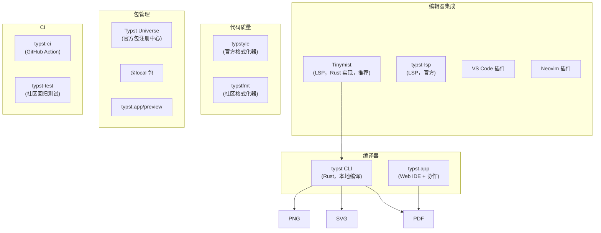

# Typst 开发者全景指南

> **范围说明**：Typst 是领域特定语言——用于排版而非通用编程。本文的维度模板针对 DSL 做了调整：语言画像聚焦设计理念和定位，而非内存管理或并发模型。

## 语言画像

| 维度 | 描述 |
|------|------|
| 类型 | **标记 + 脚本混合**——类似 Markdown 的轻量标记 + 图灵完备的脚本语言 |
| 执行模型 | **编译型**——源码 `.typ` 编译为目标格式（PDF、SVG、PNG） |
| 范式 | **声明式标记 + 命令式脚本**——排版用声明式（`= Title`、`#heading`），逻辑用命令式（`#for`、`#if`、`#let`） |
| 主要实现 | **typst**（Rust 编写，唯一官方实现）。CLI + Web App（typst.app） |
| 许可证 | Apache 2.0（开源），Web App 是商业服务 |

**一句话定位**：Typst 是 LaTeX 的现代替代——更快的编译速度、更友好的错误信息、内置的脚本语言替代了 LaTeX 的宏系统。它不是"更好的 LaTeX"，而是"从零开始重新思考的排版系统"。

### 与 LaTeX 的对比

| | LaTeX | Typst |
|------|-------|-------|
| 首次发布 | 1984 | 2023 |
| 编译速度 | 慢（多趟编译） | 极快（增量编译，毫秒级） |
| 错误信息 | 晦涩（"Emergency stop"） | 友好（指向具体位置，给出建议） |
| 脚本能力 | TeX 宏（极难编写） | 内置命令式脚本语言 |
| 包管理 | CTAN（数万个包） | typst.app/universe（快速增长） |
| 热重载 | 无原生支持 | CLI `typst watch` + Web App 实时预览 |
| 数学排版 | 极致（AMSMath 30 年打磨） | 优秀（快速追赶中） |
| 输出格式 | PDF、DVI | PDF、SVG、PNG、HTML（实验性） |

> **我的建议**：新文档项目（论文、报告、幻灯片、简历）优先尝试 Typst。如果数学公式极复杂或依赖特定 LaTeX 包，暂时保留 LaTeX。

---

## 从源码到排版输出

```
源码 .typ ──[解析]──▶ AST ──[类型检查 + 求值]──▶ 排版引擎 ──[分页 + 布局]──▶ PDF / SVG / PNG
```

**关键理解**：Typst 的编译是**单趟**的：

1. **解析**：标记（`=`、`-`、`_`）→ AST 节点
2. **求值**：脚本代码（`#[]` 块）被求值为内容或值
3. **排版**：内容被布局到页面（类似浏览器的渲染引擎但面向固定页面）
4. **输出**：生成 PDF/SVG/PNG

Typst 编译器是用 Rust 写的，编译速度是 LaTeX 的 10-100 倍。`typst watch` 提供热重载（改源码，PDF 自动更新）。

---

## 工具链地图



### 核心工具

| 工具 | 说明 |
|------|------|
| **typst CLI** | 编译器本体。`typst compile`、`typst watch`、`typst query` |
| **Tinymist** | Typst 的 LSP 实现（Rust 编写），提供补全、跳转、预览、诊断。当前推荐 |
| **typstyle** | 官方代码格式化工具（`typstyle format`） |
| **typst.app** | 官方 Web IDE，所见即所得，支持协作（类似 Overleaf 的定位） |

---

## 包管理与生态

### Typst Universe

Typst 有官方包注册中心（[typst.app/universe](https://typst.app/universe)），包在 GitHub 上管理，通过提交 PR 来发布/更新。

```typst
// 导入包
#import "@preview/tablex:0.1.0": tablex, cellx
#import "@preview/cmarker:0.2.0"

// 导入官方包（typst 组织维护）
#import "@preview/ctheorems:1.1.0": *
```

### 包结构

```
my-package/
├── typst.toml        # 包元数据（名称、版本、描述）
├── lib.typ           # 包入口（#import "@preview/my-package" 加载此文件）
├── src/              # 包源码（可选子模块）
└── README.md
```

### 包版本管理

- 包发布后不可删除、不可覆盖（类似 crates.io）
- 版本号遵循 SemVer
- 通过 GitHub PR 发布/更新（人工审核）

### 本地包

```typst
#import "@local/mylib:0.1.0"    # 从本地包目录加载
```

`@local` 指向平台相关的目录（`~/.local/share/typst/packages/local/` on Linux）。

---

## 项目结构约定

### 最小文档

```
paper/
├── main.typ           # 文档入口
├── refs.bib           # 参考文献（BibLaTeX 格式）
└── assets/            # 图片等资源
    └── figure.png
```

### 模板项目

```
template-project/
├── typst.toml         # 如果是包/模板
├── template/
│   ├── lib.typ        # 模板入口
│   └── src/           # 模板内部模块
├── demo/
│   └── main.typ       # 演示文档
├── thumbnail.png      # 包缩略图
└── README.md
```

---

## 编码习惯与惯用法

### 标记模式 vs 代码模式

Typst 的核心设计：**标记模式是默认的，代码模式通过 `#` 切换**：

```typst
// 标记模式（默认）
= Introduction
This is a paragraph with _italic_ and *bold* text.

// 代码模式（# 引入）
#let author = "Alice"
#let year = 2026

// 内联代码（# 前缀在文本中）
The author is #author, writing in #year.

// 代码块（#[] 引入上下文切换）
#[
  This whole block is evaluated as code,
  with variables like #author available.
]
```

### 函数调用

```typst
// 命名参数、位置参数、内容块参数
#heading(level: 2, "Results")

// 内容块（类似 LaTeX 的 \begin{...}）
#figure(
  image("graph.png"),
  caption: [Performance comparison],
)

// 文本直接是内容块
#text(size: 12pt, weight: "bold", [Hello])
```

### Show 规则（Show Rules）

Show 规则是 Typst 最强大的排版机制——类似 CSS 的样式规则，但作用于整个文档树：

```typst
// 标题样式
#show heading.where(level: 1): it => {
  set text(font: "Helvetica", size: 24pt)
  it
}

// 自定义所有图片的默认行为
#show figure: it => {
  set align(center)
  it
}

// 改变列表项的符号
#show list: it => {
  set list(marker: [→])
  it
}
```

### Set 规则

```typst
#set text(font: "Libertinus Serif", size: 11pt)
#set page(margin: 2.5cm, numbering: "1")
#set par(justify: true, leading: 0.6em)
```

### 自定义函数与模板

```typst
// 定义一个模板函数
#let my-paper(title, authors, body) = {
  set page(margin: 2.5cm)
  set text(font: "Libertinus Serif", size: 11pt)

  align(center, text(size: 16pt, weight: "bold", title))
  align(center, text(size: 11pt, authors))

  v(1cm)   // 垂直间距
  body
}

// 使用模板
#show: my-paper.with(
  title: "My Research Paper",
  authors: "Alice, Bob",
)

// ... 正文内容从这开始 ...
= Introduction
...
```

### 数学公式

```typst
// 行内公式
The area is $A = pi r^2$.

// 块级公式
$ integral_0^oo e^(-x^2) dif x = sqrt(pi) / 2 $

// 对齐公式
$ cases(
  1, x > 0,
  0, x = 0,
  -1, x < 0,
) $
```

数学语法与 LaTeX 相似但有改进：`dif x` 替代 `dx`（微分的正确排版间距），`oo` 替代 `\infty`。

### 脚本惯用法

```typst
// 数据驱动的表格
#let data = csv("results.csv")
#table(
  columns: 3,
  ..data.flatten(),
)

// 条件内容
#let score = 85
#[
  #if score >= 60 [
    Passed (#score)
  ] else [
    Failed
  ]
]

// 循环生成内容
#for (name, value) in (
  ("Alice", 90),
  ("Bob", 85),
) [
  #name: #value \
]
```

---

## 测试版图

Typst 的测试生态仍在早期阶段：

| 工具 | 说明 |
|------|------|
| **typst-test** | 社区回归测试工具。将编译输出与参考 PDF 逐页对比 |
| **typst compile --diagnostic-format** | 机器可读的诊断输出（用于 CI） |
| **CI 集成** | GitHub Action（typst-community/setup-typst） |

### 典型的 CI 流程

```yaml
# .github/workflows/compile.yml
steps:
  - uses: typst-community/setup-typst@v3
  - run: typst compile main.typ
  - run: typst compile main.typ --diagnostic-format=short  # 仅检查错误
```

---

## 部署与分发

### 输出格式

| 格式 | 命令 | 用途 |
|------|------|------|
| PDF | `typst compile main.typ` | 最终交付（打印、提交、存档） |
| SVG | `typst compile main.typ output.svg` | Web 嵌入（单页） |
| PNG | `typst compile main.typ output.png` | 预览/缩略图 |
| HTML | 实验性 | Web 发布 |

### 模板发布

通过提交 PR 到 [typst/packages](https://github.com/typst/packages) 发布包。审核通过后自动出现在 Typst Universe 中。

### 批量/自动化场景

```bash
# 监视模式（改源码自动重编译）
typst watch main.typ

# 查询文档元数据（用于脚本处理）
typst query main.typ "<heading>" --field text

# 批量编译（配合 shell 脚本）
for f in *.typ; do
  typst compile "$f" "$(basename $f .typ).pdf"
done
```

---

## 代表性项目

| 项目 | 说明 | 为什么值得研究 |
|------|------|---------------|
| [typst/typst](https://github.com/typst/typst) | Typst 编译器本体 | Rust 写的排版引擎，`crates/typst/src/` 是核心排版算法 |
| [typst/packages](https://github.com/typst/packages) | 官方包仓库 | 浏览包结构，了解包发布流程 |
| [typst/templates](https://github.com/typst/templates) | 官方模板 | 学习 Typst 模板的最佳实践 |
| [johannes-wolf/cetz](https://github.com/johannes-wolf/cetz) | Typst 绘图库 | 类似 TikZ，展示 Typst 脚本能力的极致用法 |
| [Enter-tainer/typst-preview](https://github.com/Enter-tainer/typst-preview) | 预览工具 | 在编辑器中实时预览 Typst 文档 |
| [Myriad-Dreamin/tinymist](https://github.com/Myriad-Dreamin/tinymist) | Typst LSP | Typst 编辑器体验的核心，Rust 实现 |

---

## 实用入门路径

### 最小环境

```bash
# 安装编译器
# 选项 A: 包管理器
sudo pacman -S typst                  # Arch
brew install typst                    # macOS
scoop install typst                   # Windows

# 选项 B: 从 GitHub Releases 下载
# github.com/typst/typst/releases

# 验证
typst --version
```

### 编辑器设置（Neovim）

```bash
# 安装 Tinymist LSP（推荐）
# 通过 Mason: :MasonInstall tinymist
# 或直接下载: github.com/Myriad-Dreamin/tinymist/releases

# 安装代码格式化
# 通过 Mason: :MasonInstall typstyle
```

### 第一个文档

```bash
mkdir hello-typst && cd hello-typst

cat > main.typ << 'EOF'
= Hello, Typst!

This is my first document, written in #datetime.today().display().

== Math Test

The quadratic formula:
$ x = (-b plus.minus sqrt(b^2 - 4 a c)) / (2 a) $

== Code Block

#let fib(n) = {
  if n <= 1 { n }
  else { fib(n - 1) + fib(n - 2) }
}

The 10th Fibonacci number is #fib(10).

#align(center)[
  *Made with Typst*
]
EOF

typst compile main.typ
# 生成 main.pdf
```

### 学习路线建议

1. **掌握标记语法**：标题（`=`）、列表（`-`）、强调（`_`、`*`）、链接、引用（`@label`）
2. **理解双模式**：标记模式（默认）vs 代码模式（`#`）。什么时候用哪个
3. **学习 Set/Show 规则**：改变样式、自定义元素外观
4. **编写自定义函数**：`#let` 定义变量和函数
5. **数学公式**：熟悉数学语法（与 LaTeX 的差异）
6. **模板开发**：封装可复用的文档结构
7. **引用和参考文献**：`@cite` + `.bib` 文件

### 关键资源

- **typst.app/docs**：官方文档（高质量，带交互示例）
- **typst.app/universe**：包和模板浏览
- **Typst Tutorial**：typst.app/docs/tutorial，官方入门教程
- **typst.app/docs/reference**：语言参考（函数、类型、规则）
