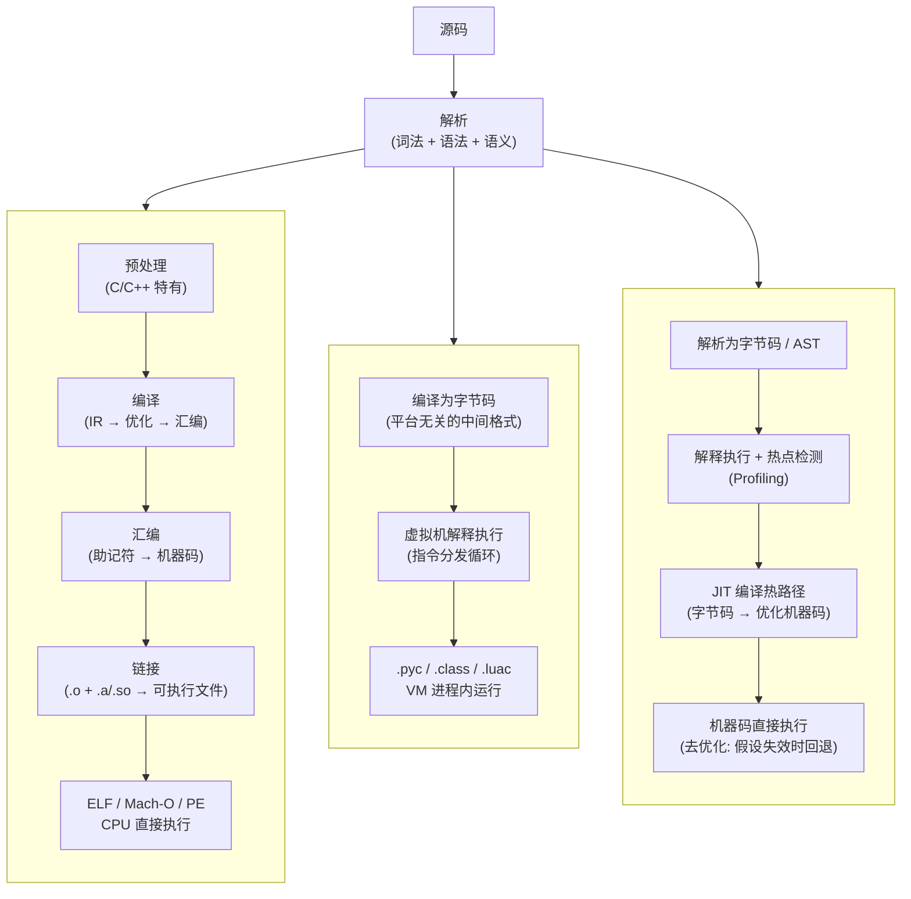

# 02 — 从源码到运行：三条执行路径的完整管线

## 为什么需要理解这个流程

源码不会自己运行。在"写了代码"和"程序跑起来了"之间，有一系列步骤把人类可读的文本转化为机器可执行的指令。理解这些步骤意味着你能：

- 看懂错误发生在哪个阶段（是语法错误？类型错误？链接错误？运行时错误？）
- 理解语言设计的取舍（为什么 C 编译慢但运行快？为什么 Python 启动快但稳态慢？）
- 知道性能瓶颈在哪里（编译时 vs 运行时、优化阶段、JIT 预热）

---

## 全景：三条路径



---

## 路径一：编译型（AOT Compilation）

**代表**：C、C++、Rust、Go、Zig

### 完整流程

```
main.c ──[预处理]──▶ main.i ──[编译]──▶ main.s ──[汇编]──▶ main.o
                                                               │
lib.c ──────────────────────────────────────────────▶ lib.o ──[链接]──▶ a.out
                                                               │
                                                        libc.so ┘
```

### 阶段 1：预处理（Preprocessing）—— C/C++ 特有

**工具**：`cpp`（C Preprocessor）

| 操作 | 说明 |
|------|------|
| `#include` 展开 | 头文件内容复制到当前位置。一个 `.c` 文件展开后可能膨胀到几万行 |
| `#define` 宏替换 | 纯文本替换，不是函数调用 |
| `#ifdef` / `#if` 条件编译 | 根据宏定义保留或删除代码块 |
| 注释删除 | 所有注释在此阶段移除 |

> Rust 和 Go **没有预处理阶段**。Rust 用 `#[cfg]` 属性和 `cfg!` 宏，Go 用 build tags 和文件命名约定（`*_linux.go`）。

### 阶段 2：编译（Compilation，狭义）

**输入**：`.i`（C/C++）、`.rs`（Rust）、`.go`（Go）
**输出**：`.s`（汇编代码）

子步骤：
1. **词法分析**：字符流 → Token 流
2. **语法分析**：Token 流 → AST
3. **语义分析**：类型检查、作用域检查
4. **IR 生成**：AST → 中间表示（GIMPLE/RTL、LLVM IR、Go SSA）
5. **优化**：死代码消除、内联、循环展开、常量折叠
6. **代码生成**：优化后的 IR → 目标平台汇编

**编译的核心原则**：每个源文件独立编译。`main.c` 编译时不知道 `lib.c` 里有什么——只凭头文件中的声明（声明告诉编译器"外部有这些函数，相信我"）。

### 阶段 3：汇编（Assembly）

**工具**：`as`（GNU Assembler）
**输入**：`.s` → **输出**：`.o`（目标文件）

- 助记符 → 机器码
- 生成符号表（本文件导出/引用了哪些符号）
- 生成重定位表（哪些地址需要在链接时修正）

### 阶段 4：链接（Linking）

**工具**：`ld` / `lld` / `mold`
**输入**：`.o` + `.a` + `.so` → **输出**：可执行文件 / 共享库

链接器的工作：
1. **符号解析**：将每个 `.o` 中的外部引用匹配到实际定义
2. **地址分配**：给所有代码和数据分配最终虚拟内存地址
3. **重定位**：修正所有占位符地址
4. **段合并**：将各 `.o` 的 `.text`、`.data`、`.bss` 合并

**链接阶段的错误**：
- `undefined reference to 'xxx'` — 只声明了但找不到定义
- `multiple definition of 'xxx'` — 同一个符号定义了多次

### 静态链接 vs 动态链接

| | 静态链接 | 动态链接 |
|------|---------|---------|
| 库形式 | `.a`（Linux）、`.lib`（Windows） | `.so`（Linux）、`.dll`（Windows）、`.dylib`（macOS） |
| 链接时机 | 编译时，库代码嵌入可执行文件 | 运行时，由 `ld.so` 加载 |
| 产物大小 | 大 | 小 |
| 库更新 | 需重新链接 | 替换 .so 即可（ABI 兼容前提下） |
| 部署 | 单文件，无外部依赖 | 需确保目标系统有对应库版本 |

**各语言的倾向**：
- **Go**：默认静态链接（包括 Go 运行时和依赖）。CGO 开启后变动态链接
- **Rust**：默认静态链接 Rust 依赖，动态链接 libc。用 musl target 实现完全静态
- **C/C++**：Linux 发行版倾向动态链接，嵌入式倾向静态链接

---

## 路径二：字节码虚拟机（Bytecode VM）

**代表**：CPython、Lua、早期 Java（JDK 1.0-1.2，在 JIT 加入前）

```
源码 .py ──[编译为字节码]──▶ .pyc ──[VM 解释执行]──▶ 程序运行
```

### 为什么需要字节码

- **平台无关**：`.pyc` 可以在任何有 CPython 的平台上运行
- **启动更快**：跳过重复解析。`.pyc` 缓存在 `__pycache__/`
- **简化编译**：编译成字节码比编译成机器码简单得多
- **代价**：运行速度比机器码慢 10-100 倍

### CPython 的字节码

```bash
# 每个 import 自动生成 .pyc
python3 -c "import mymodule"
ls __pycache__/          # mymodule.cpython-312.pyc

# 查看字节码
python3 -m dis mymodule.py
```

CPython 的字节码指令基于栈（非寄存器），指令集约 200 条。

### Java 的字节码（JVM）

```
源码 .java ──[javac]──▶ .class（Java 字节码）──▶ JVM
```

- `.class` 文件是标准化的二进制格式，任何语言只要编译到这个格式就能在 JVM 上跑（Kotlin、Scala、Clojure）
- JVM 规范定义了字节码指令集和 class 文件格式

### 与编译型的本质区别

| | AOT 编译型 | 字节码 VM |
|------|-----------|-----------|
| 优化时机 | 编译时（离线） | 运行时（JIT 可选） |
| 平台依赖 | 二进制绑定 ISA | 字节码跨平台 |
| 启动速度 | 极快 | 较快（需加载 VM + 解析字节码） |
| 稳态性能 | 高（编译时优化充分） | 中（无 JIT 的话显著慢于 AOT） |

---

## 路径三：JIT 编译（Just-In-Time Compilation）

**代表**：JavaScript（V8）、Java（HotSpot）、C#（.NET）、PyPy、LuaJIT

### V8（Chrome/Node.js）的 JIT 管线

```
源码 .js ──[Ignition 解析器]──▶ 字节码 ──[Ignition 解释执行]──▶ 热点检测
                                                                    │
                                                    ┌───────────────┘
                                                    ▼
                                          [Sparkplug 基线 JIT]
                                            快速生成未优化的机器码
                                                    │
                                            继续热 → [TurboFan 优化 JIT]
                                                      基于 profiling 的激进优化
                                                      包括内联、类型特化
                                                    │
                                                    ▼
                                            [优化后的机器码直接执行]
                                            如果假设失效 → 去优化（Deopt）
                                            回退到 Ignition 解释执行
```

### JIT 的核心权衡

- **预热期**：JIT 程序启动后需要时间达到峰值性能（"warm-up"）。期间解释执行 + profiling 有额外开销
- **去优化（Deoptimization）**：JIT 的优化基于运行时 profiling 的假设。如果假设被打破（比如函数之前只收 int，突然收到了 string），优化后的机器码必须被丢弃，回退到解释模式
- **内存开销**：JIT 编译器本身和生成的机器码占用额外内存

### 谁用哪种 JIT

| 运行时 | 基线 JIT | 优化 JIT | 特点 |
|--------|---------|---------|------|
| **V8** (JS) | Sparkplug | TurboFan (Maglev 中间层) | 多层 JIT，逐级优化 |
| **JavaScriptCore** (Safari) | Baseline JIT | DFG → FTL | 四层编译 |
| **HotSpot** (Java) | C1 (Client) | C2 (Server) | C1 快启动，C2 深度优化 |
| **.NET CLR** | Tier 0 | Tier 1 (RyuJIT) | 分层编译 |
| **PyPy** (Python) | — | Meta-tracing JIT | 跨解释器循环的优化 |
| **LuaJIT** | — | Trace-based JIT | 追踪热路径，线性化为机器码 |

### JIT vs AOT：什么时候各有利弊

| | AOT（编译型） | JIT |
|------|-------------|-----|
| 启动速度 | 极快（无预热） | 有预热期 |
| 峰值性能 | 高（离线优化充分） | 可超越 AOT（基于真实 profiling 优化） |
| 跨平台 | 需交叉编译 | 源码/字节码跨平台 |
| 内存占用 | 较低 | 较高（JIT 编译器 + 生成代码） |
| 运行时可动态性 | 无（编译时定死） | 可动态加载/修改代码 |

> JIT 可超越 AOT 的原因：JIT 可以根据**实际运行时数据**做优化——知道哪个分支更常走、知道某个参数在 99% 调用中是一个特定类型。AOT 只能做静态分析。

---

## 各语言的管线对照

| 语言 | 路径 | 关键步骤 | 中间格式 |
|------|------|---------|---------|
| C | AOT | 预处理 → 编译 → 汇编 → 链接 | `.i` → `.s` → `.o` → 可执行文件 |
| C++ | AOT | 同 C（+ 模板实例化在编译阶段） | 同 C |
| Rust | AOT | 解析 → MIR → LLVM IR → 链接 | `.rs` → MIR → LLVM IR → `.o` |
| Go | AOT + 运行时 | 解析 → SSA → 链接（静态） | `.go` → SSA → 静态二进制 |
| Java | 字节码 VM + JIT | `javac` 编译 → `.class` → JVM（解释 + C1/C2 JIT）→ 优化机器码 | `.java` → `.class` → JIT 机器码 |
| C# | 字节码 VM + JIT | `csc` 编译 → IL → .NET CLR（RyuJIT） | `.cs` → IL → JIT 机器码 |
| Python | 字节码 VM（+ JIT 可选） | 源码 → `.pyc` → CPython VM（或 PyPy JIT） | `.py` → `.pyc` |
| JavaScript | JIT | 源码 → 解析 → 字节码 → Ignition → Sparkplug → TurboFan | 多层 JIT 的机器码 |
| Typst | AOT | 解析 → 排版 → PDF/SVG | Typst IR |

---

## 关键概念速查

| 概念 | 解释 |
|------|------|
| **AOT**（Ahead-of-Time） | 运行前完成所有编译工作 |
| **JIT**（Just-in-Time） | 运行时动态编译热点代码 |
| **IR**（Intermediate Representation） | 源码和机器码之间的中间表示。LLVM IR、MIR、Go SSA、Java 字节码都是 IR |
| **链接** | 将多个目标文件和库拼接成可执行文件的过程 |
| **符号** | 函数名或全局变量名。编译器和链接器通过符号关联引用和定义 |
| **ABI**（Application Binary Interface） | 二进制层面的调用约定——参数怎么传、栈谁清理、结构体怎么布局 |
| **去优化（Deopt）** | JIT 编译器因运行时假设失效而丢弃已生成的机器码 |
| **sysroot** | 交叉编译时目标平台的根文件系统（头文件 + 库） |
