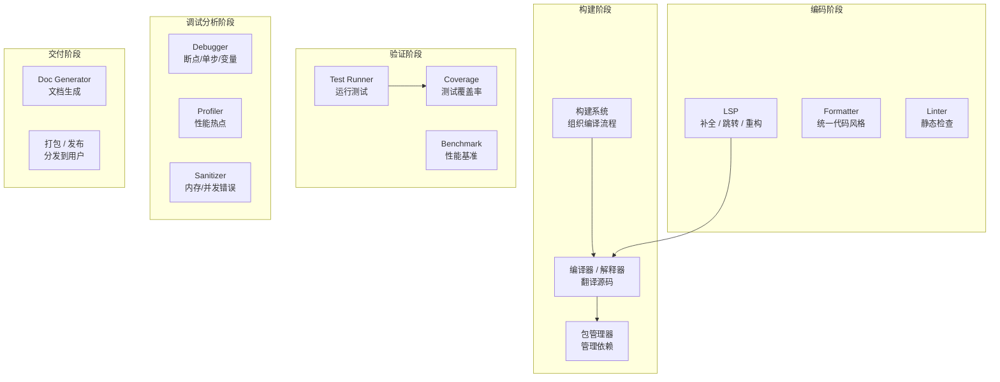
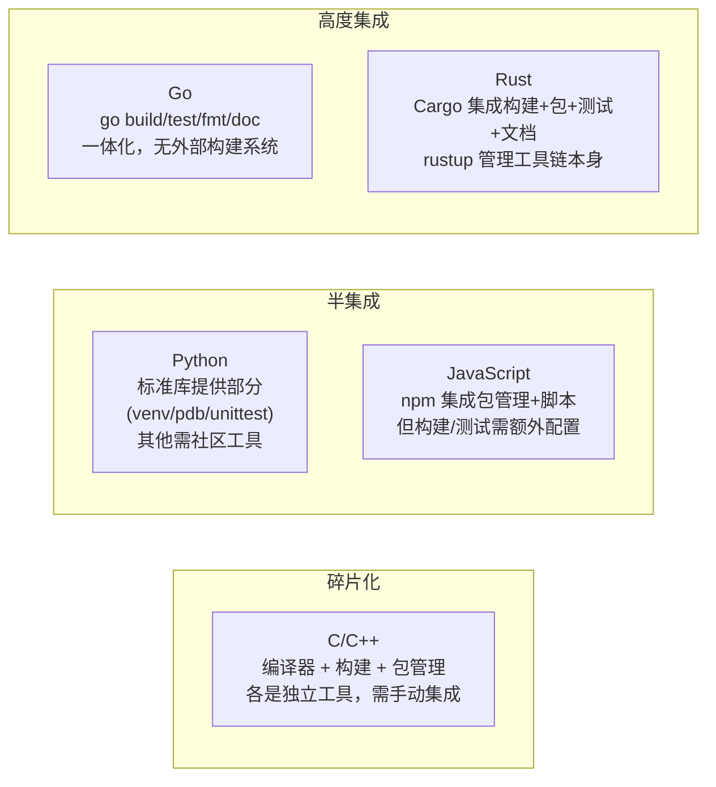

# 03 — 工具链生态位全景

## 工具链是什么、为什么存在

"装好 Python 就能写代码"和"配好 C++ 开发环境"之间的差距，不在于语言复杂度，而在于**工具链的成熟度和可见度**。

每门语言的工具链都是一组工具的集合，分布在一条"源码→产物→交付→维护"的管线上。这些工具各自占据一个**生态位**（ecological niche）——解决一个特定的问题。

## 生态位全景图

各生态位之间的关系：
- **LSP 利用编译器/解释器的分析能力**：补全需要类型信息，跳转需要符号索引。这也是为什么 clangd 依赖 Clang、gopls 依赖 Go 工具链
- **Formatter 和 Linter 共享 AST 解析**：两者都需要理解代码结构。这也是为什么 ruff（Python）和 Biome（JS）在统一这两者
- **构建系统不在工具链最底层**：它调用编译器，而不是编译器调用它

## 各生态位详解

### 编译器 / 解释器

**解决什么**：把源码翻译为可执行的形式。

这是工具链的**锚点**——所有其他工具都围绕它。编译器的内部表示（IR/AST）是 LSP、linter、formatter 等工具的信息来源。

| 职责 | 说明 |
|------|------|
| 翻译 | 高级语言 → 机器码 / 字节码 / IR |
| 优化 | 在翻译过程中改善性能 |
| 诊断 | 报告语法错误、类型错误、警告 |

**编译器/解释器即平台**：
- GCC/Clang 定义了 C/C++ 的"真实语义"（标准之外的部分）
- CPython 定义了 Python（没有独立的标准文档）
- V8 定义了 JavaScript 的性能天花板

### 构建系统

**解决什么**：当项目有几十上百个源文件时，如何高效组织编译过程。

**为什么需要它**：
- 只重编译修改过的文件（增量编译）
- 按依赖顺序编译（A 依赖 B → 先编译 B）
- 管理编译选项（不同 target 不同配置）
- 并行编译（利用多核）

**与编译器的关系**：构建系统调用编译器，不是反过来。构建系统是"工程管理器"，编译器是"翻译工人"。

| 构建系统 | 定位 | 谁在用 |
|----------|------|--------|
| **Make** | 最底层、最通用 | 小项目、C/C++ 早期项目 |
| **CMake** | C/C++ 事实标准 | 绝大多数 C++ 项目 |
| **Meson** | CMake 的现代替代 | 新 C/C++ 项目 |
| **Bazel** | 大型 monorepo | Google 系 |
| **Cargo** | Rust 内建，构建+包管理一体 | 所有 Rust 项目 |
| **go build** | Go 内建，无需外部构建系统 | 所有 Go 项目 |
| **npm scripts / task runner** | JS 生态的轻量"构建" | 小型 JS 项目 |
| **Vite / Webpack** | JS 的打包器（前端构建系统） | 前端项目 |

**关键观察**：Rust 和 Go 的构建系统是语言的一部分——你不需要单独选择和配置 CMake/Meson。这是现代语言的关键设计选择。

### 包管理器

**解决什么**：从哪里获取、如何管理第三方代码。

详见 [04 — 包管理通识](./04-package-management.md)。

**与构建系统的关系**：这是工具链设计中的核心架构决策：

| 关系模式 | 代表 | 说明 |
|----------|------|------|
| **分离式** | pip + setuptools、Conan + CMake | 包管理和构建是两件事，各管各的 |
| **集成式** | Cargo、go mod、npm | 包管理和构建在同一个工具中 |
| **无内置，生态补位** | vcpkg、Conan（C/C++） | 语言本身没给答案，社区自行拼凑 |

### Linter（静态分析器）

**解决什么**：在不运行代码的情况下发现错误和风格问题。

| Linter 类型 | 检查什么 | 示例 |
|-------------|---------|------|
| **风格** | 命名、格式、代码复杂度 | ESLint rules、Pylint、golint |
| **正确性** | 潜在 bug、空指针、未使用变量 | clang-tidy、rustc warnings |
| **安全** | SQL 注入、XSS、密码明文 | bandit（Python）、gosec（Go） |
| **性能** | 不必要的拷贝、可优化的模式 | clippy::perf |

**关键**：Linter 和编译器诊断的边界在模糊。Rust 的 `rustc` 本身有大量警告，`clippy` 是在此基础上的增强——而不是替代。

### Formatter（代码格式化器）

**解决什么**：自动统一代码排版——缩进、换行、空格。

Formatter 的终极价值**不是"好看"**，而是消除代码评审中关于格式的讨论。

| 模式 | 代表 | 特点 |
|------|------|------|
| **强约定（无配置）** | gofmt、rustfmt、typstyle | 零配置，社区统一 |
| **有限配置** | Prettier | 极少选项（`printWidth`、`tabWidth`、`semi`） |
| **高度可配** | clang-format | 大量选项（基于文件配置） |

**趋势**：现代工具趋向于"零配置或极少配置"。`gofmt` 证明了"统一的格式比每个人喜欢的格式更重要"。

### LSP（Language Server Protocol）

**解决什么**：让编辑器和 IDE 获得编译器级别的代码理解能力。

LSP 是 Microsoft 定义的一个协议——语言服务器（Language Server）通过 JSON-RPC 向编辑器提供：

| 功能 | 说明 |
|------|------|
| **补全**（Completion） | 输入时提示可能的符号 |
| **跳转定义**（Go to Definition） | 符号的声明位置 |
| **查找引用**（Find References） | 哪些地方用到了这个符号 |
| **悬停信息**（Hover） | 鼠标悬停显示类型和文档 |
| **重命名**（Rename） | 语义级重命名（不是文本替换） |

**LSP 实现与编译器的关系**：

| 语言 | LSP 实现 | 基于 |
|------|---------|------|
| Rust | rust-analyzer | 独立实现（非 rustc 前端），更快 |
| Go | gopls | 官方，使用 go 工具链的分析能力 |
| C/C++ | clangd | 基于 Clang 前端 |
| Python | Pyright / Pylance | 独立实现（非 CPython），Microsoft 维护 |
| TypeScript | tsserver（TypeScript 编译器内置） | 编译器自身 |
| Typst | Tinymist | 独立实现（Rust 编写），使用 typst 库 |

### 调试器（Debugger）

**解决什么**：在程序运行时观察和操控其状态。

| 功能 | 说明 |
|------|------|
| **断点**（Breakpoint） | 在指定位置暂停执行 |
| **单步执行**（Step over/into/out） | 逐行或逐指令执行 |
| **变量查看** | 查看当前作用域的变量值 |
| **调用栈**（Call Stack） | 查看函数的调用链 |
| **条件断点** | 满足条件时才触发的断点 |

| 语言 | 调试器 |
|------|--------|
| C/C++ | **GDB**（GNU）、**LLDB**（LLVM）、Visual Studio Debugger（Windows） |
| Rust | GDB / LLDB（通过 `rust-gdb`/`rust-lldb` 包装器） |
| Go | **Delve**（Go 专用，比 GDB 对 Go 支持好得多） |
| Python | **pdb**（标准库）、**ipdb**（IPython 增强版）、**debugpy**（VS Code 用） |
| JavaScript | 浏览器 DevTools、`node inspect`、VS Code 内置调试器 |

### 性能分析器（Profiler）

**解决什么**：程序哪些部分最耗 CPU/内存。

| 分析类型 | 说明 | 代表工具 |
|----------|------|---------|
| **采样型（Sampling）** | 定期暂停程序记录调用栈 | `perf`（Linux）、`pprof`（Go）、`py-spy`（Python） |
| **插桩型（Instrumentation）** | 在代码中插入计时点 | `gprof`（C/C++）、`cProfile`（Python） |
| **追踪型（Tracing）** | 记录每个关键事件的时间线 | Chrome Tracing、`go tool trace` |
| **内存分析** | 哪些分配了最多/最久的对象 | `heaptrack`、`go tool pprof --alloc_space`、Valgrind Massif |

### Sanitizer（运行时错误检测）

**解决什么**：在运行时（通常在测试中）检测内存错误、数据竞争、未定义行为。

Sanitizer 由 Google 开发，编译器内置支持（`-fsanitize=address`）：

| Sanitizer | 检测什么 |
|-----------|---------|
| **ASan**（Address Sanitizer） | 堆/栈缓冲区溢出、use-after-free、double-free |
| **UBSan**（Undefined Behavior Sanitizer） | 整数溢出、空指针解引用、非法类型转换 |
| **TSan**（Thread Sanitizer） | 数据竞争（多线程 bug） |
| **MSan**（Memory Sanitizer） | 未初始化内存的读取 |
| **LSan**（Leak Sanitizer） | 内存泄漏（集成在 ASan 中） |

**支持情况**：GCC 4.8+ 和 Clang 3.3+ 内置支持。仅 C/C++/Rust 有原生的 sanitizer 支持，其他语言的内存模型不兼容。

## 工具链集成度：从碎片化到一体化

| | C/C++ | Python | JavaScript | Go | Rust |
|------|-------|--------|------------|-----|------|
| 编译器 | GCC/Clang/MSVC | CPython/PyPy | V8/JSC | gc | rustc |
| 构建系统 | CMake/Meson | — | Vite/Webpack | go build | Cargo |
| 包管理 | vcpkg/Conan | pip/uv/poetry | npm/yarn/pnpm | go mod | Cargo |
| Linter | clang-tidy/cppcheck | ruff/pylint | ESLint/Biome | golangci-lint | clippy |
| Formatter | clang-format | ruff/black | Prettier/Biome | gofmt | rustfmt |
| LSP | clangd | Pyright | tsserver | gopls | rust-analyzer |
| 调试器 | GDB/LLDB | pdb/debugpy | DevTools | Delve | GDB/LLDB |
| Profiler | perf/gprof | cProfile/py-spy | DevTools | pprof | perf/samply |
| 文档 | Doxygen | Sphinx/pdoc | JSDoc/TypeDoc | go doc | rustdoc |
| 测试 | GTest/Catch2 | pytest | Vitest/Jest | go test | cargo test |

**同一个表，不同的开发体验**：
- **Go/Rust**：安装一个工具就获得全套能力
- **Python**：标准库有基础工具，高质量第三方工具补充
- **JavaScript**：npm 给了包管理，但构建/测试/lint 需要选型和配置
- **C/C++**：每个工具都是独立选择，没有"标准答案"

## 工具链选择的本质

工具链的集成度直接影响"用空白编辑器开发"的体验成本：

- **Go/Rust**：装好官方 CLI，几乎不需要额外选择——打开 Neovim 就能开发
- **Python**：需要选择包管理器（pip vs uv）、linter（ruff vs pylint）、测试框架
- **C/C++**：需要选择所有东西，而且各选择之间有兼容性问题
