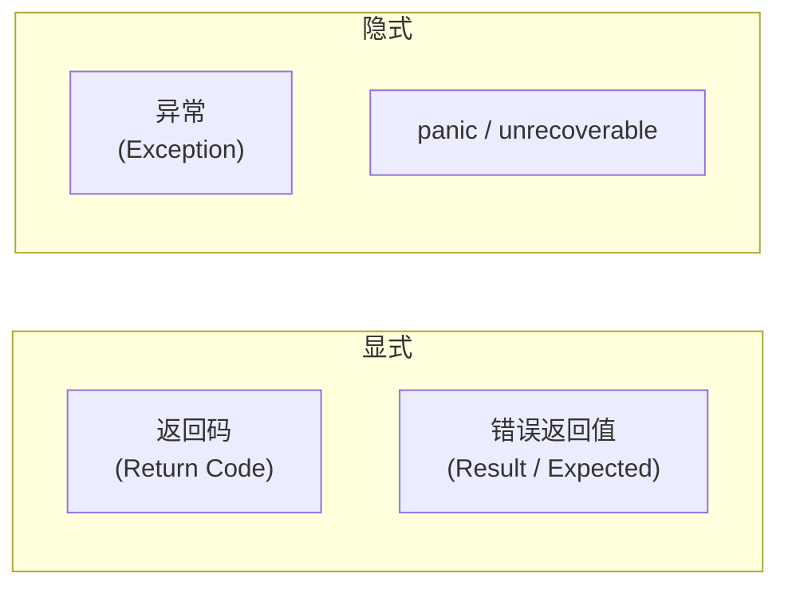
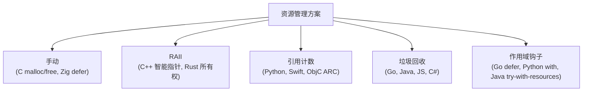

# 06 — 编码惯用法全景

## 为什么不同语言的"惯用法"如此不同

每种语言的惯用法（idioms）不是随机的——它们是语言设计在工程实践中的投影。一种语言的内存管理方式决定了资源清理的写法；类型系统决定了错误处理的形式；执行模型决定了并发的表达方式。

本文先定义每个维度上的**方案谱系**，再标注各语言的选择。

---

## 错误处理谱系

每门语言都必须回答：函数执行失败了，怎么通知调用者？



### 返回码（Return Code）

```c
// C：函数返回 int，0 表示成功，负数表示错误
int do_something() {
    if (fail) return -1;
    return 0;   // 成功
}
```

**特点**：调用者可选择忽略（最容易导致未处理错误）。无额外语言特性，纯粹是约定。
**语言**：C、早期的 Go（`if err != nil` 就是返回码模式）

### 错误作为返回值（Result / Expected）

```rust
// Rust：Result<T, E> 强制处理（编译器警告未使用的 Result）
fn do_something() -> Result<(), Error> {
    let file = File::open("data.txt")?;  // ? 传播错误
    Ok(())
}
```

```go
// Go：多返回值（没有 Result 类型，但模式相同）
func doSomething() (*Data, error) {
    f, err := os.Open("data.txt")
    if err != nil {
        return nil, fmt.Errorf("opening: %w", err)
    }
    defer f.Close()
    return parse(f)
}
```

**特点**：
- 显式：错误是返回值的一部分，调用者必须面对它
- **Rust 的 `?`**：传播语法糖，遇到错误提前返回（不写 `if err != nil`）
- **Go 的 `if err != nil`**：没有语法糖，每步手动检查。是 Go 社区最被讨论的特征
- **C++23 `std::expected<T, E>`**：引入类似 Rust 的 Result 模式

### 异常（Exception）

```python
try:
    data = load_file("data.txt")
except FileNotFoundError:
    data = default()
except PermissionError as e:
    log.error("permission denied", exc_info=e)
    raise
finally:
    cleanup()
```

**特点**：
- 隐式传播：异常沿着调用栈向上冒泡，不需要每层显式传播
- 栈展开（Stack Unwinding）：异常触发时，调用栈逐层清理（调用析构函数/finally 块）
- **C++ 的信号**：有异常机制但 Google/LLVM 等大型项目禁用（性能、可预测性）

### panic / abort（不可恢复错误）

```rust
let config = load_config().unwrap();  // 失败则 panic
// vs
let config = load_config().expect("config must be valid");
```

**特点**：用于"不应该发生"的错误——程序 bug、不变量违反、初始化失败等

### 各语言错误处理对照

| 语言 | 主要方式 | 语法糖 | 可忽略？ |
|------|---------|--------|---------|
| C | 返回码 + errno | 无 | **是**（最大隐患） |
| Go | 返回 error | 无（`if err != nil` 手动） | **是**（但 linter 告警） |
| Rust | `Result<T, E>` | `?` 运算符 | **否**（编译器警告） |
| C++23 | `std::expected<T, E>` + 异常 | `?`（提案中） | 是（expected）/ 是（异常） |
| Python | 异常 | `try/except/finally` | 是（Runtime error） |
| JavaScript | 异常 + Promise rejection | `try/catch` + `.catch()` | 是（unhandled rejection 警告） |
| Java | 受检异常（checked） + 非受检异常 | `try/catch/finally` + `throws` | 否（checked）/ 是（unchecked） |

**核心洞察**：
- **显式方案胜在"错误不会被遗漏"**，代价是代码中充斥错误检查
- **隐式方案胜在"代码简洁"**，代价是错误路径可能未处理
- **Rust 的 `?`** 是在显式和简洁之间的最优折中

---

## 资源管理谱系

每门语言都必须回答：谁负责释放资源（内存、文件、锁、socket）？



### 手动管理

```c
// C：malloc 和 free 必须配对
void process(const char *path) {
    char *buf = malloc(BUFSIZ);
    if (!buf) return;                // 忘记 free(buf)? 泄漏
    // ... 使用 buf ...
    free(buf);                       // 容易忘记
}
```

**语言**：C、Zig（有 `defer` 辅助）

### RAII（资源获取即初始化）

```cpp
// C++：构造获取，析构释放
{
    std::ifstream file("data.txt");  // 构造 → 打开文件
    auto data = std::make_unique<Buffer>();  // 智能指针
    // ... 使用 ...
}  // 离开作用域 → 析构函数自动关闭文件、释放 Buffer
```

```rust
// Rust：所有权系统在编译时保证
{
    let file = File::open("data.txt")?;  // 获取资源
    // ... 使用 ...
}  // file 离开作用域 → Drop::drop 自动调用 → 文件关闭
```

**语言**：C++（约定，可绕开）、Rust（编译器强制）

### 作用域钩子（无 RAII 语言的替代方案）

```go
// Go defer：函数退出时执行
f, err := os.Open("data.txt")
if err != nil { return err }
defer f.Close()  // 无论正常返回还是 panic，都会执行
// ... 使用 f ...
```

```python
# Python with：进入时 __enter__，退出时 __exit__
with open("data.txt") as f:
    data = f.read()
# 自动关闭，即使中间抛异常
```

| 机制 | 语言 | 何时释放 |
|------|------|---------|
| **手动** | C, Zig | 程序员决定（出错点容易遗漏） |
| **RAII** | C++, Rust | 作用域结束时（确定性） |
| **defer** | Go | 函数返回时（确定性，但只能函数粒度） |
| **with / try-with-resources** | Python, Java | 代码块结束时（显式声明、确定性） |
| **GC + finalizer** | Go, Java, JS, Python | GC 运行时（不确定！不能依赖 finalizer 释放非内存资源） |

**核心洞察**：
- **RAII 是最优雅的方案**——资源生命周期自动绑定到对象生命周期，无需手动写 `defer` 或 `with`
- **defer/with 是 RAII 的穷人版**——在没有析构函数的语言中手动标记清理点
- **GC 只管理内存**——文件、锁、socket 等必须用其他方式管理

---

## 并发模型谱系

### 操作系统线程（OS Threads）

```rust
std::thread::spawn(|| { /* 并发工作 */ });
```

**特点**：1:1 映射到 OS 线程。创建/切换成本高（~1MB 栈），数量有限（几百到几千）。
**语言**：所有通用语言都支持

### 轻量级用户态协程（Green Threads / Goroutines）

```go
go doWork()   // 启动一个 goroutine，栈 ~2KB，可同时运行百万个
```

**特点**：M:N 调度——M 个 goroutine 映射到 N 个 OS 线程。创建和切换成本极低。
**语言**：Go（goroutine）、Erlang/Elixir（process）、Java（Virtual Threads，Java 21）

### async/await（协作式并发）

```rust
// Rust + Tokio
async fn fetch_url(url: &str) -> Result<String> { ... }
let result = fetch_url("https://example.com").await;
```

```javascript
// JavaScript
const response = await fetch("https://example.com");
const data = await response.json();
```

```python
# Python + asyncio
async def fetch_url(url):
    async with aiohttp.ClientSession() as session:
        async with session.get(url) as resp:
            return await resp.json()
```

**特点**：
- **协作式**：函数在 `.await` 点主动让出，不是抢占式
- 最适合：**I/O 密集型**（网络请求、文件 I/O）
- **函数染色（Function Coloring）**：async 函数只能被 async 函数调用——这是 async/await 最被诟病的问题

| 语言 | async 运行时 | 说明 |
|------|------------|------|
| JavaScript | 内建（单线程事件循环） | 没有选择，所有 I/O 都是异步 |
| Rust | Tokio（主流）/ async-std | 运行时是库而非语言的一部分 |
| Python | asyncio（标准库） | 需配合 `aiohttp`/`httpx` 等异步库 |
| Go | 无 async/await | goroutine 替代了一切——同步代码、异步执行 |
| C# | 内建（Task/Task<T>） | 语言级别支持 |
| C++ | `co_await`（C++20） | 语言级别，但生态未成熟 |

### Channel / CSP（通信顺序进程）

```go
// Go channel
ch := make(chan int)
go func() { ch <- 42 }()
value := <-ch
```

```rust
// Rust channel (mpsc)
let (tx, rx) = std::sync::mpsc::channel();
thread::spawn(move || { tx.send(42).unwrap(); });
let value = rx.recv().unwrap();
```

**核心思想**：不通过共享内存通信，而是通过通信共享内存。
**语言**：Go（原生）、Rust（std 库）、Clojure（core.async）

### Actor 模型

```elixir
# Elixir / Erlang
receive do
  {:message, from, content} -> process(content); send(from, :ok)
end
```

**特点**：每个 actor 有独立的私有状态，只能通过消息通信。
**语言**：Erlang/Elixir、Akka（Scala/Java）

### 并发模型对照

| 语言 | OS 线程 | 轻量协程 | async/await | Channel/CSP |
|------|--------|---------|-------------|------------|
| Go | 可用但不常用 | ● goroutine | 不需要（goroutine 替代） | ● channel |
| Rust | ● 可用 | 无（async 替代） | ● Tokio | ● mpsc |
| Python | ●（GIL 限制 CPU 密集型） | 无 | ● asyncio | ○（queue module） |
| JavaScript | ○（Web Worker） | 无 | ● 语言核心 | 无 |
| Java | ● | ● Virtual Threads（Java 21） | ◑（CompletableFuture） | ○（BlockingQueue） |
| C++ | ●（std::thread） | 无（C++20 coroutines 不同） | ◑（co_await，C++20） | 无标准方案 |

---

## 空值处理

"这个变量可能没有值"是编程中最常见的情况。各语言用不同方式表达：

| 方案 | 示例 | 语言 |
|------|------|------|
| **null 指针** | `int *p = NULL;` | C/C++ |
| **null 引用** | `String s = null;` | Java、C#（可空引用类型） |
| **null / undefined** | `let x = null; let y;` | JavaScript（两种"空"！） |
| **None** | `x = None` | Python |
| **nil** | `var x *int = nil` | Go |
| **Option<T>** | `let x: Option<i32> = None;` | Rust（编译器强制处理） |
| **Nullable types** | `string? name = null;` | TypeScript、C# 8+、Kotlin |
| **Maybe** | `Maybe Int` | Haskell |

**编译器强制 vs 约定**：
- **Rust**：没有 null。`Option<T>` 是 `Some(T) | None` 的 enum，编译器强制处理 None 情况
- **TypeScript**：`strictNullChecks` 启用后，`string` 不能赋 `null`，只能用 `string | null`
- **Go**：零值（pointer 的零值是 nil）——不需要初始化但容易 nil dereference
- **C/C++**：null 指针是排名第一的 bug 来源（Tony Hoare 称 null 为"十亿美元的错误"）

---

## 命名惯例对照

| | C | Go | Rust | Python | JavaScript | Java |
|------|---|-----|------|--------|------------|------|
| 变量 | snake_case | camelCase | snake_case | snake_case | camelCase | camelCase |
| 函数 | snake_case | PascalCase(导出)/camelCase | snake_case | snake_case | camelCase | camelCase |
| 类/类型 | PascalCase | PascalCase | PascalCase | PascalCase | PascalCase | PascalCase |
| 常量 | SCREAMING_SNAKE | PascalCase | SCREAMING_SNAKE | SCREAMING_SNAKE | SCREAMING_SNAKE | SCREAMING_SNAKE |
| 文件名 | snake_case | snake_case | snake_case | snake_case | kebab-case | PascalCase |
| 包/模块 | — | 全小写、单数 | snake_case | snake_case | kebab-case | lowercase |

---

## 核心规律

1. **错误处理的选择取决于类型系统和社区哲学**。显式方案（Result）适合需要可靠性的场景；隐式方案（异常）适合快速开发
2. **资源管理的最佳方案是 RAII**，但需要语言在编译器层面支持确定性的析构。没有 RAII 的语言用 defer/with 模拟
3. **async/await 正在成为并发 I/O 的通用语言**，但 Go 证明了 goroutine+channel 是另一个可行路径
4. **null 问题的最佳解决方案是 Option/Maybe 类型 + 编译器强制处理**，所有现代语言都在往这个方向走
