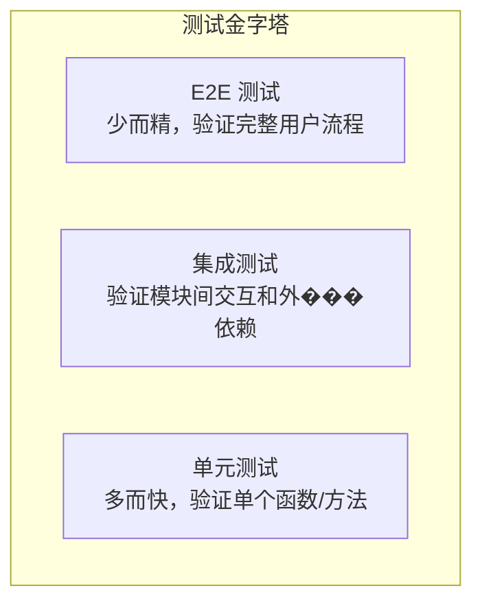

# 07 — 测试版图全景

## 测试解决什么问题

代码的正确性不能靠"看着对"来保证。测试是**可机器执行的正确性断言**——改了一行代码后，跑测试就能知道有没有破坏已有功能。

测试的工具生态分布在几个层级上，每个层级解决不同的问题。

## 测试金字塔

| 层级 | 数量 | 速度 | 测试什么 | 失败意味什么 |
|------|------|------|---------|------------|
| **单元测试** | 最多 | 最快（ms） | 单个函数/方法 | 这段代码的逻辑有问题 |
| **集成测试** | 中等 | 中等（10ms-1s） | 模块间交互、数据库查询 | 组件间配合有问题 |
| **E2E 测试** | 最少 | 最慢（s-min） | 完整用户场景 | 系统层面的问题 |

---

## 各层级工具

### 单元测试框架

| 语言 | 主流框架 | 备用选择 | 特点 |
|------|---------|---------|------|
| C | Check | Unity, CUnit, Criterion | Check 支持 fork 模式隔离测试 |
| C++ | Google Test (GTest) | Catch2, doctest, Boost.Test | GTest 最流行，doctest 编译最快 |
| Rust | `cargo test`（内建） | — | 测试直接写在源码中（`#[test]`），零配置 |
| Go | `go test` + `testing`（内建） | Testify（断言库） | 内建测试运行器+基准测试+覆盖率，一体 |
| Python | pytest | unittest（标准库） | pytest 是绝对主流，插件生态极丰富 |
| JavaScript | Vitest | Jest, Mocha | Vitest 速度快（ESM 原生），Jest 生态最大 |
| Java | JUnit 5 | TestNG | JUnit 是 Java 测试的锚点 |

### Mock / Stub / Fake

当被测试的代码依赖外部服务（数据库、HTTP API、文件系统）时，需要用可控的替身替代真实依赖。

| 替身类型 | 说明 | 示例 |
|----------|------|------|
| **Stub** | 返回预设值，不关心是否被调用 | `stub_get_user()` 始终返回固定的 User |
| **Mock** | 验证交互——"这个方法被调用了 3 次，参数是 X" | `expect(mailer.send).toHaveBeenCalledWith(email)` |
| **Fake** | 真实但简化的实现 | 内存数据库替代 PostgreSQL |

| 语言 | Mock 方案 |
|------|----------|
| C | CMock（配合 Unity，自动生成 mock 函数） |
| C++ | Google Mock（配合 GTest）、trompeloeil |
| Rust | `mockall`、手写 trait 的 mock 实现 |
| Go | `gomock`、`testify/mock`、手写 interface 实现（Go 社区倾向于手写） |
| Python | `unittest.mock`（标准库）、`pytest-mock` |
| JavaScript | Vitest `vi.fn()` / `vi.mock()`、Jest 内建 mock |
| Java | Mockito、EasyMock |

### 基准测试（Benchmark）

测量代码性能——不是"对不对"，而是"多快"。

| 语言 | 方案 |
|------|------|
| C/C++ | Google Benchmark、`clock_gettime` 手动计时 |
| Rust | `cargo bench`（内建，需 nightly）或 `criterion` 库 |
| Go | `go test -bench=.`（内建，标准方式） |
| Python | `pytest-benchmark`、`timeit`（标准库） |
| JavaScript | `benchmark.js`、Vitest `bench` |
| Java | JMH（Java Microbenchmark Harness）——JIT 预热问题，不要手写 |

> **警告**：基准测试极易误导。不同语言的 JIT 预热、GC 暂停、CPU 频率缩放都会影响结果。永远不要依赖手写的 `time.time()` 做结论。

### 模糊测试（Fuzzing）

给程序喂随机/变异的输入，看它会不会崩溃。

| 语言 | 方案 |
|------|------|
| C/C++ | AFL++、libFuzzer、honggfuzz |
| Rust | `cargo-fuzz`（libFuzzer 包装）、`afl.rs` |
| Go | `go test -fuzz`（Go 1.18+ 内建） |
| Python | python-afl、atheris、hypothesis（属性测试，接近 fuzz） |
| JavaScript | jsfuzz、jazzer.js |

### 覆盖率（Coverage）

测试执行了哪些代码行/分支。

| 语言 | 方案 |
|------|------|
| C/C++ | gcov + lcov（GCC）、`-fprofile-instr-generate`（Clang） |
| Rust | `cargo-llvm-cov`、tarpaulin |
| Go | `go test -cover`（内建，生成 cover profile） |
| Python | coverage.py（`coverage run -m pytest`） |
| JavaScript | V8 内建覆盖率（通过 Vitest `--coverage`）、Istanbul（c8） |
| Java | JaCoCo |

### 属性测试（Property-based Testing）

不写具体的测试用例，而是描述**属性**——"对于任意两个整数 a 和 b，`add(a,b)` 应该等于 `add(b,a)`"。框架自动生成大量随机输入来验证属性。

| 语言 | 方案 |
|------|------|
| Python | Hypothesis |
| Rust | proptest |
| Haskell | QuickCheck（起源） |
| JavaScript | fast-check |
| Java | jqwik |

---

## 跨语言测试惯例对比

| 维度 | C | Go | Rust | Python | JavaScript |
|------|---|-----|------|--------|------------|
| 测试文件放置 | `test/` 独立目录 | 与源码同目录（`_test.go`） | 单元测试内联（`#[cfg(test)]`），集成测试在 `tests/` | `tests/` 独立目录 | `*.test.ts` 与源码同目录或独立 |
| 测试运行 | 需 CMake/Make 配置 | `go test ./...` | `cargo test` | `pytest` | `vitest` / `jest` |
| 断言风格 | `ck_assert_int_eq(x, y)` | 手写 `if got != want { t.Errorf(...) }` | `assert_eq!(x, y)` | `assert x == y` | `expect(x).toBe(y)` |
| 基准测试 | Google Benchmark（外部） | `go test -bench`（内建） | `cargo bench` / criterion | pytest-benchmark | Vitest bench / benchmark.js |
| Mock 倾向 | 手写或 CMock 生成 | 社区倾向手写 interface 实现 | mockall 或手写 trait impl | pytest-mock / unittest.mock | vi.fn() / vi.mock() |
| 覆盖率工具 | gcov + lcov | `go test -cover`（内建） | cargo-llvm-cov | coverage.py | c8 / Istanbul |

---

## 各语言的测试哲学差异

### Go：极简、内建

Go 的测试哲学是"够用就好"。`testing` 包不提供断言——你写 `if got != want { t.Errorf(...) }`。社区对此无争议——Go 社区接受"重复写 if"多于"引入依赖"。

表驱动测试（table-driven tests）是 Go 的标志性惯用法——在一个 struct slice 中定义所有测试用例，然后循环执行。

### Rust：编译器参与测试

Rust 的独特之处：
- **文档测试（doctest）**：文档中的代码块被编译并作为测试运行——文档不会过时
- **`#[cfg(test)]`** 将测试代码与源码放在同一个文件中，测试模块只在 `cargo test` 时编译
- **`#[should_panic]`** 断言代码应该 panic

### Python：pytest 即标准

pytest 是 Python 测试的绝对中心。它的 fixture 系统（通过 `conftest.py` 共享测试依赖）和参数化测试（`@pytest.mark.parametrize`）是 Python 测试的标志性惯用法。

### JavaScript：选择最多的生态

JS 测试选择了"生态多样性"路线——Vitest、Jest、Mocha、Playwright、Cypress 都有大量用户。前端特有的 E2E 测试工具（Playwright/Cypress）深度依赖浏览器自动化，是 JS 测试版图的独特组成部分。

---

## 测试策略的核心原则

1. **单元测试要多、要快**（毫秒级）。每个函数的正确性基线
2. **E2E 测试要少、要覆盖关键路径**（登录→核心操作→关键结果）
3. **不要为了覆盖率数字写测试**——100% 覆盖率 ≠ 正确。测关键逻辑路径
4. **外部依赖用 mock/fake 隔离**——测试不应该真的调用付费 API 或发送邮件
5. **CI 中必须跑测试**——不跑测试的 CI 不是 CI
