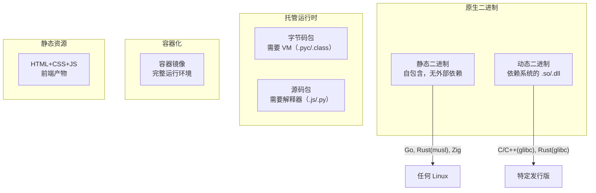
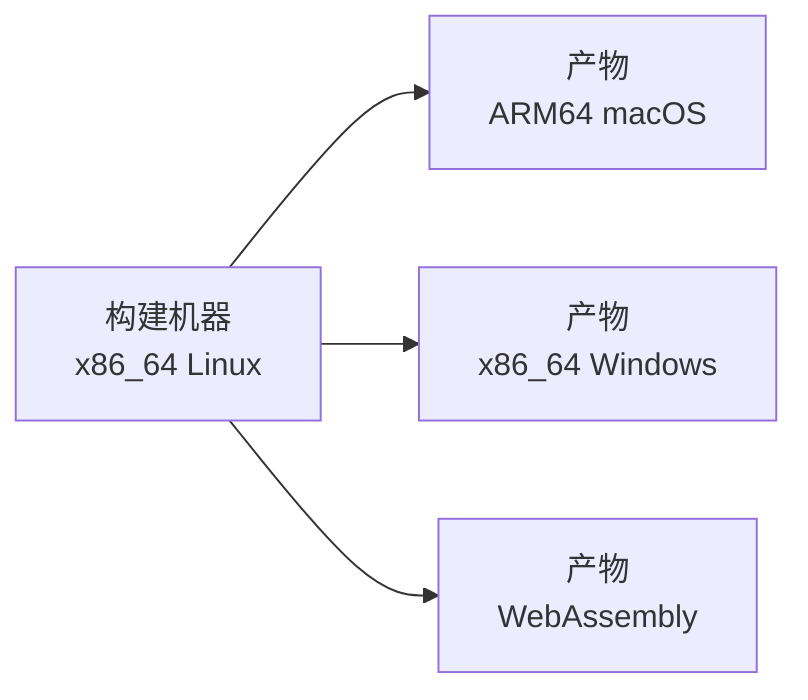

# 08 — 部署与分发全景

## 代码写完了，然后呢

编译通过、测试全绿之后，代码需要**到达用户手中**。不同语言的部署形态差异巨大——从 Go 的"一个二进制文件复制过去就行"，到 Python 的"需要目标机器有正确的 Python 版本和所有依赖"，再到 JavaScript 前端的"构建出静态文件，扔到 CDN 上"。

本文不深入部署操作细节，而是建立"产物形态 → 分发渠道 → 运行环境"的概念框架。

---

## 产物形态：最终交付的是什么



### 静态二进制

单个可执行文件，不依赖系统的动态库。复制到目标机器即可运行。

```bash
# Go
CGO_ENABLED=0 go build -o myapp .
# 产物: myapp（独立可执行文件，~5-10MB）

# Rust（musl target）
rustup target add x86_64-unknown-linux-musl
cargo build --release --target x86_64-unknown-linux-musl
# 产物: ./target/x86_64-unknown-linux-musl/release/myapp
```

**支持最好的语言**：Go、Rust（musl）、Zig
**优点**：部署最简单——一个 `scp` 就完成部署
**代价**：二进制体积较大（Go 的 hello world ~2MB）；更新库需要重新编译

### 动态二进制

依赖目标系统的动态库（Linux 上的 `.so`、macOS 上的 `.dylib`、Windows 上的 `.dll`）。

```bash
# C/C++（默认）
gcc main.c -o myapp                  # 动态链接 libc
ldd myapp                            # 查看依赖哪些 .so
```

**适用**：所有编译型语言（C/C++/Rust/Go with CGO）
**优点**：二进制体积小，库可共享更新
**代价**：部署时需确保目标系统有正确版本的库（"ABI 地狱"）

### 源码分发

用户下载源码，在自己的环境中构建/运行。

```bash
# Python
pip install mypackage                # 或
pip install mypackage-1.0.0-py3-none-any.whl  # wheel 是预编译的

# JavaScript
npm install mypackage
```

**适用**：Python、JavaScript、Ruby、Rust 库（通过 crates.io）
**本质**：源��分发 + 构建过程在用户端完成

### 容器镜像

将应用及其所有依赖打包为一个容器镜像。

```dockerfile
# Go（多阶段构建，最小镜像）
FROM golang:1.23 AS builder
COPY . /src && cd /src && CGO_ENABLED=0 go build -o /app .

FROM scratch                          # 空镜像
COPY --from=builder /app /app
ENTRYPOINT ["/app"]
# 最终镜像 ~5MB
```

**适用**：所有语言，服务端部署的现代标准
**核心优势**：完全自包含（OS 级别的静态链接），解决了"在我机器上能跑"问题

### 静态 Web 资源

前端项目的最终产物——HTML + CSS + JavaScript 的静态文件集合。

```bash
npm run build    # 或 vite build
# 产出 dist/ 目录（纯静态文件）
```

**适用**：前端项目
**部署**：任何能托管静态文件的服务（Nginx、S3、Vercel、Netlify、Cloudflare Pages）

---

## 交叉编译：在 A 平台上构建 B 平台的产物



### 各语言交叉编译体验

| 语言 | 难度 | 做法 |
|------|------|------|
| **Go** | ★☆☆☆☆ | `GOOS=linux GOARCH=arm64 go build`。所有目标平台内建支持 |
| **Rust** | ★★☆☆☆ | `rustup target add` + `cargo build --target`。LLVM 的多目标能力 |
| **Zig** | ★☆☆☆☆ | 语言设计目标之一：`zig build -Dtarget=aarch64-macos` |
| **C/C++** | ★★★★☆ | 需要安装目标平台的交叉工具链 + sysroot |
| **Python** | — | 不需要（解释器本身就是交叉编译的目标） |

**为什么 Go/Zig 交叉编译这么简单**：
- Go 有自己的链接器（不依赖系统 ld）、没有 C 依赖（CGO_ENABLED=0 时）
- Zig 捆绑了所有目标平台的 libc 和链接器
- 而 C/C++ 需要单独安装目标平台的 binutils + libc + 所有依赖库

---

## 分发渠道：产物怎么到达用户

| 渠道 | 适用产物 | 代表 |
|------|---------|------|
| **语言注册中心** | 库 | PyPI（Python）、npm（JS）、crates.io（Rust）、Maven Central（Java） |
| **系统包管理器** | 应用程序 | apt、dnf、pacman、brew |
| **GitHub Releases** | 静态二进制 | 上传编译好的二进制文件 |
| **Docker Registry** | 容器镜像 | Docker Hub、GHCR、ECR、GCR |
| **静态托管** | 前端产物 | Vercel、Netlify、Cloudflare Pages、S3 |
| **应用商店** | 移动/桌面应用 | App Store、Google Play、Microsoft Store |
| ** curl \| sh ** | CLI 工具 | 安装脚本模式（rustup、nvm、uv） |

### 发布注册中心的体验对比

| 注册中心 | 发布难度 | 审核 | 可删除 |
|----------|---------|------|--------|
| **npm** | 极低（`npm publish`） | 无 | 是（有限制） |
| **PyPI** | 低（`twine upload`） | 无 | 是（有限制） |
| **crates.io** | 低（`cargo publish`） | 无 | **不可删除**（不可变） |
| **Typst Universe** | 中（提交 PR） | 人工审核 | 不可删除 |
| **系统包管理器** | 高（需打包规范 + 维护者） | 有 | 可更新 |

---

## 部署策略：怎么把新版本上线

| 策略 | 说明 | 适用 |
|------|------|------|
| **原地替换** | 停旧版本→替换二进制→启动新版本 | 单机部署 |
| **蓝绿部署** | 准备两套环境，切换流量 | 减少停机时间 |
| **滚动更新** | 逐个替换实例 | Kubernetes 默认 |
| **金丝雀发布** | 先发布到小比例用户，验证后全量 | 降低风险 |
| **不可变基础设施** | 新版本 = 新容器镜像，旧容器销毁 | 容器化部署 |

**这些策略与语言选择的关系**：
- Go/Rust 的静态二进制 → 部署最简单（单文件替换）
- 动态链接的 C/C++ 应用 → 部署时需关注系统库版本
- Python/Node.js → 推荐用容器镜像部署（避免环境差异）

---

## 跨语言部署模型对照

| 语言 | 典型产物 | 分发渠道 | 用户侧需求 |
|------|---------|---------|-----------|
| Go | 静态二进制 | GitHub Releases / Docker | 无（二进制即完整程序） |
| Rust | 静态二进制（musl）/ 动态二进制 | crates.io（库）/ GitHub Releases（应用） | 无（静态）/ libc（动态） |
| C/C++ | 动态二进制 / 系统包 | 系统包管理器 / GitHub Releases | glibc/libstdc++ 版本匹配 |
| Python | 源码 / wheel / 容器 | PyPI / Docker Registry | Python 解释器 + 正确的依赖版本 |
| JavaScript | npm 包 / 静态文件 / 容器 | npmjs.com / Vercel / Docker Registry | Node.js（后端）/ 浏览器（前端） |
| Java | JAR / WAR / 容器 | Maven Central / Docker Registry | JVM 版本兼容 |
| Typst | PDF / SVG / PNG | typst.app/universe（模板）/ 任意文件分发（文档） | PDF 阅读器（文档） |

---

## 环境变量与配置

**12-Factor App 原则**：配置与代码分离。配置存储在环境变量中（不是代码文件）。

```
# .env（不提交到 Git）
DATABASE_URL=postgresql://localhost/mydb
API_KEY=sk-xxx

# .env.example（提交到 Git，不含真实值）
DATABASE_URL=postgresql://localhost/mydb
API_KEY=your-api-key-here
```

| 配置方式 | 适用场景 |
|----------|---------|
| **环境变量** | 所有场景（最简单、最通用） |
| **配置文件**（.yaml/.toml） | 复杂配置（嵌套结构） |
| **Secret 管理服务**（Vault/AWS Secrets Manager） | 生产环境的敏感信息 |
| **命令行参数** | 简单选项（`--port 8080`） |

> **黄金规则**：永远不要将密钥、密码、API token 写入代码或提交到 Git。

---

## 核心规律

1. **静态二进制 = 部署最简**。Go 和 Rust（musl）在这点上领先所有其他语言
2. **容器化是"万能兼容层"**——不在乎语言和依赖，代价是额外的运维复杂度
3. **交叉编译的难度 = 语言与底层系统的耦合度**。Go/Zig < Rust < C/C++
4. **分发渠道决定你能触达谁**——库用注册中心、应用用包管理器/GitHub Releases、服务用 Docker
