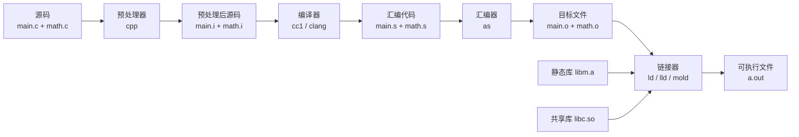
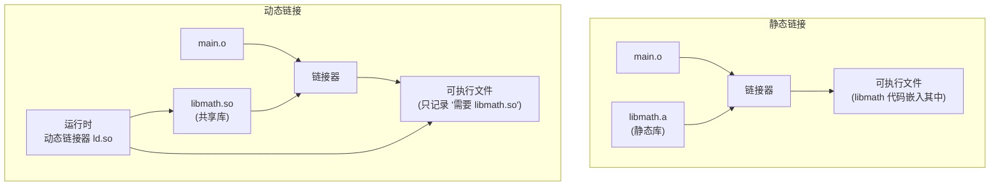
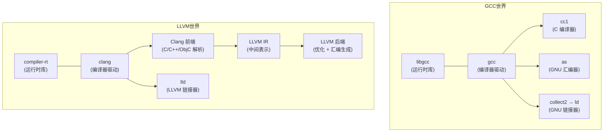

# 编译通识：从源码到可执行文件

## 为什么需要理解编译过程

编译器不是黑箱。理解编译过程意味着你能：

- 看懂编译错误发生在哪个阶段
- 理解头文件、宏、条件编译的行为
- 明白链接错误的根因（"undefined reference"是什么意思）
- 选择和使用正确的编译、链接选项
- 理解交叉编译的挑战

---

## 全景流程



---

## 阶段 1：预处理（Preprocessing）

**工具**：`cpp`（C Preprocessor，通常内置于编译器驱动中，如 `gcc -E`）

**输入**：`.c` + `.h` 文件
**输出**：`.i` 文件（预处理后的纯 C 代码）

**做了什么事**：

| 操作 | 指令 | 说明 |
|------|------|------|
| 头文件展开 | `#include` | 将 `.h` 文件内容复制到当前位置 |
| 宏替换 | `#define` | 文本替换（不是函数调用） |
| 条件编译 | `#ifdef` / `#ifndef` / `#if` | 根据条件保留或删除代码块 |
| 注释删除 | — | 所有注释被移除 |
| 行号标记 | `#line` | 嵌入调试信息，用于报错定位 |

**关键理解**：预处理是纯文本操作。`#include` 展开后，一个 `.c` 文件可能膨胀到几万行。

---

## 阶段 2：编译（Compilation，狭义）

**工具**：`cc1`（GCC 的 C 编译器本体）/ Clang 前端

**输入**：`.i` 文件（预处理后的源码）
**输出**：`.s` 文件（汇编代码）

**做了什么事**：

1. **词法分析**：字符流 → Token 流（关键字、标识符、字面量、运算符）
2. **语法分析**：Token 流 → AST（抽象语法树）
3. **语义分析**：类型检查、作用域检查、隐式转换
4. **中间代码生成**：AST → IR（中间表示）。GCC 用 GIMPLE/RTL，LLVM 用 LLVM IR
5. **优化**：在 IR 层面进行各种优化（死代码消除、循环展开、内联等）
6. **目标代码生成**：优化后的 IR → 目标平台的汇编代码

**关键理解**：
- 编译是**每个源文件独立进行**的。`main.c` 和 `math.c` 各自编译，互不知道对方的存在。
- 编译阶段看到的错误：语法错误、类型不匹配、未声明变量等。
- 调用外部函数时，编译器只检查**声明**（通常来自头文件），不检查**定义**是否真的存在——那是链接器的事。
- GCC 和 Clang 在这一阶段分化最大：它们有不同的 IR、不同的优化策略、不同的汇编生成方式。

---

## 阶段 3：汇编（Assembly）

**工具**：`as`（GNU Assembler）/ 集成在编译器驱动中

**输入**：`.s` 文件（汇编代码）
**输出**：`.o` 文件（目标文件，Object File）

**做了什么事**：

- 将助记符（`mov`, `add`, `call`）翻译为机器码
- 生成**符号表**：记录本文件导出了哪些符号（函数名、全局变量）和引用了哪些外部符号
- 生成**重定位表**：标记哪些地址需要在链接时修正

**关键理解**：
- `.o` 文件是 ELF（Linux）/ Mach-O（macOS）/ PE（Windows）格式的二进制文件
- `.o` 文件中的地址是"占位符"——引用的外部符号地址留空，等待链接器填充
- 可以用 `nm` 查看 `.o` 文件的符号表，用 `objdump -d` 反汇编

---

## 阶段 4：链接（Linking）

**工具**：`ld`（GNU ld）/ `lld`（LLVM 链接器）/ `mold`（高速链接器）

**输入**：多个 `.o` 文件 + `.a`（静态库）+ `.so`（共享库）
**输出**：可执行文件 / 共享库

**做了什么事**：

1. **符号解析**：将每个 `.o` 文件中引用的外部符号，匹配到提供该符号的 `.o` 或库
2. **地址分配**：给所有代码和数据分配最终的虚拟内存地址
3. **重定位**：修正所有占位符地址为真实地址
4. **段合并**：将各 `.o` 中同类型的段（`.text`、`.data`、`.bss`）合并

**链接阶段看到的错误**：
- `undefined reference to 'xxx'` — 符号声明了但找不到定义
- `multiple definition of 'xxx'` — 同一个符号定义了多次
- 架构不匹配（arm64 的 `.o` 无法和 x86_64 的 `.o` 链接）

---

## 静态库 vs 动态库



| 特性 | 静态库 (`.a` / `.lib`) | 动态库 (`.so` / `.dll` / `.dylib`) |
|------|------------------------|-------------------------------------|
| 链接时机 | 编译时 | 运行时（由 `ld.so` 加载） |
| 产物大小 | 较大（库代码嵌入） | 较小（只记录引用） |
| 更新库 | 需重新链接 | 替换 .so 文件即可（ABI 兼容前提下） |
| 多程序共享 | 各有一份拷贝 | 内存中可共享一份 |
| 部署复杂度 | 低（单文件） | 需确保目标系统有对应 .so |

---

## GCC 与 LLVM/Clang：两条工具链



**关键关系**：

- **GCC** 是一个完整的工具链——编译器、汇编器、链接器都自带。它是 GNU 项目的核心组件，Linux 内核和绝大多数 Linux 发行版用 GCC 编译。
- **LLVM** 是一个编译器基础设施项目。它本身不直接产生编译器，而是提供了一套可复用的组件（IR、优化器、后端）。**Clang** 是 LLVM 项目的 C/C++/Objective-C 前端。
- Clang 生成的 LLVM IR 可以被 LLVM 的优化器和后端处理，这使 Clang 可以轻松支持多种目标平台。
- **lld** 是 LLVM 项目的链接器，速度快于 GNU ld，但 macOS 上已是默认链接器，Linux 上仍有部分兼容性问题。
- **libgcc** 和 **compiler-rt** 是各自的运行时库，提供编译器隐式调用的底层函数（如 128 位整数运算、异常处理等）。

> **注意**：GCC 和 Clang 可以在工具链层面混用——比如用 Clang 编译但用 GNU ld 链接。这在 Linux 上很常见。

---

## 链接器生态：ld vs gold vs lld vs mold

| 链接器 | 开发者 | 特点 |
|--------|--------|------|
| **GNU ld** (bfd) | GNU | 最古老、最完整、最慢 |
| **GNU gold** | Google (Ian Lance Taylor) | 仅 ELF、比 ld 快、已停止开发 |
| **lld** | LLVM 项目 | 极快、支持多平台、macOS 默认链接器 |
| **mold** | Rui Ueyama (lld 原作者) | 追求极致速度，仅 Linux |

链接器选择与编译器无关——任何编译器生成的 `.o` 符合 ELF 规范即可被任何链接器处理。

---

## 构建系统：一个简短注解

构建系统（Make、CMake、Meson、Bazel、Ninja）不是编译工具链的一部分，**它们解决的是"当项目有几十上百个源文件时，如何高效地组织编译过程"**这个问题。

核心职责：
- 追踪文件依赖，只重编译修改过的文件
- 按正确顺序编译（先编译库，再编译依赖这些库的可执行文件）
- 管理编译选项和宏定义
- 协调多个编译任务并行执行

**构建系统调用编译器驱动（gcc/clang），编译器驱动再调用预处理器、编译器本体、汇编器和链接器。** 构建系统是比编译器高一层级的工具。

---

## Windows 工具链（简要说明）

Windows 有一个独立于 GCC/LLVM 的工具链体系：

| 组件 | Windows | Linux |
|------|---------|-------|
| 编译器 | **MSVC** (`cl.exe`) | GCC / Clang |
| 链接器 | **LINK** (`link.exe`) | ld / lld / mold |
| 调试器 | WinDbg / Visual Studio | GDB / LLDB |
| 构建系统 | **MSBuild** / CMake | CMake / Meson |
| 库格式 | `.lib`（静态）、`.dll`（动态） | `.a`（静态）、`.so`（动态） |
| 标准库 | MSVC Runtime | glibc / musl |
| 目标格式 | PE（Portable Executable） | ELF |

此外，**MinGW**（Minimalist GNU for Windows）是将 GCC 移植到 Windows 的项目，使用 GNU 工具链但生成 Windows 原生 PE 可执行文件。**WSL** 则是在 Windows 内运行完整 Linux 环境。

> 本文档以 Unix/Linux 工具链为主线。Windows 开发者可选路径：纯 MSVC、MinGW、WSL、或 Clang（Clang 在 Windows 上可同时兼容 MSVC 和 GNU 风格）。

---

## 交叉编译

交叉编译指在平台 A 上编译出运行于平台 B 的程序（如在 x86 机器上编译 ARM 程序）。

核心挑战：
- 需要**目标平台的 sysroot**（头文件 + 库）
- 编译器需要生成**目标架构的机器码**而非宿主架构的机器码
- 链接器需要**目标平台的库**（不能链接宿主机的 libc）

GCC 和 LLVM 都支持交叉编译，但 LLVM 的架构设计使其对交叉编译的支持更自然——LLVM 本身就是多目标架构的。

---

## 速查：一段 C 代码经历的完整路径

```
// main.c
#include <stdio.h>
int main() { printf("hello\n"); return 0; }
```

```bash
# 一步到位
gcc main.c -o hello

# 分步执行
gcc -E main.c -o main.i          # 预处理：展开 stdio.h，生成 main.i
gcc -S main.i -o main.s          # 编译：生成汇编代码 main.s
gcc -c main.s -o main.o          # 汇编：生成目标文件 main.o
gcc main.o -o hello              # 链接：链接 libc，生成可执行文件

# 查看各阶段产物
nm main.o                        # 查看符号表（可见 printf 是未解析的外部符号）
objdump -d main.o                # 反汇编
ldd hello                        # 查看动态库依赖
```

> **注**：GCC 的 `-E` / `-S` / `-c` 分别控制停止在哪个阶段。不带这些标志时，GCC 执行全部阶段，默认输出 `a.out`。
