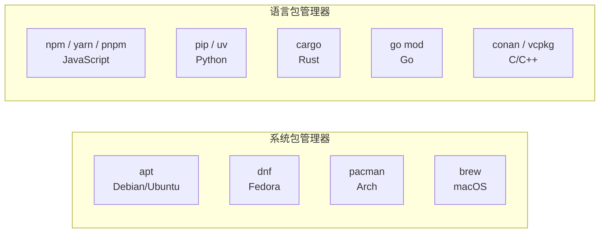
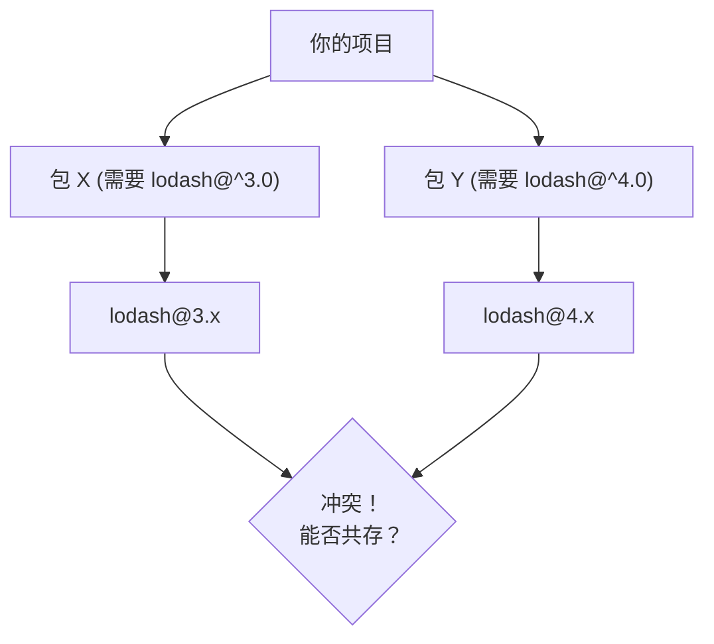

# 包管理通识：依赖世界的运行法则

## 包管理器解决什么问题

在只有标准库的时代，复用第三方代码意味着手动下载源码、手动复制到项目目录、手动维护更新。包管理器自动化了这些操作。

一个包管理器需要解决的三个核心问题：

1. **获取**：从哪下载代码？（注册中心 / Registry）
2. **组织**：下载的代码放在哪里？项目如何引用它们？（依赖图 / 版本约束）
3. **复现**：下次构建如何得到完全相同的依赖？（锁文件）

---

## 核心概念

| 概念 | 说明 | 类比 |
|------|------|------|
| **包（Package）** | 可被依赖和分发的最小单元 | 一个库或工具 |
| **注册中心（Registry）** | 集中存储包的服务器 | App Store |
| **依赖（Dependency）** | 项目所使用的外部包 | "我的项目需要用到 lodash" |
| **版本约束（Version Constraint）** | 声明需要哪个版本的依赖 | `"lodash: ^4.0.0"` |
| **锁文件（Lock File）** | 记录确切安装的每个包的精确版本和哈希 | 快照 |
| **传递依赖（Transitive Dependency）** | 依赖的依赖 | 间接依赖 |
| **依赖图（Dependency Graph）** | 所有依赖及其关系的完整树/图 | 完整的"需要谁"图谱 |

---

## 两大模型：系统级 vs 语言级

**系统包管理器**（apt, dnf, pacman, brew）：
- 管理**操作系统级别**的软件
- 安装到系统全局目录（`/usr/lib`, `/usr/bin`）
- 一个包一个版本（系统只需要一个 libssl）
- 以二进制分发为主、源码编译为辅

**语言包管理器**（npm, pip, cargo, go mod）：
- 管理**特定语言**的库
- 通常安装到项目本地目录（`node_modules/`, `.venv/`）
- 支持同一依赖的多个版本共存（项目 A 和项目 B 可以各自使用不同版本的 lodash）
- 以源码分发为主、二进制分发为辅

> **关键区别**：系统包管理器追求"整个系统的一致性"，语言包管理器追求"每个项目的独立性"。这解释了很多设计差异。

---

## 版本约束与 SemVer

### SemVer（语义化版本）

格式：`主版本号.次版本号.修订号`，即 `MAJOR.MINOR.PATCH`

| 变更类型 | 版本号变化 | 含义 |
|----------|-----------|------|
| 不兼容的 API 修改 | MAJOR +1, MINOR→0, PATCH→0 | 破坏性变更，用户需修改代码 |
| 向后兼容的新功能 | MINOR +1, PATCH→0 | 新功能但不破坏现有接口 |
| 向后兼容的 Bug 修复 | PATCH +1 | 只修 bug |

### 版本约束语法（以 npm 为例，各语言类似）

| 写法 | 含义 |
|------|------|
| `1.2.3` | 精确版本 |
| `^1.2.3` | 兼容版本：`>=1.2.3 <2.0.0`（允许 MINOR 和 PATCH 变化） |
| `~1.2.3` | 近似版本：`>=1.2.3 <1.3.0`（仅允许 PATCH 变化） |
| `>=1.2.3` | 大于等于 |
| `*` / `latest` | 任意版本 |

> **社区差异**：npm 生态默认使用 `^`（乐观——相信 MINOR 升级不破坏），Rust 的 Cargo 默认使用 `^` 但行为相同，Go 则倾向更保守的策略。

---

## 依赖解析策略

当一个项目有多个依赖，且它们共同依赖同一个包的不同版本时，包管理器需要决定安装哪些版本。这就是**依赖解析**。

三种主流策略：

| 策略 | 代表 | 行为 |
|------|------|------|
| **多版本共存** | npm (v3+), Cargo | 安装两个版本，各自引用各自的 |
| **SAT 求解** | pip, bundler | 把版本约束转化为 SAT 问题，找一组满足所有约束的版本（可能很慢） |
| **最小版本选择（MVS）** | Go | 不"求解"——选择满足所有约束的**最旧**版本（构建最可复现） |

### SAT 求解（pip, bundler）

把版本约束转化为逻辑公式，用 SAT 求解器找可行解。找到后选"最新"的可行版本集合。

- 优点：给出"最新"的依赖组合
- 缺点：可能很慢；结果不直观（为什么选了这个版本？）

### 最小版本选择 MVS（Go）

Go 的设计哲学与众不同：不选"最新兼容版本"，而选"满足所有约束的最旧版本"。

- 如果 `go.mod` 说需要 `A v1.2.0` 和 `B v1.0.0`，而 `B` 依赖 `A v1.0.0`，则选择 `A v1.2.0`（两个约束中较新的那个——即"最小的最新"）
- 开发者通过显式升级来推动版本更新（`go get -u`）
- 优点：构建极可复现、决策透明

### npm 的演进：嵌套 → 扁平 → 严格

- **npm v2**：嵌套安装（`node_modules/A/node_modules/B/...`），深度爆炸
- **npm v3**：扁平安装，多版本冲突时嵌套
- **pnpm**：内容寻址存储 + 硬链接，解决磁盘浪费和幽灵依赖问题

---

## 锁文件（Lock File）

**非锁文件**（如 `package.json`、`Cargo.toml`）：声明意图——"我需要 lodash ^4.0.0"
**锁文件**（如 `package-lock.json`、`Cargo.lock`）：记录事实——"我安装了 lodash 4.17.21，哈希值为 abc123..."

| 语言 | 声明文件 | 锁文件 |
|------|---------|--------|
| JavaScript | `package.json` | `package-lock.json` / `yarn.lock` / `pnpm-lock.yaml` |
| Python | `pyproject.toml` / `setup.py` | `poetry.lock` 或 `requirements.txt`（固定版本形式） |
| Rust | `Cargo.toml` | `Cargo.lock` |
| Go | `go.mod` | `go.sum`（仅哈希校验，不锁版本） |

**为什么需要锁文件？**

没有锁文件，`npm install` 在不同时间可能安装不同版本的依赖（即使版本约束相同）。锁文件确保了**构建的可复现性**——任何人在任何时候运行 `npm install`，都得到完全相同的依赖树。

### 锁文件应该提交到 Git 吗？

| 场景 | 建议 |
|------|------|
| 应用程序（最终要部署的） | **提交**——确保部署的一致性 |
| 库（被别人依赖的） | 看社区惯例。npm 库通常不提交，Rust 库通常不提交 |

---

## Vendoring（将依赖纳入自身仓库）

Vendoring 是将依赖的完整源码复制到项目仓库中的做法。

| 语言/生态 | vendoring 态度 |
|-----------|---------------|
| Go | 原生支持（`go mod vendor`），社区常见 |
| Rust | 较少使用，Cargo 的缓存机制足够好 |
| C/C++ | 常见（`third_party/` 目录），因为没有统一包管理器 |
| JavaScript | 历史上常见（`vendor/` 目录），现在由包管理器取代 |

**何时考虑 vendoring**：离线构建需求、对依赖稳定性有极端要求、合规/审计要求。

---

## 各语言包管理速览

| 语言 | 包管理器 | 注册中心 | 特点 |
|------|---------|---------|------|
| JavaScript | npm / yarn / pnpm | npmjs.com | 生态最大，依赖膨胀现象严重 |
| Python | pip / uv / poetry | pypi.org | 历史路线曲折（easy_install→pip→poetry→uv），工具链正在收敛 |
| Rust | Cargo | crates.io | 高度集成（构建+测试+发布一体），社区黄金标准 |
| Go | go mod（内置） | proxy.golang.org | 极简设计，MVS 策略独特 |
| C/C++ | 无官方。vcpkg / conan / xmake | 各自维护 | 碎片化，至今无统一方案 |
| Java | Maven / Gradle | Maven Central | 最早"现代"包管理器理念的来源 |
| Zig | 内置包管理 | 分散（URL + hash） | 去中心化设计 |
